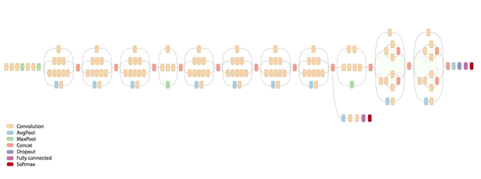
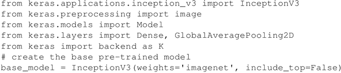
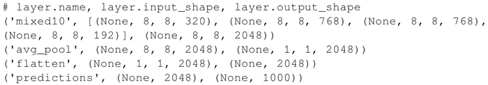
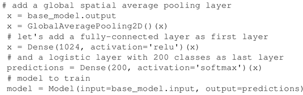
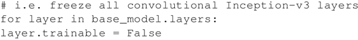
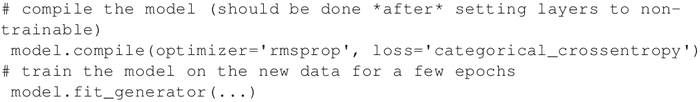
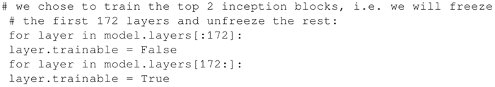
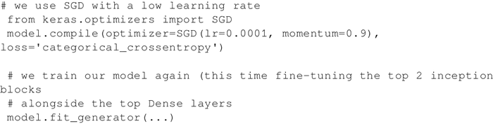

# TensorFlow 实现 InceptionV3 详解

迁移学习是一种非常强大的深度学习技术，在不同的领域有着各种应用。迁移学习的思想很简单，可以用类比来解释。假设你想学习一种新的语言，比如西班牙语，那么从你已经知道的另一种语言，比如说英语开始学起，可能会有所帮助。

遵循这一思路，计算机视觉研究人员通常使用预先训练的 CNN 为新任务生成表示，其中新任务数据集可能不够大，无法从头开始训练整个 CNN。另一个常见的策略是采用预先训练好的 ImageNet 网络，然后对整个网络进行微调以完成新任务。

InceptionV3 网络是由 Google 开发的一个非常深的卷积网络。Keras 实现了完整的网络，如下图所示，它是在 ImageNet 上预先训练好的。这个模型的默认输入尺寸是 299×299，有三个通道。
图 1 ImageNet v3 网路结构示意图（[点此查看高清大图](http://c.biancheng.net/uploads/allimg/190110/2-1Z110112Q0462.jpg)）
这个框架的例子受 Keras 网站上的在线模型([`keras.io/applications/`](https://keras.io/applications/))启发。假设在一个域中有一个与 ImageNet 不同的训练数据集 D。D 具有 1024 个输入特征和 200 个输出类别。

## 具体实现过程

1.  导入预处理模型和处理所需的库：
    

2.  使用一个训练过的 Inception-v3 网络，但是不包括顶层模型，因为想要在 D 上进行微调。顶层是一个密集层，有 1024 个输入，最后一个输出层是一个 softmax 密集层，有 200 个输出类。
    x=GlobalAveragePooling2D()(x) 用于将输入转换为密集层处理的正确形状。实际上，base_model.output tensor 的形态有 dim_ordering="th"（对应样本...通道）或者 dim_ordering="tf"（对应样本，通道，行，列），但是密集层需要将其调整为（样本，通道）GlobalAveragePooling2D 按（行，列）平均。所以如果你看最后四层（include_top=True），你会看到这些形状：
    

3.  如果包含 _top=False，则会删除最后三层并显示 mixed_10 层，因此 GlobalAveragePooling2D 层将（None...2048）转换为（None，2048），其中（None，2048）张量是（None...2048）张量中每个对应的（8，8）子张量的平均值：
    

4.  所有卷积层都是预先训练好的，所以在整个模型的训练过程中冻结它们：
    

5.  对模型进行编译并训练几批次，以便对顶层进行训练：
    

6.  接下来冻结 Inception 中的顶层并微调 Inception 层。在这个例子中，冻结了前 172 层（一个用来微调的超参数）：
    

7.  重新编译模型进行微调优化。需要重新编译模型以使这些修改生效：
    

## 解读分析

现在我们有了一个新的深度网络，它重新使用了标准的 Inception-v3 网络，但是它通过迁移学习在一个新的领域 D 上进行了训练。

当然，有许多参数可以精确调整以达到较好的精度。但是，现在正在通过迁移学习重新使用一个非常大的预训练网络作为起点。这样做可以通过重新使用 Keras 中已有的功能来节省训练成本。

#### 知识扩展

截至 2017 年，“计算机视觉”问题（在图像中找到模式的问题）被认为已经解决了，这个问题对生活有很大影响。例如：

论文“[Dermatologist-level classification of skin cancer with deep neural networks](https://www.nature.com/nature/journal/v542/n7639/full/nature21056.html)”（Andre Esteva，Brett Kuprel，Roberto A.Novoa，Justin Ko，Susan M.Swetter，Helen M.Blau & Sebastian Thrun，2017）使用由 2032 种不同疾病组成的 129450 张临床图像的数据集训练 CNN。他们通过 21 位经过认证的皮肤科医师对活检证实的临床图像进行二元分类，分别区分角质形成单元癌与良性脂溢性角化病、恶性黑色素瘤与良性痣。CNN 与人类专家在这两项任务上都达到了同样的水平，证明了人工智能在进行皮肤癌分类中能够与皮肤科医生相媲美。

论文“[High-Resolution Breast Cancer Screening with Multi-View Deep Convolutional Neural Networks](https://arxiv.org/abs/1703.07047)”（Krzysztof J.Geras，Stacey Wolfson，S.Gene Kim，LindaMoy，KyunghyunCho）提出一种有望提高乳腺癌筛查过程效率的新架构，可以处理四种标准的视图或角度。与常用的自然图像 DCN 架构（这种架构适用于 224×224 像素的图像）相比，MV-DCN 还能够使用 2600×2000 像素的分辨率。