# TensorFlow WaveNet 声音合成详解

WaveNet 是生成原始音频波形的深层生成模型。这项突破性的技术已经被 [Google DeepMind](https://deepmind.com/) 引入（[`deepmind.com/blog/generate-mode-raw-audio/`](https://deepmind.com/blog/generate-mode-raw-audio/)），用于教授如何与计算机对话。结果确实令人惊讶，在网上你可以找到合成声音的例子，电脑学习如何用名人的声音与人们谈话。

所以，你可能想知道为什么学习合成音频是如此困难。听到的每个数字声音都是基于每秒 16000 个样本（有时是 48000 个或更多）建立一个预测模型，在这个模型中学习基于以前所有的样本来重现样本，这是一个非常困难的挑战。

尽管如此，有实验表明，WaveNet 已经改进了当前最先进的文本到语音（Text-To-Speech，TTS）系统，降低了英语和普通话之间 50% 的差异。

更酷的是，DeepMind 证明了 WaveNet 可以教会电脑如何产生乐器的声音，比如钢琴音乐。

下面给出一些定义。TTS 系统通常分为两个不同的类别：

*   连续 TTS：其中单个语音片段首先被记忆，然后在语音再现时重新组合。这种方法没有大规模应用，因为它只能再现记忆过的语音片段，并且不可能在没有记忆片段的情况下再现新的声音或不同类型的音频。
*   参数 TTS：其中创建模型用于存储要合成的音频的所有特征。在 WaveNet 之前，使用参数 TTS 生成的音频不如连续 TTS 自然。WaveNet 通过直接建模音频声音的生成来改进现有技术，而不是使用过去常用的中间信号去处理算法。

原则上，WaveNet 可以看作是一堆卷积层（已经在前面章节中看到了二维卷积图像），而且步长恒定，没有池化层。请注意，输入和输出的结构具有相同的尺寸，所以 ConvNet 非常适合对音频声音等连续数据进行建模。

然而，实验表明，为了达到输出神经元中的感受野大尺寸，有必要使用大量的大型滤波器或者不可避免地增加网络的深度。请记住，一个网络中一层神经元的感受野是前一层神经元对其提供输入的横截面。由于这个原因，纯粹的卷积网络在学习如何合成音频方面效率不高。

WaveNet 的关键在于所谓的扩张因果卷积（有时称为带孔卷积），这就意味着当应用卷积层的滤波器时，一些输入值被跳过。例如，在一个维度上，一个具有扩张 1、大小为 3 的滤波器 w 将计算如下所示的加权和。

简而言之，在扩张值为 D 的扩张卷积中，通常步长是 1，你也可使用其他的步长。下图给出了一个例子，扩大（孔）尺寸为 0，1，2：
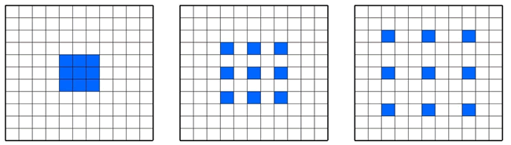
图 1 扩张网络的一个例子
由于引入“孔”这个简单的想法，使得堆叠多个扩张的卷积层与指数增加的过滤器、学习长距离输入而不用担心有一个过深的网络成为可能。

因此，WaveNet 属于卷积网络，其卷积层具有各种扩张因子，使得感受野随深度呈指数增长，有效地覆盖了数千个音频时间步长。

当训练时，输入是来自人类说话者的录音。这些波形量化为一个固定的整数范围。WaveNet 定义了一个初始卷积层，只访问当前和之前的输入。然后，有一堆扩大的卷积层，仍然只能访问当前和之前的输入。最后，有一系列密集层结合了前面的结果，接下来是分类输出的 softmax 激活函数。

在每个步骤中，从网络预测一个值并将其反馈到输入中。同时，计算下一步的新预测。损失函数是当前步骤的输出和下一步的输入之间的交叉熵。

[NSynth](https://magenta.tensorflow.org/nsynth)是最近由 Google Brain 小组发布的一个 WaveNet 的演变，它不是因果关系，而是旨在看到输入块的整个上下文。如下图所示，神经网络确实是复杂的，但是作为介绍性讨论，知道网络学习如何通过使用基于减少编码/解码期间的误差的方法来再现其输入就足够了：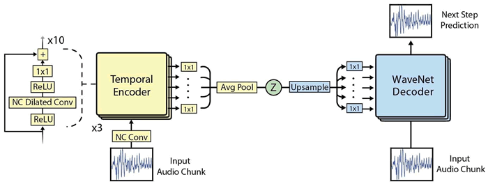
图 2 NSynth 架构的一个案例
本节直接使用网上的代码来演示([`github.com/tensorflow/magenta/tree/master/magenta/models/nsynth`](https://github.com/tensorflow/magenta/tree/master/magenta/models/nsynth))，你还可以从 [Google Brain](https://aiexperiments.withgoogle.com/sound-maker) 中找到一些。

感兴趣的读者也可以阅读论文“Neural Audio Synthesis of Musical Notes with WaveNet Autoencoders”（Jesse Engel，Cinjon Resnick，Adam Roberts，Sander Dieleman，Douglas Eck，Karen Simonyan，Mohammad Norouzi，2017.4，https://arxiv.org/abs/1704.01279）。

## 具体做法

1.  通过创建单独的 conda 环境来安装 NSynth。使用支持 Jupyter Notebook 的 Python 2.7 创建并激活 Magenta conda 环境：
    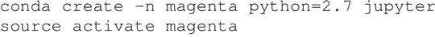

2.  安装用于读取音频格式的 Magenta pip 软件包和 librosa：
    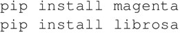

3.  从网上下载安装一个预先建立的模型（[`download.magenta.tensorflow.org/models/nsynth/wavenet-ckpt.tar`](http://download.magenta.tensorflow.org/models/nsynth/wavenet-ckpt.tar)）并下载示例声音（[`www.freesound.org/people/MustardPlug/sounds/395058/`](https://www.freesound.org/people/MustardPlug/sounds/395058/)），然后运行 demo 目录中的笔记。第一部分包含了稍后将在计算中使用的模块：
    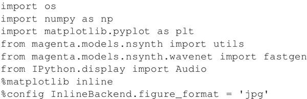

4.  加载从互联网下载的演示声音，并将其放在与笔记本电脑相同的目录中。这将在约 2.5 秒内将 40000 个样品装入机器：
    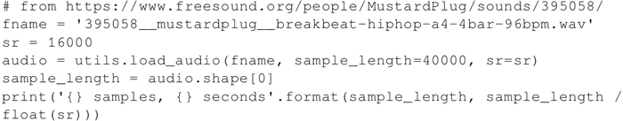

5.  使用从互联网上下载的预先训练的 NSynth 模型以非常紧凑的表示方式对音频样本进行编码。每 4 秒给一个 78×16 的尺寸编码，然后可以解码或重新合成。编码是张量(#files=1x78x16)：
    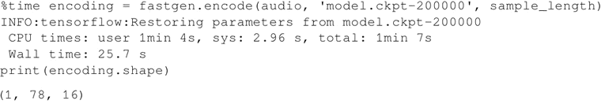

6.  保存稍后用于重新合成的编码。另外，用图形表示快速查看编码形状，并将其与原始音频信号进行比较。如你所见，编码遵循原始音频信号中的节拍：
    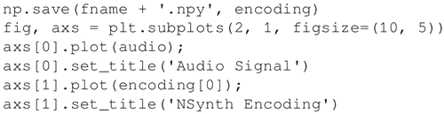

7.  我们观察如下图所示的音频信号和 NSynth 编码：
    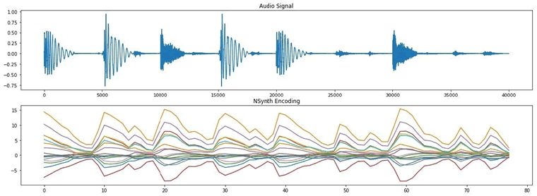

8.  现在对刚刚制作的编码进行解码。换句话说，如果重新合成的声音类似于原来的，这里试图以紧凑表示再现对原始音频的理解。事实上，如果你运行实验并听取原始音频和重新合成的音频，会感觉它们听起来非常相似：
    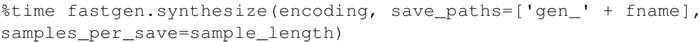

## 总结

WaveNet 是一种卷积网络，卷积层具有各种扩张因子，使得感受野随深度呈指数级增长，因此可以有效地覆盖数千个音频时间步长。NSynth 是 WaveNet 的一种演变，其中原始音频使用类似 WaveNet 的处理来编码，以学习紧凑的表示。然后，这个紧凑的表示被用来再现原始音频。

一旦学习如何通过扩张卷积创建一段紧凑的音频，可以发现其中的乐趣，比如说：

*   你会发现在互联网上很酷的演示。例如，可以看到模型如何学习不同乐器的声音([`magenta.tensorflow.org/nsynth`](https://magenta.tensorflow.org/nsynth))：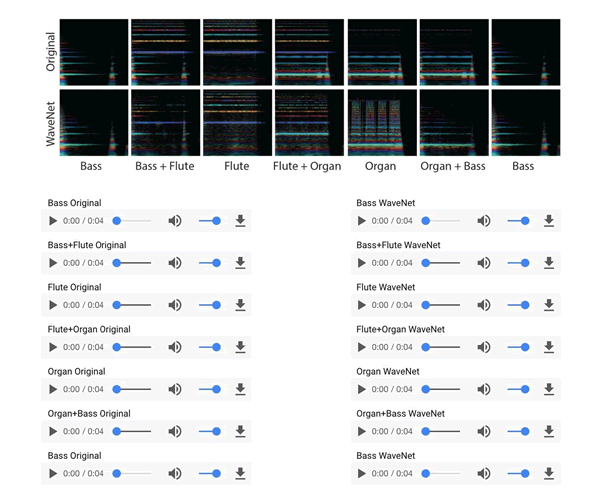
*   你可以看到一个环境中学习的模型如何在另一个环境中重新混合。例如，通过改变扬声器的身份，可以使用 WaveNet 用不同的声音描述同样的事情（[`deepmind.com/blog/wavenet-generative-model-raw-audio/`](https://deepmind.com/blog/wavenet-generative-model-raw-audio/)）。
*   另一个非常有趣的实验是学习乐器的模型，然后重新混合，这样就可以创造出以前从未听过的新乐器。这真的很酷，它打开了一个新世界。
    例如，在这个例子中，把西塔琴和电吉他结合起来，形成一种很酷的新乐器。还不够酷？那么把低音贝斯和狗的叫声结合起来怎么样([`aiexperiments.withgoogle.com/sound-maker/view/`](https://aiexperiments.withgoogle.com/sound-maker/view/))？
    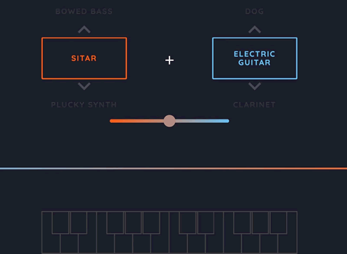