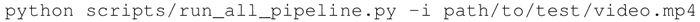

# TensorFlow 实现视频分类的 6 种方法

对视频进行分类是一个活跃的研究领域，因为处理这种类型的问题需要大量的数据。内存需求经常达到现代 GPU 的极限，可能需要在多台机器上进行分布式的训练。

目前学者们正在探索复杂度不断增加的几个方向，来回顾一下：

1.  第一种方法是通过将视频的每一帧视为一幅单独的图像，利用二维 CNN 进行处理。这种方法将视频分类问题简化为图像分类问题。每帧视频图像都有类别输出，并且根据各帧输出的类别，选择频率最高的类别作为视频的分类结果。
2.  第二种方法是创建一个单一的网络，将二维 CNN 与一个 RNN 结合在一起。这个想法是，CNN 将考虑到图像分量，而 RNN 将考虑每个视频的序列信息。这种类型的网络可能非常难以训练，因为要优化的参数数量非常大。
3.  第三种方法是使用三维卷积网络，其中三维卷积网络是二维 CNN 的在 3D 张量（时间，图像宽度，图像高度）上运行的扩展。这种方法是图像分类的另一个自然延伸，但三维卷积网络可能很难训练。
4.  第四种方法基于智能方法的直觉。它们可以用于存储视频中每个帧的离线功能，而不是直接使用 CNN 进行分类。这个想法基于，特征提取可以非常有效地进行迁移学习，如前面章节所示。在提取所有的特征之后，可以将它们作为一组输入传递给 RNN，其将在多个帧中学习序列并输出最终的分类。
5.  第五种方法是第四种方法的简单变体，其中最后一层是 MLP 而不是 RNN。在某些情况下，就计算需求而言，这种方法可以更简单并且成本更低。
6.  第六种方法也是第四种方法的变体，其中特征提取阶段采用三维 CNN 来提取空间和视觉特征，然后将这些特征传递给 RNN 或 MLP。

使用哪种方法取决于具体应用，并没有统一的答案。前三种方法通常计算量更大，而后三种方法计算成本更低，而且性能更好。

本节将展示如何利用论文“[Temporal Activity Detection in Untrimmed Videos with Recurrent Neural Networks](https://arxiv.org/abs/1608.08128)”（Montes，Alberto and Salvador，Amaia and Pascual，Santiago and Giro-i-Nieto，Xavier，2016）中的实验结果实现第六种方法。

这项工作旨在解决 ActivityNet 挑战赛中的问题（[`activity-net.org/challenges/2016/`](http://activity-net.org/challenges/2016/)），重点是从用户生成的视频中识别高层次和目标导向的活动，类似于互联网门户中的活动。面临的挑战是如何在两个不同的任务中生成 200 个活动类别：

*   分类挑战：给定一个长视频，预测视频中的活动标签。
*   检测挑战：给定一个长视频，预测视频中活动的标签和时间范围。

图 1 C3D+RNN 示例
提出的架构由两个阶段组成（如图 1 所示）：

1.  第一阶段将视频信息编码成小视频剪辑的单个矢量表示。为了达到这个目的，使用 C3D 网络。C3D 网络使用 3D 卷积来从视频中提取时空特征，这些特征在前面已被分成 16 帧的剪辑。
2.  第二阶段，一旦提取到视频特征，就要对每个片段上的活动进行分类。为了执行这种分类，使用 RNN。具体来说，使用 LSTM 网络，它尝试利用长期相关性，并且执行视频序列的预测。这是一个训练阶段：

## 具体做法

本节简单总结了网站（[`github.com/imatge-upc/activitynet-2016-cvprw/blob/master/misc/nstep_by_step_guide.md`](https://github.com/imatge-upc/activitynet-2016-cvprw/blob/master/misc/nstep_by_step_guide.md)）中的结果：

1.  从 git 库中克隆压缩包：
    

2.  下载 ActivityNet v1.3 数据集，大小为 600GB：
    

3.  下载 CNN3d 和 RNN 的预训练权重：
    

4.  进行视频分类：
    

如果你对在自己的机器上训练 CNN3D 和 RNN 网络感兴趣，那么可以在互联网上找到本机训练需要使用的特定命令。目的是提供可用于视频分类的不同方法的高级视图。同样，不是仅有一种方法，而是有多种选择，应该根据具体需求选择最佳方案。

CNN-LSTM 体系结构是一个新的 RNN 层，输入变换和循环变换的输入都是卷积的。尽管命名非常相似，但 CNN-LSTM 层不同于 CNN 和 LSTM 的组合。

该模型在论文“[Convolutional LSTM Network：A Machine Learning Approach for Precipitation Nowcasting](https://arxiv.org/abs/1506.04214)”（Xingjian Shi，Zhourong Chen，Hao Wang，Dit-Yan Yeung，Wai-kin Wong，Wang-chun Woo，2015)中被提出。2017 年一些人开始使用此模块的视频进行实验，但这仍是一个非常活跃的研究领域。