# RNN 循环神经网络及原理（详解版）

循环神经网络（Recurrent Neural Network，RNN）很多实时情况都能通过时间序列模型来描述。

例如，如果你想写一个文档，单词的顺序很重要，当前的单词肯定取决于以前的单词。如果把注意力放在文字写作上...一个单词中的下一个字符取决于之前的字符（例如，The quick brown f...，下一个字母是 o 的概率很高），如下图所示。关键思想是在给定上下文的情况下产生下一个字符的分布，然后从分布中取样产生下一个候选字符：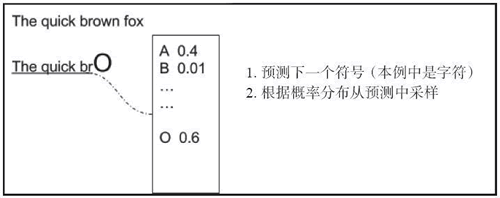图 1 关于“The quick brown fox”句子的预测示例
一个简单的变体是存储多个预测值，并创建一个预测扩展树，如下图所示：
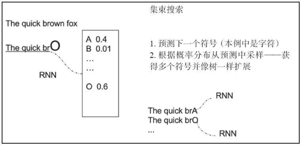
图 2 关于“The quick brown fox”句子的预测树示例
基于序列的模型可以用在很多领域中。在音乐中，一首曲子的下一个音符肯定取决于前面的音符，而在视频领域，电影中的下一帧肯定与先前的帧有关。此外，在某些情况下，视频的当前帧、单词、字符或音符不仅仅取决于过去的信号，而且还取决于未来的信号。

基于时间序列的模型可以用 RNN 来描述，其中，时刻 i 输入为 Xi，输出为 Yi，时刻 [0，i-1] 区间的状态信息被反馈至网络。这种反馈过去状态的思想被循环描述出来，如下图所示：
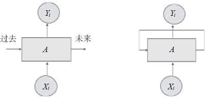图 3 反馈的描述
展开（unfolding）网络可以更清晰地表达循环关系，如下图所示：
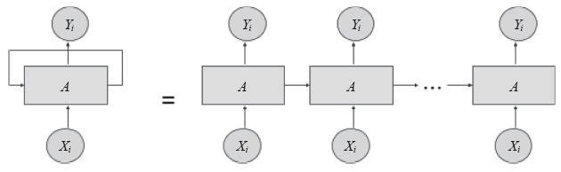
图 4 循环单元的展开
最简单的 RNN 单元由简单的 tanh 函数组成，即双曲正切函数，如下图所示：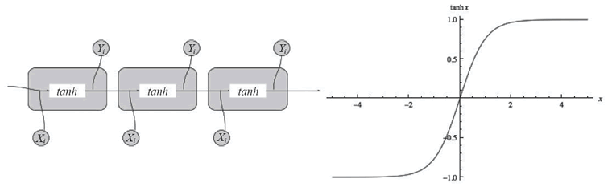
图 5 简单的 tanh 单元

## 梯度消失与梯度爆炸

由于存在两个稳定性问题，训练 RNN 是很困难的。由于反馈环路的缘故，梯度可以很快地发散到无穷大，或者迅速变为 0。如下图所示：
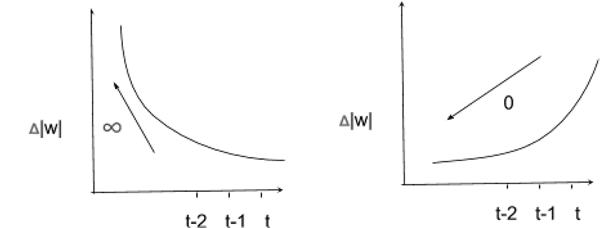
图 6 梯度示例
在这两种情况下，网络将停止学习任何有用的东西。梯度爆炸的问题可以通过一个简单的策略来解决，就是梯度裁剪。梯度消失的问题则难以解决，它涉及更复杂的 RNN 基本单元（例如长短时记忆（LSTM）网络或门控循环单元（GRU））的定义。先来讨论梯度爆炸和梯度裁剪：

梯度裁剪包括对梯度限定最大值，以使其不能无界增长。如下图所示，该方法提供了一个解决梯度爆炸问题的简单方案：
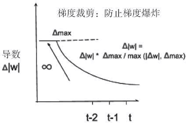
图 7 梯度裁剪示例
解决梯度消失需要一个更复杂的记忆模型，它可以有选择地忘记以前的状态，只记住真正重要的状态。如下图所示，将输入以概率 p∈[0，1] 写入记忆块 M，并乘以输入的权重。

以类似的方式，以概率 p∈[0，1] 读取输出，并乘以输出的权重。再用一个概率来决定要记住或忘记什么：
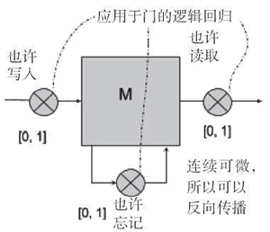
图 8 记忆单元示例

## 长短时记忆网络（LSTM）

长短时记忆网络可以控制何时让输入进入神经元，何时记住之前时序中学到的东西，以及何时让输出传递到下一个时间戳。所有这些决策仅仅基于输入就能自我调整。

乍一看，LSTM 看起来很难理解，但事实并非如此。我们用下图来解释它是如何工作的：
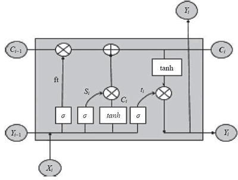
图 9 一个 LSTM 单元的示例
首先，需要一个逻辑函数 σ 计算出介于 0 和 1 之间的值，并且控制哪个信息片段流经 LSTM 门。请记住，logisitic 函数是可微的，所以它允许反向传播。

然后需要一个运算符 ⊗ 对两个相同维数的矩阵进行点乘产生一个新矩阵，其中新矩阵的第 ij 个元素是两个原始矩阵第 ij 个元素的乘积。同样，需要一个运算符 ⊕ 将两个相同维数的矩阵相加，其中新矩阵的第 ij 个元素是两个原始矩阵第 ij 个元素的和。在这些基本模块中，将 i 时刻的输入 x[i] 与前一步的输出 y[i] 放在一起。

方程 f[i]=σ(W[f]·[y[i-1],x[i]]+b[f]) 是逻辑回归函数，通过控制激活门 ⊗ 决定前一个单元状态 C[i-1] 中有多少信息应该传输给下一个单元状态 C[i]（W[f] 是权重矩阵，b[f] 是偏置）。逻辑输出 1 意味着完全保留先前单元状态 C[t-1]，输出 0 代表完全忘记 C[i-1] ，输出（0，1）中的数值则代表要传递的信息量。

接着，方程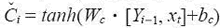根据当前输入产生新信息，方程 s[i]=σ(W[c]·[Y[i-1]，X[i]]+b[c]) 则能控制有多少新信息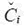通过运算符 ⊕ 被加入到单元状态 C[i] 中。利用运算符 ⊗ 和 ⊕，给出公式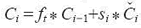对单元状态进行更新。

最后，需要确定当前单元状态的哪些信息输出到 Y[i]。很简单，再次采用逻辑回归方程，通过 ⊗ 运算符控制候选值的哪一部分应该输出。在这里有一点需要注意，单元状态是通过 tanh 函数压缩到 [-1，1]。这部分对应的方程是 Y[i]=t[i]*tanh(C[i])。

这看起来像很多数学理论，但有两个好消息。首先，如果你明白想要达到的目标，那么数学部分就不是那么难；其次，你可以使用 LSTM 单元作为标准 RNN 元的黑盒替换，并立即解决梯度消失问题。因此你真的不需要知道所有的数学理论，你只需从库中取出 TensorFlow LSTM 并使用它。

## 门控循环单元和窥孔 LSTM

近年来已经提出了许多 LSTM 的变种模型，其中有两个很受欢迎：窥孔（peephole）LSTM 允许门层查看单元状态，如下图中虚线所示；而门控循环单元（GRU）将隐藏状态和单元状态合并为一个信息通道。

同样，GRU 和窥孔 LSTM 都可以用作标准 RNN 单元的黑盒插件，而不需要知道底层数学理论。这两种单元都可以用来解决梯度消失的问题，并用来构建深度神经网络。

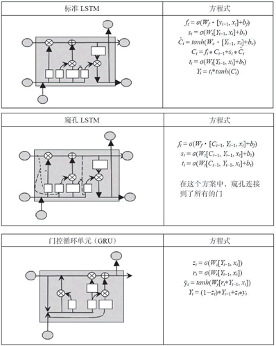图 10 标准 LTSM、窥孔 LTSM、GRU 示例（[点此查看高清大图](http://c.biancheng.net/uploads/allimg/190110/2-1Z11015234a37.gif)）

## 处理向量序列

真正使 RNN 强大的是它能够处理向量序列，其中 RNN 的输入和输出可以是序列，下图很好地说明了这一点，最左边的例子是一个传统（非递归）网络，后面跟着一个序列输出的 RNN，接着跟着一个序列输入的 RNN，其次跟着序列输入和序列输出不同步的 RNN，最后是序列输入和序列输出同步的 RNN。
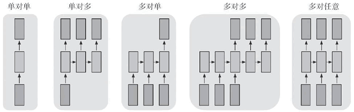
图 11 RNN 序列示例
机器翻译是输入序列和输出序列中不同步的一个例子：网络将输入文本作为一个序列读取，读完全文后输出目标语言。

视频分类是输入序列和输出序列同步的一个例子：视频输入是一系列帧，对于每一帧，在输出中提供分类标签。

如果你想知道更多关于 RNN 的有趣应用，则必读 Andrej Karpathy 的博客 [`karpathy.github.io/2015/05/21/rnn-effectiveness/`](http://karpathy.github.io/2015/05/21/rnn-effectiveness/)，他训练网络写莎士比亚风格的散文（用 Karpathy 的话说：能勉强承认是莎士比亚的真实样品），写玄幻主题的维基百科文章，写愚蠢不切实际问题的定理证明（用 Karpathy 的话说：更多幻觉代数几何），并写出 Linux 代码片段（用 Karpathy 的话说：模型首先逐字列举了 GNU 许可字符，产生一些宏然后隐藏到代码中）。