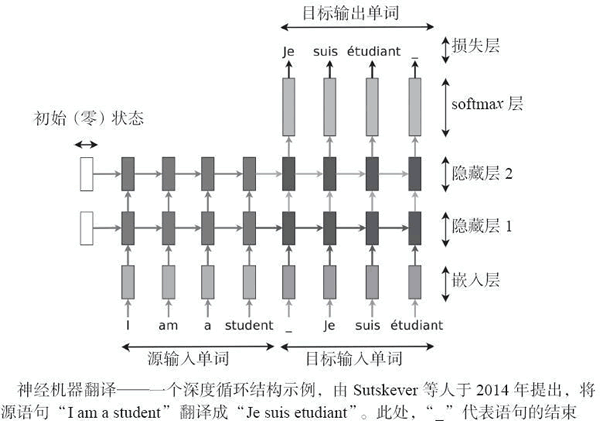

# 神经机器翻译（seq2seq RNN）实现详解

seq2seq 是一类特殊的 RNN，在机器翻译、文本自动摘要和语音识别中有着成功的应用。本节中，我们将讨论如何实现神经机器翻译，得到类似于谷歌神经机器翻译系统得到的结果（[`research.googleblog.com/2016/09/a-neural-network-for-machine.html`](https://research.googleblog.com/2016/09/a-neural-network-for-machine.html)）。

关键是输入一个完整的文本序列，理解整个语义，然后输出翻译结果作为另一个序列。阅读整个序列的想法与以前的架构截然不同，在该架构中，一组固定词汇从一种源语言翻译成目标语言。

本节受到 Minh-Thang Luong 于 2016 年所写的博士论文“[Neural Machine Translation](https://github.com/lmthang/thesis/blob/master/thesis.pdf)”的启发。第一个关键概念是编码器–解码器架构，其中编码器将源语句转换为表示语义的向量，然后这个向量通过解码器产生翻译结果。

编码器和解码器都是 RNN，它们可以捕捉语言中的长距离依赖关系，例如性别一致性和语法结构，而不必事先知道它们，也不需要跨语言进行 1:1 映射。它能够流利地翻译并且具有强大的功能。

图 1 编码器–解码器示例
来看一个 RNN 例子：将 She loves cute cats 翻译成 Elle aime les chats mignons。有两个 RNN：一个充当编码器，一个充当解码器。源语句 She loves cute cats 后面跟着一个分隔符“-”和目标语句 Elle aime les chats mignon。这两个关联语句被输入给编码器用于训练，并且解码器将产生目标语句 Elle aime les chats mignon。当然，需要大量类似例子来获得良好的训练。

图 2 NMT 的序列模型示例

NUM 序列模型，一个深度循环结构示例，用于将源语句“She loves cute cats” 翻译成目标语句“Elle aimel les chats mignons”。解码器侧，前面时序中产生的单词作为输出下一个单词的输入，“_”代表语句的结束。

现在有一些可以使用的 RNN 变体，具体介绍其中的一些：

*   RNN 可以是单向的或双向的，后者将捕捉双向的长时间依赖关系。
*   RNN 可以有多个隐藏层，层数的选择对于优化来说至关重要...更深的网络可以学到更多知识，另一方面，训练需要花费很长时间而且可能会过度拟合。
*   RNN 可以有多个隐藏层，层数的选择对于优化来说至关重要...更深的网络可以学到更多知识，另一方面，训练需要花费很长时间而且可能会过度拟合。
*   RNN 可以具有嵌入层，其将单词映射到嵌入空间中，在嵌入空间中相似单词的映射恰好也非常接近。
*   RNN 可以使用简单的重复性单元、LSTM、窥孔 LSTM 或者 GRU。

仍然考虑博士论文“[Neural Machine Translation](https://github.com/lmthang/thesis/blob/master/thesis.pdf)”，可以使用嵌入层将输入的句子映射到一个嵌入空间。然后，存在两个连接在一起的 RNN——源语言的编码器和目标语言的解码器。如下图所示，有多个隐藏层和两个流动方向：前馈垂直方向连接隐藏层，水平方向是将知识从上一步转移到下一步的循环部分。

图 3 神经机器翻译示例
本节使用 NMT（Neural Machine Translation，神经机器翻译），这是一个在 TensorFlow 上在线可得的翻译演示包。

NMT 可通过[`github.com/tensorflow/nmt/`](https://github.com/tensorflow/nmt/) 获取，具体代码可通过 GitHub 获取。

## 具体实现过程

1.  从 GitHub 克隆 NMT：
    

2.  下载一个训练数据集。在这个例子中，使用训练集将越南语翻译成英语，其他数据集可以在[`nlp.stanford.edu/projects/nmt/`](https://nlp.stanford.edu/projects/nmt/)上获得，如德语和捷克语：
    

3.  参考[`github.com/tensorflow/nmt/`](https://github.com/tensorflow/nmt/)，这里将定义第一个嵌入层，嵌入层将输入、词汇量尺寸 V 和期望的输出尺寸嵌入到空间中。词汇量尺寸 V 中只有最频繁的单词才考虑被嵌入，所有其他单词则被打上 unknown 标签。在本例中，输入是 time-major，这意味着 max time 是第一个输入参数（[`www.tensorflow.org/api_docs/python/tf/nn/dynamic_rnn`](https://www.tensorflow.org/api_docs/python/tf/nn/dynamic_rnn)）：
    

4.  仍然参考 [`github.com/tensorflow/nmt/`](https://github.com/tensorflow/nmt/)，这里定义一个简单的编码器，它使用 tf.nn.rnn_cell.BasicLSTMCell(num_units) 作为基本的 RNN 单元。虽然很简单，但要注意给定基本 RNN 单元，我们利用 tf.nn.dynamic_rnn 构建了 RNN 的（见[`www.tensorflow.org/api_docs/python/tf/nn/dynamic_rnn`](https://www.tensorflow.org/api_docs/python/tf/nn/dynamic_rnn)）：
    

5.  定义解码器。首先要有一个基本的 RNN 单元：tf.nn.rnn_cell.BasicLSTMCell，以此来创建一个基本的采样解码器 tf.contrib.seq2seq.BasicDecoder，将结果输入到解码器 tf.contrib.seq2seq.dynamic_decode 中进行动态解码。
    

6.  网络的最后一个阶段是 softmax dense 阶段，将最高隐藏状态转换为 logit 向量：
    

7.  定义在训练阶段使用的交叉熵函数和损失：
    

8.  定义反向传播所需的步骤，并使用适当的优化器（本例中使用 Adam）。请注意，梯度已被剪裁，Adam 使用预定义的学习率：
    

9.  运行代码并理解不同的执行步骤。首先，创建训练图，然后开始迭代训练。评价指标是 BLEU（bilingual evaluation understudy），这个指标是评估将一种自然语言机器翻译为另一种自然语言的文本质量的标准，质量被认为是算法的结果和人工操作结果的一致性。正如你所看到的，指标值随着时间而增长：
    

## 解读分析

所有上述代码已经在 [`github.com/tensorflow/nmt/blob/master/nmt/model.py`](https://github.com/tensorflow/nmt/blob/master/nmt/model.py) 上给出。关键是将两个 RNN 打包在一起，第一个是嵌入空间的编码器，将相似的单词映射得很接近，编码器理解训练样例的语义，并产生一个张量作为输出。然后通过将编码器的最后一个隐藏层连接到解码器的初始层可以简单地将该张量传递给解码器。

请注意，学习能够进行是因为损失函数基于交叉熵，且 labels=decoder_outputs。

如下图所示，代码学习如何翻译，并通过 BLEU 指标的迭代跟踪进度：
图 4（[点此查看高清大图](http://c.biancheng.net/uploads/allimg/190110/2-1Z110161SE02.gif)）
下面我们将源语言翻译成目标语言。这个想法非常简单：一个源语句作为两个组合的 RNN（编码器+解码器）的输入。一旦句子结束，解码器将发出 logit 值，采用贪婪策略输出与最大值相关的单词。

例如，单词 moi 作为来自解码器的第一个标记被输出，因为这个单词具有最大的 logit 值。此后，单词 suis 输出，等等：图 5 带概率分布的 NMT 序列模型示例
解码器的输出有多种策略：

1.  贪婪：输出对应最大 logit 值的单词。
2.  采样：通过对众多 logit 值采样输出单词。
3.  集束搜索：有多个预测，因此创建一个可能结果的扩展树。

## 翻译实现过程

1.  制定解码器采样的贪婪策略。这很简单，因为可以使用 tf.contrib.seq2seq.GreedyEmbeddingHelper 中定义的库，由于不知道目标句子的准确长度，因此这里使用启发式方法将其限制为源语句长度的两倍。
    

2.  现在可以运行网络，输入一个从未见过的语句（inference_input_file=/tmp/my_infer_file），并让网络转换结果（inference_output_file=/tmp/nmt_model/output_infer）：
    

两个 RNN 封装在一起形成编码器–解码器 RNN 网络。解码器发出的 logits 被贪婪策略转换成目标语言的单词。作为一个例子，下面显示了一个从越南语到英语的自动翻译的例子：

