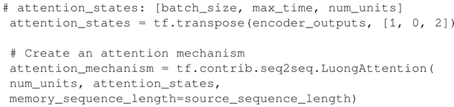
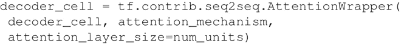

# 注意力机制(基于 seq2seq RNN)详解

本节提出了注意力（Attention）机制，这是神经网络翻译的最新解决方案。

注意力的思想是 2015 年在论文“[Neural Machine Translation by Jointly Learning to Align and Translate](https://arxiv.org/abs/1409.0473)”（Dzmitry Bahdanau，Kyunghyun Cho 和 Yoshua Bengio，ICLR，2015）中提出的，它需要在编码器和解码器 RNN 之间增加额外的连接。事实上，仅将解码器与编码器的最新层连接会存在信息瓶颈，而且不一定能够传递先前编码器层的信息。

下图说明了采用注意力机制的方法：
图 1 引入注意力模型的 NMT 示例
需要考虑以下三个方面：

1.  将当前目标隐藏状态与所有先前的源状态一起使用，以导出注意力权重，用于给先前序列中的信息分配不同的注意力大小。
2.  总结注意力权重的结果创建上下文向量。
3.  将上下文向量与当前目标隐藏状态相结合以获得注意力向量。

## 具体做法

1.  通过使用库 tf.contrib.seq2seq.LuongAttention 来定义注意力机制，该库实现了文献“Effective Approaches to Attention-based Neural Machine Translation”（Minh-Thang Luong，Hieu Pham 和 Christopher D.Manning，2015）中定义的注意力模型：
    

2.  通过一个注意力包装器，使用所定义的注意力机制作为解码器单元进行封装：
    

3.  运行代码查看结果。可以立即注意到注意力机制在 BLEU 评分方面产生了显著的改善：
    

## 解读分析

注意力机制是使用编码器 RNN 内部状态获得的信息，并将该信息与解码器的最终状态进行组合的机制，关键思想是可以对源序列中的信息分配不同的注意力。下图的 BLEU 得分显示了应用注意力机制后的优势。

图 2 使用注意力机制的 BLEU 指标示例（[点此查看高清大图](http://c.biancheng.net/uploads/allimg/190110/2-1Z1101APC38.gif)）

注意到，之前所给出的同样的图中，没有使用注意力机制。

值得注意的是，seq2seq 不仅仅可以用于机器翻译，来看一些例子：

*   Lukasz Kaiser 在论文“[Grammar as a Foreign Language](https://arxiv.org/abs/1412.7449)”中使用 seq2seq 模型构建语法成分解析器，成分解析树将文本分成子句。树中的非终端是短语类型，终端是句子中的单词，边缘未标记。
*   seq2seq 的另一个应用是 SyntaxNet，又名 Parsey McParserFace（一个句法分析器，[`research.googleblog.com/2016/05/announcing-syntaxnet-worlds-most.html`](https://research.googleblog.com/2016/05/announcing-syntaxnet-worlds-most.html)），这是许多 NLU 系统上的一个关键组件。在这个系统中输入一个句子，它会自动给句子中的每一个单词打上 POS（Part-of-Speech）标签，用来描述这些词的句法功能，并在依存句法树中呈现。这些句法关系直接涉及句子的潜在含义。

    下图给出了这个概念的思想：
    图 3 SyntaxNet 示例