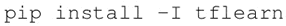
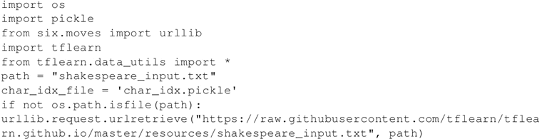
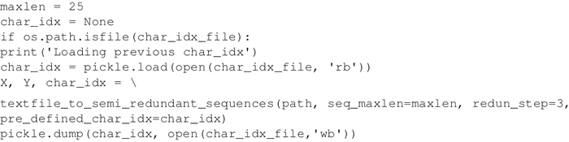
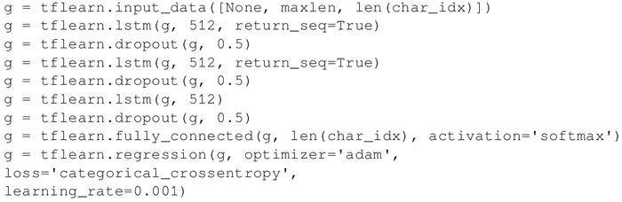
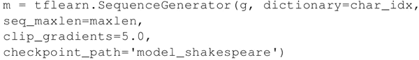
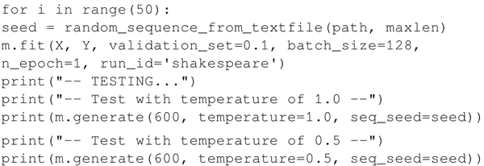
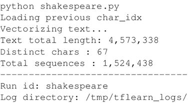
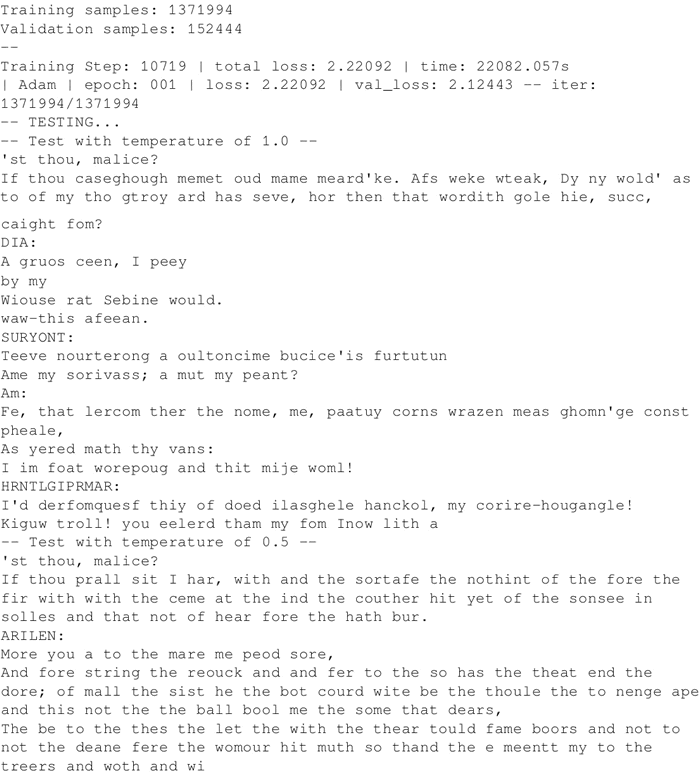
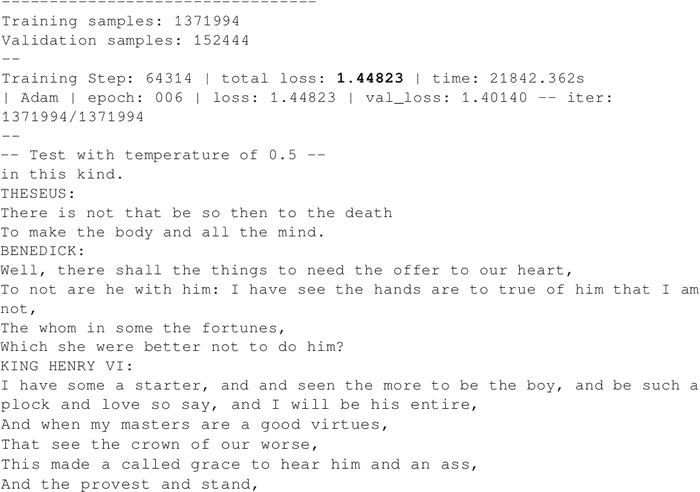

# RNN 训练模型并生成文本过程详解

在本节中，我们将学习如何生成类似于莎士比亚风格的文本。核心思想非常简单：以莎士比亚写的真实文本作为输入，并输入到即将要训练的 RNN 中；然后，用训练好的模型来生成新文本，这些文本看起来像是英国最伟大的作家所写的。

为了简单起见，这里将使用基于 TensorFlow 运行的框架 [TFLearn](http://tflearn.org/)，这里所使用的例子只是标准版的一部分（参考[`github.com/tflearn/tflearn/blob/master/examples/nlp/lstm_generator_shakespeare.py`](https://github.com/tflearn/tflearn/blob/master/examples/nlp/lstm_generator_shakespeare.py)），所开发的模型是字符级 RNN 语言模型，考虑的序列则是字符序列而不是单词序列。

## 具体做法

1.  用 pip 方式安装 TFLearn：
    

2.  导入一些有用的模块，并下载莎士比亚写的文本。本例使用的文本位于[`raw.githubusercontent.com/tflearn/tflearn.github.io/master/resources/shakespeare_input.txt`](https://raw.githubusercontent.com/tflearn/tflearn.github.io/master/resources/shakespeare_input.txt)：
    

3.  将输入文本转换为向量，并通过 `string_to_semi_redundant_sequences()` 返回解析的序列和目标以及关联的字典（函数输出一个元组：包括输入、目标和字典）：
    

4.  定义由三个 LSTM 组成的 RNN，每个 LTSM 有 512 个节点，并返回完整序列而不是仅返回最后一个序列。请注意，使用概率为 50% 的 drop-out 模块来连接 LSTM 模块。最后一层是全连接层，softmax 长度等于字典尺寸。损失函数采用 categorical_crossentropy，优化器采用 Adam：
    

5.  现在可以用库函数 flearn.models.generator.SequenceGenerator(network，dictionary=char_idx，seq_maxlen=maxle，clip_gradients=5.0，checkpoint_path='model_shakespeare') 生成序列：
    

6.  经过 50 次迭代，从输入文本中选取一个随机序列并生成一个新的文本。温度参数控制所创建序列的多样性；接近于 0 的温度创建的序列看起来就像用于训练的样本，温度越高，结果越多样：
    

## 解读分析

当一件新的未知或遗忘的艺术作品需要被鉴定归于某位作者时，就会有著名学者将这件作品与作者的其他作品进行比较。学者们所做的是在作者已知作品的文本序列中寻找共同特征，并希望在鉴定作品中找到相似的特征。

本节的工作方式与之前的相似：RNN 学习莎士比亚作品中的特征，然后这些特征被用来产生新的、从未见过的文本，这些文本很好地代表了最伟大的英国作家的写作风格。来看执行示例：

第一次迭代，此时，网络正在学习一些基本结构，包括虚拟人物（DIA、SURYONT、HRNTLGIPRMAR 和 ARILEN）的对话，但是英语水平还很糟糕，很多单词并不是真正的英文：

经过几次迭代，此时，网络正在学习对话的正确结构，使写出来的英语看起来更像正确的句子，例如：Well，there shall the things to need the offer to our heart 和 There is not that be so then to the death To make the body and all the mind：

