# RNN 循环神经网络实现预测比特币价格过程详解

本节将介绍如何利用 RNN 预测未来的比特币价格。

核心思想是过去观察到的价格时间序列为未来价格提供了一个很好的预估器。给定时间间隔的比特币值通过[`www.coindesk.com/api/`](https://www.coindesk.com/api/)的 API 下载，以下是 API 文档的一部分：

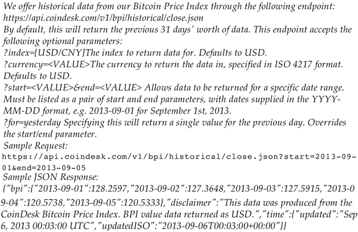

经 MIT 授权许可，本节将使用[`github.com/guillaume-chevalier/seq2seq-signal-prediction`](https://github.com/guillaume-chevalier/seq2seq-signal-prediction)中的代码。

## 具体实现过程

1.  克隆下面的 GitHub 存储库。这是一个鼓励用户尝试 seq2seq 神经网络架构的项目：
    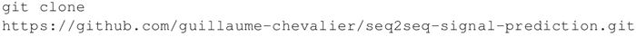

2.  在上述 GitHub 库基础上，考虑使用以下能够下载和标准化比特币历史值（美元或欧元）数据的函数，这些函数在 dataset.py 中定义。训练集和测试集根据 80/20 规律分开，因此，20% 的测试数据是最新的比特币值。每个示例都包含 40 个美元（USD）数据点，特征轴/维度上是欧元（EUR）数据。数据根据均值和标准差进行归一化处理，函数 generate_x_y_data_v4 生成尺寸为 batch_size 的训练数据（或测试数据）的随机样本：
    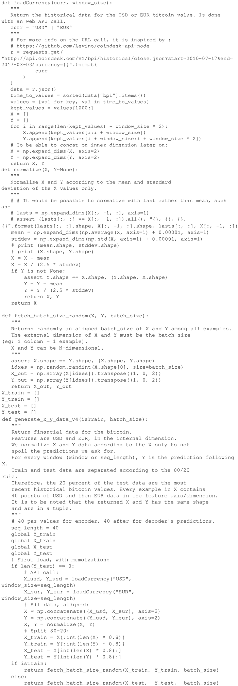

3.  生成训练集、验证集和测试集，并定义一些超参数，例如 batch_size、hidden_dim（RNN 中隐藏神经元的数量）和 layers_stacked_count（堆栈循环单元的数量）。另外，定义一些用于微调优化器性能的参数，例如优化器的学习率、迭代次数、优化器模拟退火的 lr_decay、优化器的动量以及避免过拟合的 L2 正则化。请注意，GitHub 存储库默认 batch_size=5 和 nb_iters=150，但我设置 batch_size=1000 和 nb_iters=100000，已经获得了更好的结果：
    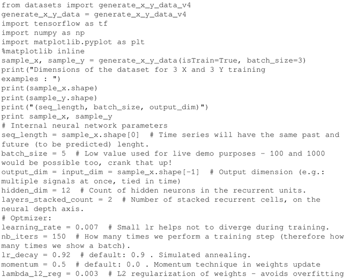

4.  将网络定义为由基本 GRU 单元组成的编码器–解码器。网络由 layers_stacked_count=2 个 RNN 组成，使用 TensorBoard 对网络进行可视化。请注意，hidden_dim=12 是循环单元中隐藏的神经元：
    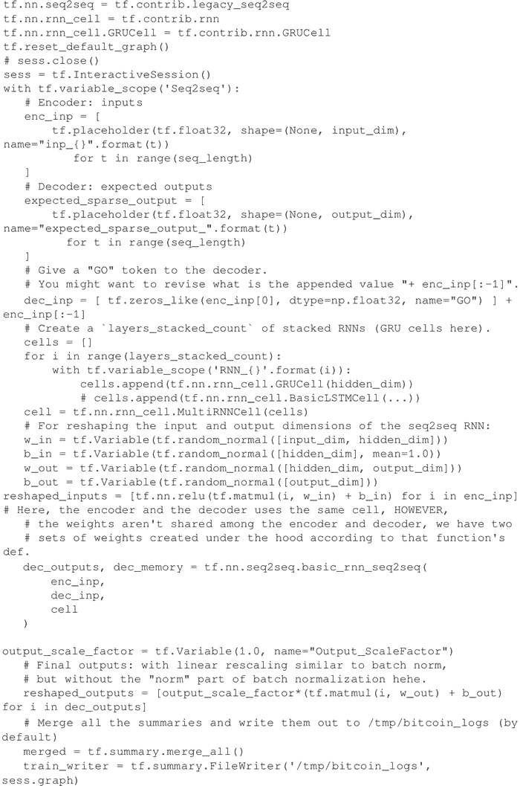

5.  运行 TensorBoard 并可视化由 RNN 编码器和 RNN 解码器组成的网络：
    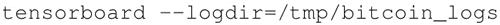

6.  以下是代码的流程：
    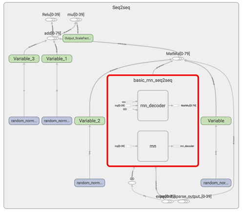
    图 1 TensorBoard 中的比特币价格预测示例（[点此查看高清大图](http://c.biancheng.net/uploads/allimg/190111/2-1Z111100133E0.gif)）

7.  定义一个 L2 正则化损失函数，以避免过度拟合并具有更好的泛化能力。优化器选择 RMSprop，其中 learning_rate、decay 和 momentum 的值在第 3 步中已给出：
    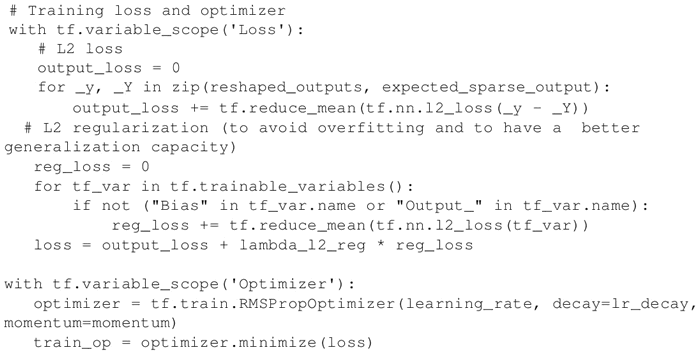

8.  生成训练数据并在数据集的 batch_size 示例上运行优化程序，为批量训练做好准备。同样，从数据集的 batch_size 示例生成测试数据，为测试做好准备。训练运行迭代次数为 nb_iters+1，并每训练 10 次迭代来测试一次结果：
    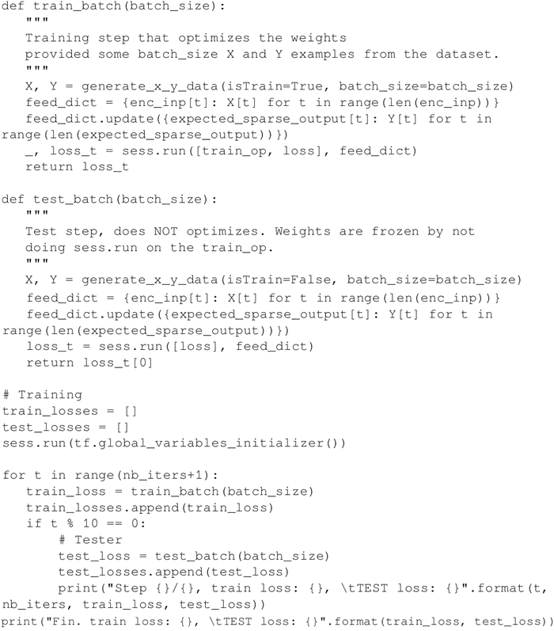

9.  将 n_predictions 测试结果可视化，nb_predictions 取 5，预测值用黄色圆点实际值用蓝色×符号表示。请注意，预测从直方图中的最后一个蓝点开始，可以看出，即使是这个简单的模型也是相当准确的：
    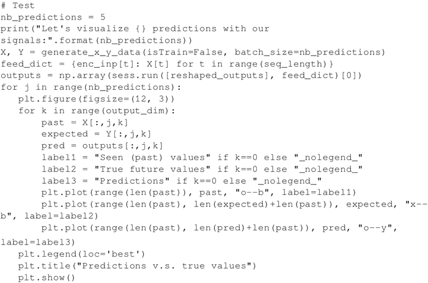
     结果如下：
    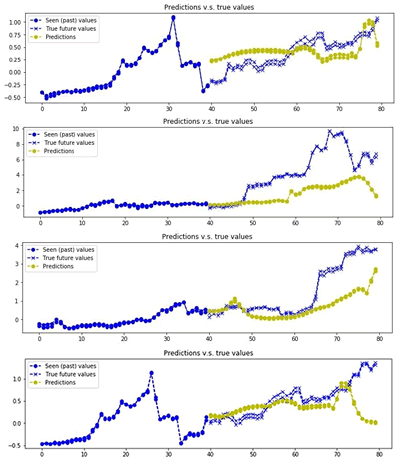
    图 2 比特币价格预测示例（[点此查看高清大图](http://c.biancheng.net/uploads/allimg/190111/2-1Z1111004424R.gif)）

## 解读分析

比特币价格的预测是使用一个基于 GRU 基本单元的 RNN 组成的编码器–解码器。RNN 非常擅长学习序列，事实上即使是只有两层和 12 个 GRU 单元的简单模型，比特币价格预测也是相当准确的。当然，这个预测代码并不是鼓励投资比特币，而只是讨论深度学习方法。而且，为了确认是否存在数据过度拟合的情况，需要进行更多的实验。