# 主成分分析法（PCA）原理和步骤（超级详细）

主成分分析（Principal Component Analysis，PCA）是一种多变量统计方法，它是最常用的降维方法之一，通过正交变换将一组可能存在相关性的变量数据转换为一组线性不相关的变量，转换后的变量被称为主成分。

可以使用两种方法进行 PCA，分别是特征分解或奇异值分解（SVD）。

## 准备工作

PCA 将 n 维输入数据缩减为 r 维，其中 r<n。简单地说，PCA 实质上是一个基变换，使得变换后的数据有最大的方差，也就是通过对坐标轴的旋转和坐标原点的平移使得其中一个轴（主轴）与数据点之间的方差最小，坐标转换后去掉高方差的正交轴，得到降维数据集。

这里使用 SVD 方法进行 PCA 降维，假定有 p×n 维数据样本 X，共有 p 个样本，每行是 n 维，p×n 实矩阵可以分解为：
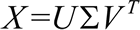
 这里，正交阵 U 的维数是 p×n，正交阵 V 的维数是 n×n（正交阵满足：UU^T=V^TV=1），Σ 是 n×n 的对角阵。接下来，将 Σ 分割成 r 列，记作 Σ[r]；利用 U 和 V 便能够得到降维数据点 Y[r]：
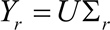

## 具体做法

1.  导入所需的模块，除了 TensorFlow，还需要 numpy 进行基本的矩阵计算，用 matplotlib、mpl_toolkit 和 seaborn 绘制图形：
    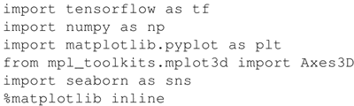

2.  加载数据集，此处使用常用的 MNIST 数据集：
    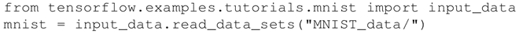

3.  定义类 TF_PCA，此类初始化如下：
    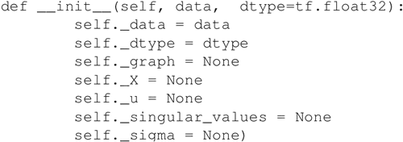

4.  定义 fit 函数计算输入数据的 SVD。定义计算图，以此计算奇异值和正交矩阵 U，self._X 以占位符的形式读入数据 self.data，tf.svd 以递减顺序返回形状为 [...，p] 的奇异值 s（singular_values），然后使用 tf.diag 将奇异值转换为对角矩阵：
    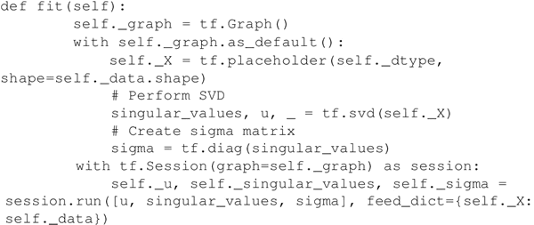

5.  现在有了 sigma 矩阵、正交矩阵 U 和奇异值，下面定义 reduce 函数来计算降维数据。该方法需要 n_dimensions 和 keep_info 两个输入参数之一，n_dimensions 参数表示在降维数据中保持的维数，keep_info 参数表示保留信息的百分比（0.8 意味着保持 80% 的原始数据）。该方法创建一个计算图，对 sigma 矩阵进行分割并计算降维数据集 Yr：
    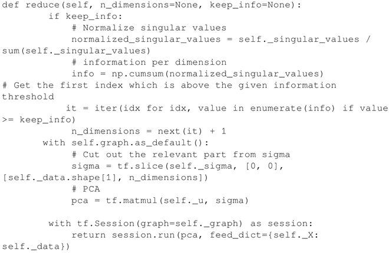

6.  TF_PCA 类已经准备就绪，下面会将 MNIST 的每个输入数据从维度为 784（28×28）减小到每个维度为 3。在这里为了对比效果只保留了 10% 的信息，但通常情况下需要保留大约 80% 的信息：
    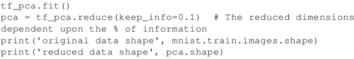
     代码输出如下：
    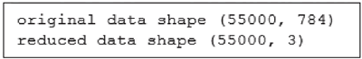

7.  绘制三维空间中的 55000 个数据点：
    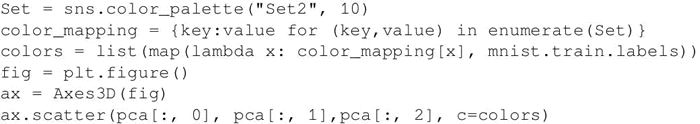
     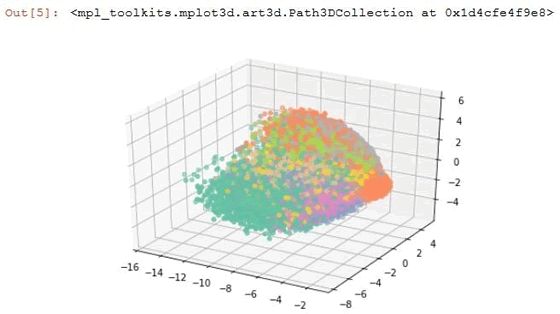

## 解读分析

前面的代码对 MNIST 图像进行了降维操作。原图的大小为 28×28，利用 PCA 方法把尺寸压缩得更小。通常在图像处理中经常用到降维操作，因为太大的图像尺寸包含大量的冗余数据。

TensorFlow 中的 embeddings 技术可以实现从对象到向量的映射，TensorBoard 中的 Embedding Projector 可以交互式地对模型的 embeddings 进行可视化，并提供了三种降维的方法：PCA、t-SNE 和自定义方式，可以使用 Embeddings Projector 来得到与上面类似的结果。

这需要从 tensorflow.contrib.tensorboard.plugins 中导入 projector，并且通过简单的三个步骤就可以完成：

1.  加载数据：
    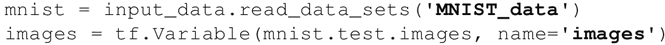

2.  新建一个 metadata 文件（用制表符分隔的 .tsv 文件）：
    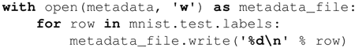

3.  将 embeddings 保存在 Log_DIR 中：
    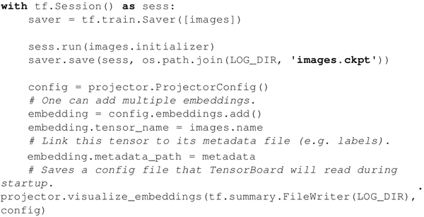

现在就可以使用 TensorBoard 查看 embeddings 了，通过命令行 tensorboard--logdir=log，在 Web 浏览器中打开 TensorBoard，然后进入 EMBEDDINGS 选项卡。下图显示的就是使用 PCA 方法运算的前三个主成分为轴的 TensorBoard 投影：
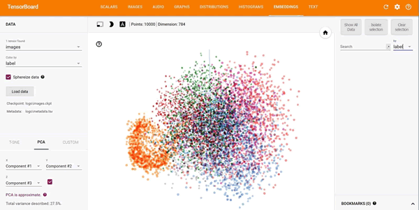
（[点此查看高清大图](http://c.biancheng.net/uploads/allimg/190111/2-1Z1111049103c.jpg)）