# k 均值聚类算法原理和（TensorFlow）实现（无师自通）

顾名思义，k 均值聚类是一种对数据进行聚类的技术，即将数据分割成指定数量的几个类，揭示数据的内在性质及规律。

我们知道，在机器学习中，有三种不同的学习模式：监督学习、无监督学习和强化学习：

1.  监督学习，也称为有导师学习，网络输入包括数据和相应的输出标签信息。例如，在 MNIST 数据集中，手写数字的每个图像都有一个标签，代表图片中的数字值。
2.  强化学习，也称为评价学习，不给网络提供期望的输出，但空间会提供给出一个奖惩的反馈，当输出正确时，给网络奖励，当输出错误时就惩罚网络。
3.  无监督学习，也称为无导师学习，在网络的输入中没有相应的输出标签信息，网络接收输入，但既没有提供期望的输出，也没有提供来自环境的奖励，神经网络要在这种情况下学习输入数据中的隐藏结构。无监督学习非常有用，因为现存的大多数数据是没有标签的，这种方法可以用于诸如模式识别、特征提取、数据聚类和降维等任务。

k 均值聚类是一种无监督学习方法。

还记得哈利波特故事中的分院帽吗？那就是聚类，将新学生（无标签）分成四类：格兰芬多、拉文克拉、赫奇帕奇和斯特莱林。

人是非常擅长分类的，聚类算法试图让计算机也具备这种类似的能力，聚类技术很多，例如层次法、贝叶斯法和划分法。k 均值聚类属于划分聚类方法，将数据分成 k 个簇，每个簇有一个中心，称为质心，k 值需要给定。

k 均值聚类算法的工作原理如下：

1.  随机选择 k 个数据点作为初始质心（聚类中心）。
2.  将每个数据点划分给距离最近的质心，衡量两个样本数据点的距离有多种不同的方法，最常用的是欧氏距离。
3.  重新计算每个簇的质心作为新的聚类中心，使其总的平方距离达到最小。
4.  重复第 2 步和第 3 步，直到收敛。

## 准备工作

使用 TensorFlow 的 Estimator 类 KmeansClustering 来实现 k 均值聚类，具体实现可参考[`github.com/tensorflow/tensorflow/blob/r1.3/tensorflow/contrib/learn/python/learn/estimators/kmeans.py`](https://github.com/tensorflow/tensorflow/blob/r1.3/tensorflow/contrib/learn/python/learn/estimators/kmeans.py)，可以直接进行 k 均值聚类和推理。根据 TensorFlow 文档，KmeansClustering 类对象可以使用以下 __init__ 方法进行实例化： 

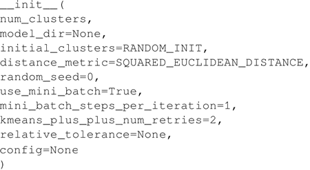

TensorFlow 文档对这些参数的定义如下：

*   num_clusters：要训练的簇数。
*   model_dir：保存模型结果和日志文件的目录。
*   initial_clusters：指定如何对簇初始化，取值请参阅 clustering_ops.kmeans。
*   distance_metric：聚类的距离度量方式，取值请参阅 clustering_ops.kmeans。
*   random_seed：Python 中的整数类型，用于初始化质心的伪随机序列发生器的种子。
*   use_mini_batch：如果为 true，运行算法时分批处理数据，否则一次使用全部数据集。
*   mini_batch_steps_per_iteration：经过指定步数后将计算的簇中心更新回原数据。更多详细信息参见 clustering_ops.py。
*   kmeans_plus_plus_num_retries：对于在 kmeans++ 方法初始化过程中采样的每个点，该参数指定在选择最优值之前从当前分布中提取的附加点数。如果指定了负值，则使用试探法对 O(log(num_to_sample)) 个附加点进行抽样。
*   relative_tolerance：相对误差，在每一轮迭代之间若损失函数的变化小于这个值则停止计算。有一点要注意就是，如果将 use_mini_batch 设置为 True，程序可能无法正常工作。

配置：请参阅 Estimator。

TensorFlow 支持将欧氏距离和余弦距离作为质心的度量，KmeansClustering 类提供了多种交互方法。在这里使用 fit()、clusters() 和 predict_clusters_idx() 方法：
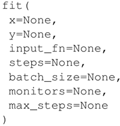
根据 TensorFlow 文档描述，需要给 fit() 提供 input_fn() 函数，cluster 方法返回簇质心，predict_cluster_idx 方法返回得到簇的索引。

## 具体做法

1.  与以前一样，从加载必要的模块开始，这里需要 TensorFlow、NumPy 和 Matplotlib。这里使用鸢尾花卉数据集，该数据集分为三类，每类都是指一种鸢尾花卉，每类有 50 个实例。可以从[`archive.ics.uci.edu/ml/datasets/iris`](https://archive.ics.uci.edu/ml/datasets/iris)上下载 .csv 文件，也可以使用 sklearn 库的数据集模块（scikit-learn）来加载数据：
    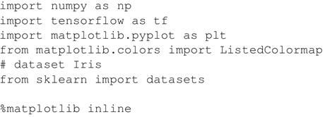

2.  加载数据集：
    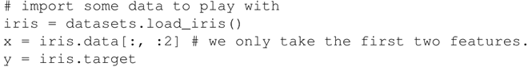

3.  绘出数据集查看一下：
    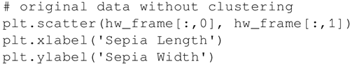
     代码输出如下：
    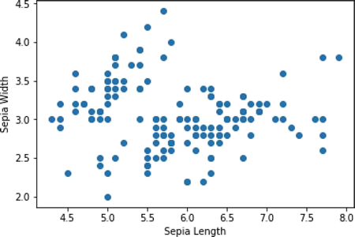

4.  可以看到数据中并没有明显可见的分类。定义 input_fn 来给 fit() 方法输入数据，函数返回一个 TensorFlow 常量，用来指定 x 的值和维度，类型为 float。
    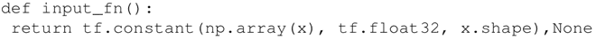

5.  开始使用 KmeansClustering 类，分为 3 类，设置 num_clusters=3。通常情况下事先并不知道最优的聚类数量，在这种情况下，常用的方法是采用肘部法则（elbow method）来估计聚类数量：
    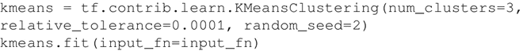

6.  使用 clusters() 方法找到这些簇，使用 predict_cluster_idx() 方法为每个输入点计算分配的簇索引：
    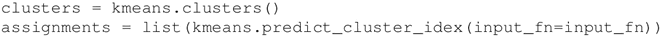

7.  对创建的簇进行可视化操作，创建一个包装函数 ScatterPlot，它将每个点的 X 和 Y 值与每个数据点的簇和簇索引对应起来：
    
     使用下面的函数画出簇：
    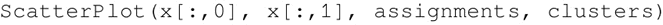
     结果如下：
    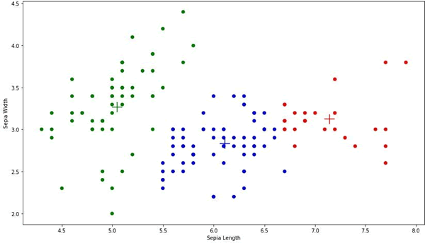

    其中“+”号代表三个簇的质心。

## 解读分析

上面的案例中使用 TensorFlow Estimator 的 k 均值聚类进行了聚类，这里是提前知道簇的数目，因此设置 num_clusters=3。但是在大多数情况下，数据没有标签，我们也不知道有多少簇存在，这时候可以使用肘部法则确定簇的最佳数量。

肘部法则选择簇数量的原则是减少距离的平方误差和（SSE），随着簇数量 k 的增加，SSE 是逐渐减小的，直到 SSE=0，当 k 等于数据点的数量时，每个点都是自己的簇。

这里想要的是一个较小的 k 值，而且 SSE 也较小。在 TensorFlow 中，可以使用 KmeansClustering 类中定义的 score() 方法计算 SSE，该方法返回所有样本点距最近簇的距离之和：
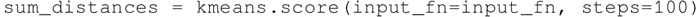
 对于鸢尾花卉数据，如果针对不同的 k 值绘制 SSE，能够看到 k=3 时，SSE 的变化是最大的；之后变化趋势减小，因此肘部 k 值可设置为 3：

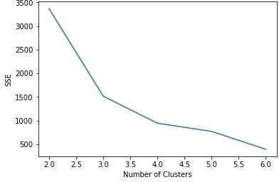
k 均值聚类因其简单、快速、强大而被广泛应用，当然它也有不足之处，最大的不足就是用户必须指定簇的数量；其次，算法不保证全局最优；再次，对异常值非常敏感。