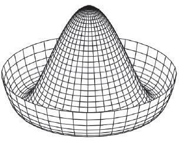

# SOM 自组织映射法原理及（TensorFlow）实现详解

自组织映射（SOM）网络，也被称为 Kohonen 网络或者胜者独占单元（WTU），在大脑中，不同的感官输入以拓扑顺序的方式呈现，是受人脑特征启发而提出的一种非常特殊的神经网络。

与其他神经网络不同，SOM 神经元之间并不是通过权重相互连接的，相反，它们能够影响彼此的学习。SOM 最重要的特点是神经元以拓扑方式表示所学到的输入信息。

在 SOM 中，神经元通常放置在（一维或二维）网格的节点处，更高的维数也可以用，但实际很少使用。网格中的每个神经元都可以通过权重矩阵连接到所有输入单元。下图中有 3×4（12）个神经元和 7 个输入，为了清晰只画出了所有输入连接到一个神经元的权重向量，在这种情况下，每个神经元将拥有 7 个权值，因此权重矩阵维数为 12×7。

 SOM 通过竞争机制进行学习，可以认为它是 PCA 的非线性推广，因此 SOM 可以像 PCA 一样用于降维。

## SOM 工作原理

先来了解它是如何工作的，用随机值或从输入中随机采样对连接权重进行初始化，网格中的每个神经元都被赋予一个位置。数据输入后，测量输入向量（X）和所有神经元权向量（W）之间的距离，与输入数据距离最小的神经元为胜者（WTU），距离度量如下：

 其中，d[j] 是神经元 j 的权重与输入 X 之间的距离，最小距离的神经元是胜者。

第二步，调整获胜神经元及其邻域神经元的权重，以确保如果下一次是相同的输入，则胜者还是同一个神经元。网络采用邻域函数 Λ(r) 确定哪些邻域神经元权重需要修改，通常使用高斯墨西哥帽函数作为邻域函数，数学表达式如下：

 其中，σ 是随时间变化的神经元影响半径，d 是距离获胜神经元的距离：
 邻域函数的一个重要特性是它的半径随时间而减小，这样刚开始时较多邻域神经元权重被修改，但是随着网络的学习，最终只有少量的神经元的权重被修改（有时只有一个或没有）。权重的改变由下式计算：

 按照这个方法继续处理输入，重复执行给定的迭代次数。在迭代过程中利用一个与迭代次数相关的因子来减少学习率和影响半径。

## 具体实现

1.  首先导入必需的模块：
    

2.  声明类 WTU 来执行 SOM 的功能。实例化时，参数 m×n 为二维 SOM 网格的大小，dim 为输入数据的维数，num_interations 为迭代次数：
    

    该方法中还定义了计算图和会话。

3.  如果没有提供 sigma 值，则采用默认值，通常是 SOM 网格最大维数的一半：
    

4.  在计算图中先定义权重矩阵变量和输入，然后计算获胜者并更新获胜者和它近邻神经元的权重。由于 SOM 具有拓扑映射，此处通过增加操作来获取神经元的拓扑定位：
    

5.  在类中定义 fit() 方法，执行默认计算图中声明的训练操作，同时还计算质心网格：
    

6.  定义一个函数来获取二维网格中获胜神经元的索引和位置：
    

7.  定义一些辅助函数来执行网格中神经元的二维映射，并将输入向量映射到二维网格中的相关神经元中：
    

8.  现在我们的 WTU 类已经可以使用了，从 .csv 文件中读取数据并将其标准化：
    

9.  使用 WTU 类进行降维，并将其排列在一个拓扑图中：
    
     最后绘图如下：
    

## 总结

SOM 是一个计算密集型网络，因此对于大型数据集并不实用，不过，该算法很容易理解，很容易发现输入数据之间的相似性。因此被广泛用于图像分割和自然语言处理的单词相似性映射中。