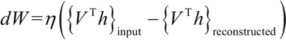

# 受限玻尔兹曼机（RBM）训练详解

受限玻尔兹曼机（RBM）是一个两层神经网络，第一层被称为可见层，第二层被称为隐藏层，因为网络只有两层，所以又被称为浅层神经网络。

该模型最早由 Paul Smolensky 于 1986 年提出（他称其为 Harmony 网络），此后 Geoffrey Hinton 在 2006 年提出了对比散度（Contrastive Divergence，CD）方法对 RBM 进行训练。可见层中的每个神经元与隐藏层中的所有神经元都相连接，但是同一层的神经元之间无连接，所有的神经元输出状态只有两种。

RBM 可以用于降维、特征提取和协同过滤，RBM 的训练可以分成三部分：正向传播、反向传播和比较。下面看看 RBM 的表达式。

正向传播：可见层（V）已知，利用权重（W）和偏置（c）采样出隐藏层（h0），根据下式的随机概率（σ 是随机概率），隐藏单元开启或关闭：

 反向传播：反过来，隐藏层 h0 已知，通过相同的权重 W 采样出可见层，但是偏置 c 不同，以此重建输入。采样概率为：

 这两个传递过程重复 k 步或直到收敛，研究表明，k=1 就已经能给出很好的结果，所以此处设置 k=1。

RBM 模型是一个基于能量的模型，对于一组给定的状态（可见向量 V 和隐藏向量）可构造能量函数：

 与每个可见向量 V 相关联的是自由能量，一个单独配置的能量，要想与其他含有 V 的配置的能量相等，则：

 使用对比发散度目标函数，即 Mean(F(V[original]))-Mean(F(V[constructed]))，则权重的变化由下式给出：

 其中，η 是学习率，偏置 b 和 c 也存在类似表达式。

## 具体做法

1.  导入模块：
    

2.  编写一个类 RBM 来完成主要工作。__init__ 中将构建完整的计算图、正向传播、反向传播和目标函数，此处使用 TensorFlow 内置的优化器来更新权重和偏置：
    

3.  在 RBM 类中定义 fit() 方法，在 __init__ 中声明所有的操作之后，训练操作就是简单地在会话中调用 train_op。我们使用批量训练：
    

4.  定义其他辅助函数计算 logit 误差，并从网络中返回重建的图像：
    

5.  加载 MNIST 数据集：
    

6.  在 MNIST 数据集上训练 RBM：
    

7.  损失函数随着训练次数的变化如下：
    

由于能够重建图像，RBM 可用于从现有数据中生成更多的数据。通过下面的画图代码对比原始和重建的 MNIST 图像：

 结果如下：
