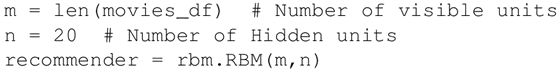
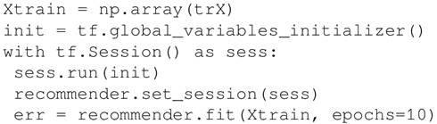
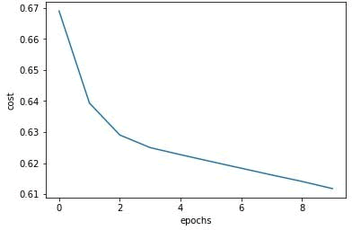
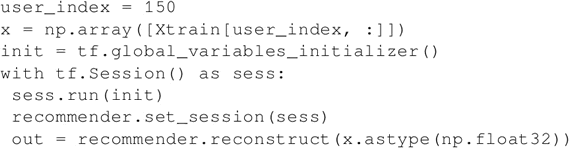
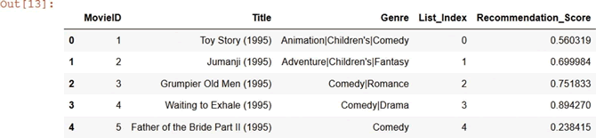

# 基于 RBM 受限玻尔兹曼机实现推荐系统

网络零售商利用推荐系统向顾客推荐产品，例如，亚马逊会告诉你购买这个产品的其他顾客对哪些产品感兴趣，Netflix 根据你观看的内容以及其他有同样兴趣的 Netflix 用户观看过的内容向你推荐电视剧和电影。

这些推荐系统都是基于协同过滤进行推荐的，在协同过滤中，系统根据用户过去的行为建立一个模型。这里利用上一节中的 RBM 模型，建立一个基于协同过滤的推荐系统用于推荐电影。存在的主要问题就是大多数用户不会评价所有的产品/电影，大部分数据是缺失的。如果有 M 个产品和 N 个用户，那么需要建立一个 N×M 的矩阵，矩阵中包括用户已知的评分，未知则置为 0。

## 准备工作

使用协同过滤构建推荐系统，首先准备数据。

此处使用从 [`grouplens.org/datasets/movielens/`](https://grouplens.org/datasets/movielens/) 获取的电影数据为例，该数据由 movies.dat 和 ratings.dat 两个.dat 文件组成，movies.dat 文件包含三列，分别为 3883 部电影的影片 ID、标题和类型，ratings.dat 文件包含四列，分别为用户 ID、影片 ID、评分和时长。

现在合并这两个数据文件来构建一个矩阵，其中，每个用户都拥有对所有 3883 个电影的评分。但是用户通常不会对所有电影进行评分，所以只有某些电影的评分是非零的（需要标准化），而其余的则是零，为 0 的这部分将不会对隐藏层产生影响。

## 具体做法

1.  使用上一节中创建的 RBM 类。先定义 RBM 网络，可见单元的数量是电影的数量 3883（movies_df 是从 movies.dat 文件读取的数据结构）：
    

2.  使用 Pandas 的 merge 和 groupby 命令创建一个列表 trX，存放 1000 名左右用户的用户影片评分，注意这里进行了标准化，列表大小是 1000×3883，用来训练 RBM：
    

3.  随着训练次数的增加，cross-logit 误差在减小，如下图所示：
    

4.  网络训练好后，对随机选择的一个用户（例如 ID 为 150）进行电影推荐：
    

5.  可以看到这个用户的推荐结果，推荐分数如下：
    

#### 知识扩展

Geoffrey Hinton 教授带领多伦多大学团队赢得了求解最优协同过滤的 Netflix 竞赛，他们的算法使用 RBM 预测用户对电影的评分（[`en.wikipedia.org/wiki/Netflix_Prize`](https://en.wikipedia.org/wiki/Netflix_Prize)）。他们的工作详情可以从他们的论文中找到，网址为[`www.cs.toronto.edu/~hinton/absps/netflixICML.pdf`](http://www.cs.toronto.edu/~hinton/absps/netflixICML.pdf)。

一个 RBM 隐藏单元的输出可以被送到另一个 RBM 的可见单元，重复这个过程就形成了堆叠 RBM，堆叠 RBM 中的每一个 RBM 都是独立训练的，无视其他 RBM 的存在。深度信任网络（DBN）就是由一系列 RBM 堆叠而成，DBN 可以使用有监督或无监督的方法进行训练，下一节中将了解更多信息。