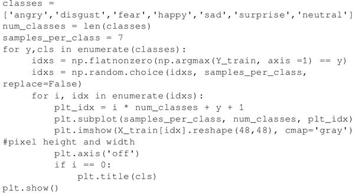

# 基于 DBN 实现情绪检测（详解版）

本节首先介绍如何利用堆叠 RBM 创建 DBN，并利用 DBN 检测情绪。

这里采用了两种不同的学习模式：首先，使用无监督学习逐一预训练 RBM，然后用监督学习训练 MLP 层。

## 准备工作

使用上一节中创建的 RBM 类，唯一的改动就是训练后不需要重建图像。此处堆叠 RBM 将数据一直向前传递到 DBN 的最后一层——MLP 层。类中不再使用 reconstruct() 函数，并增加了 rbm_output() 函数：

数据使用 Kaggle 面部表情识别数据，可从地址 [`www.kaggle.com/c/challenges-in-representation-learning-facial-expression-recognition-challenge`](https://www.kaggle.com/c/challenges-in-representation-learning-facial-expression-recognition-challenge) 获得，数据的描述如下：

*   该数据集由 48×48 像素的面部灰度图像组成，面部已经过自动调整，大致居中，并在每张图像中占据大致相同的空间。任务是根据面部表情显示的情绪将每个人脸分类成七个类别之一（0=生气，1=厌恶，2=恐惧，3=快乐，4=悲伤，5=惊奇，6=平静）。
*   train.csv 包含两列：“情绪”和“像素”，“情绪”列包含从 0 到 6（包括 0 和 6）的数字代码，代表图像中的情绪，“像素”列是用引号括起来的字符串，字符串的内容是按行定序的用空格分隔的像素值。test.csv 则只包含“像素”列，任务就是预测情绪列。
*   训练集由 28709 个样本组成，最后的测试集由 3589 个样本组成，用来评比出比赛的冠军。
*   这个数据集由 Pierre-Luc Carrier 和 Aaron Courville 编写，是一个正在进行的研究项目的一部分，他们慷慨地为研讨会组织者提供了数据集的初步版本供本次比赛使用。

完整的数据在 fer2013.csv 文件中，从其中分离出训练、验证和测试数据：

 需要对数据进行预处理，将像素和情绪标签分开。为此，构建两个函数，函数 dense_to_one_hot() 为标签执行独热编码，函数 preprocess_data() 将每个像素分隔成一个数组，利用这两个函数生成训练、验证和测试数据集的输入特征和标签：

使用前面代码中定义的函数获得训练所需格式的数据。情绪检测 DBN 模型的构建原则基本与这篇关于 MNIST 的论文相似：[`www.cs.toronto.edu/~hinton/absps/fastnc.pdf`](https://www.cs.toronto.edu/~hinton/absps/fastnc.pdf)。

## 具体做法

1.  导入依赖库 TensorFlow、NumPy 和 Pandas 来读取 .csv 文件，还需导入 Matplolib：
    

2.  使用辅助函数 preprocess_data() 获得训练、验证和测试数据：
    

3.  大致查看一下数据，绘制均值图像，并输出训练、验证和测试数据集中的图像数量：
    
     得到结果如下：
4.  查看训练样本中的图像及其标签：
    
     效果图如下：

5.  定义堆叠 RBM 的结构，每层的 RBM 将前一个 RBM 的输出作为其输入：
    
     其中包含了三个 RBM：第一个 RBM 带有 2304（48×48）个输入和 1500 个隐藏单元，第二个 RBM 带有 1500 个输入和 700 个隐藏单元，第三个 RBM 带有 700 个输入和 400 个隐藏单元。
6.  逐层训练每个 RBM，训练方法为贪婪训练。在原论文中，对 MNIST 进行训练时每个 RBM 的训练次数是 30，此处增加训练次数应该能提高网络的性能：
    

7.  定义 DBN 类，用三层 RBM 和两个 MLP 层来构建 DBN，RBM 层的权重是从预训练的 RBM 中加载的。同时也声明了 DBN 训练和预测的方法；网络利用最小化均方损失函数的方法进行微调：
    

8.  实例化 DBN 对象并进行训练，预测测试数据的标签：
    

## 解读分析

RBM 使用无监督学习来学习出模型的隐藏特征，然后将预训练的 RBM 与全连接层一起进行微调。

这里的准确度在很大程度上取决于图像表示。在前面的章节中没有进行图像处理，只有缩放比例为 0 到 1 之间的灰度图像，但是如果按照链接[`deeplearning.net/wp-contenthttp://c.biancheng.net/uploads/2013/03/dlsvm.pdf`](http://deeplearning.net/wp-contenthttp://c.biancheng.net/uploads/2013/03/dlsvm.pdf)中所陈述的增加图像处理，则精确度会进一步提高。因此在 preprocess_data 函数中将图像与 100.0/255.0 相乘，并添加如下几行代码：

