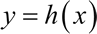
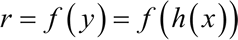
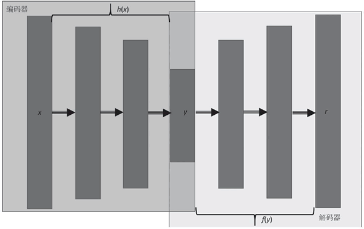

# 什么是自编码器，自编码器及其应用详解

自动编码机（简称自编码器）是前馈非循环神经网络，是一种无监督机器学习方法，具有非常好的提取数据特征表示的能力，它是深层置信网络的重要组成部分，在图像重构、聚类、机器翻译等方面有着广泛的应用。

自动编码机也被称为 diabolo 网络或 autoassociator，最初是在 20 世纪 80 年代由 Hinton 和 PDP 小组提出的。同多层感知机一样，自动编码机也使用 BP 算法进行学习，但最大的不同在于，自动编码机的目标是重构一样的输入。

可以将自动编码机看作由两个级联网络组成，第一个网络是一个编码器，负责接收输入 x，并将输入通过函数 h 变换为信号 y：

 第二个网络将编码的信号 y 作为其输入，通过函数 f 得到重构的信号 r：

 定义误差 e 为原始输入 x 与重构信号 r 之差，e=x–r，网络训练的目标是减少均方误差（MSE），同 MLP 一样，误差被反向传播回隐藏层。

下图中显示了自动编码机的结构，用颜色区分编码器和解码器。

自动编码机可以进行权值共享，即解码器和编码器的权值彼此互为转置，这样可以加快网络学习的速度，因为训练参数的数量减少了，但同时降低了网络的灵活程度。

自动编码机与 RBM 非常类似，本质区别在于，自动编码机中神经元的状态是确定性的，而 RBM 中神经元的状态是概率性的。

根据隐藏层的大小，自动编码机分为欠完备自动编码机（隐藏层神经元数量小于输入层神经元数量）和过完备自动编码机（隐藏层神经元数量大于输入层神经元数量）。而根据对损失函数的约束条件，又可以分为：稀疏自动编码机、去噪自动编码机和卷积自动编码机，后续我们将学习这些自动编码机的不同版本，并使用 TensorFlow 来实现它们。

自动编码机的一个非常好的应用是降维，而且自动编码机能产生比 PCA 更好的结果。自动编码机也可用于特征提取、文档检索、分类和异常检测。