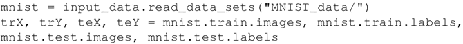
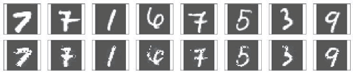

# 标准自编码器（TensorFlow 实现）详解

由 Hinton 提出的标准自动编码机（标准自编码器）只有一个隐藏层，隐藏层中神经元的数量少于输入（和输出）层中神经元的数量，这会压缩网络中的信息，因此可以将隐藏层看作是一个压缩层，限定保留的信息。

自动编码机的学习包括在隐藏层上对输入信号进行压缩表示，然后在输出层尽可能地复现原始输入：

图 1 单隐藏层的自动编码机
本节利用自动编码机进行图像重构，将利用 MNIST 数据训练自动编码机，并使用它来重构测试图像。

## 具体做法

1.  导入所有必要的模块：
    

2.  从 TensorFlow 中获取 MNIST 数据，这里要注意的一点是，标签并没有进行独热编码，因为并没有使用标签来训练网络。自动编码机是通过无监督学习进行训练的：
    

3.  声明 AutoEncoder 类，使用 init 方法初始化自动编码机的权重、偏置和占位符，也可以在 init 方法中构建全部的计算图。还需要定义编码器、解码器，set_session（会话建立）和 fit 方法。此处构建的自动编码机使用简单的均方误差作为损失函数，使用 AdamOptimizer 进行优化：
    
     为便于使用，此处还定义了两个辅助函数，reduced_dimension 给出编码器网络的输出，reconstruct 给出重构的测试图像的输出。
4.  训练时将输入数据转换为 float 型，初始化所有变量并运行会话。在计算时，目前只是测试自动编码机的重构能力：
    

5.  绘制误差在训练周期中的变化图，验证网络的均方误差在训练时是否得到优化，对于一个好的训练，误差应该随着训练周期的增加而减少：
    
     图示如下：
     可以看到，随着网络的学习，损失/成本是下降的，当训练周期达到 5000 时，几乎是在一条线上振荡，这意味着进一步增加训练周期将不再有用。如果现在还想要改进模型，应该调整学习率、批量大小和优化器等超参数。
6.  观察重构的图像，对比原始图像和自动编码机生成的重构图像：
    
     得到以下结果：
    

## 解读分析

有意思的是，在前面的代码中，维数从输入的 784 降到了 256，但是网络仍然可以重构原始图像。将自动编码机性能与 RBM 进行对比，其中隐藏层维数相等：

可以看到，由自动编码机重构的图像比 RBM 重构的图像要清晰得多。原因在于自动编码机中有更多的权重（从隐藏层到解码器输出层的权重）被训练。自动编码机学到的细节更多，即使两者都将信息压缩到相同的尺寸，其性能也优于 RBM。

#### 知识扩展

像 PCA 一样，自动编码机也可以用于降维，但 PCA 只能进行线性变换，而自动编码机可以使用非线性激活函数，从而在其中引入非线性变换。

下图是 Hinton 的论文“Reducing the dimensionality of data with Neural Networks”复现的结果，图 A 显示 PCA 的结果，图 B 是由 RBM 堆叠的自动编码机（每层节点为 784-1000-500-250-2）的结果：

 正如稍后会看到的，使用堆叠自动编码机时，每个自动编码机最初会独立进行预训练，然后会对整个网络进行微调以获得更好的性能。