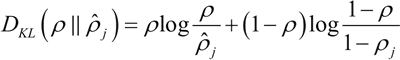

# 稀疏自编码器及 TensorFlow 实现详解

上一节中的自动编码机更像是一个识别网络，只是简单重构了输入。而重点应是在像素级重构图像，施加的唯一约束是隐藏层单元的数量。

有趣的是，像素级重构并不能保证网络将从数据集中学习抽象特征，但是可以通过添加更多的约束确保网络从数据集中学习抽象特征。

稀疏自编码器（又称稀疏自动编码机）中，重构误差中添加了一个稀疏惩罚，用来限定任何时刻的隐藏层中并不是所有单元都被激活。如果 m 是输入模式的总数，那么可以定义一个参数 ρ_hat，用来表示每个隐藏层单元的行为（平均激活多少次）。基本的想法是让约束值 ρ_hat 等于稀疏参数 ρ。具体实现时在原始损失函数中增加表示稀疏性的正则项，损失函数如下：

如果 ρ_hat 偏离 ρ，那么正则项将惩罚网络，一个常规的实现方法是衡量 ρ 和 ρ_hat 之间的 Kullback-Leiber(KL) 散度。

## 准备工作

在开始之前，先来看一下 KL 散度 D[KL] 的概念，它是衡量两个分布之间差异的非对称度量，本节中，两个分布是 ρ 和 ρ_hat。当 ρ 和 ρ_hat 相等时，KL 散度是零，否则会随着两者差异的增大而单调增加，KL 散度的数学表达式如下：

 下面是 ρ=0.3 时的 KL 的散度 D[KL] 的变化图，从图中可以看到，当 ρ_hat=0.3 时，DKL=0；而在 0.3 两侧都会单调递增：

## 具体做法

1.  导入必要的模块：
    

2.  从 TensorFlow 示例加载 MNIST 数据集：
    

3.  定义 SparseAutoEncoder 类，除了引入 KL 散度损失之外，它与前面的自动编码机类非常相似：
    
     将 KL 约束条件添加到损失函数中，如下所示：
    
     其中，alpha 是稀疏约束的权重。该类的完整代码如下所示：
    

4.  声明 SparseAutoEncoder 类的一个对象，调用 fit() 训练，然后计算重构的图像：
    

5.  重构损失均方误差随网络学习的变化图：
    

    

6.  查看重构的图像：
    
     结果如下：
    

## 解读分析

必须注意到，稀疏自编码器的主要代码与标准自动编码机完全相同，稀疏自编码器只有一个主要变化——增加了 KL 散度损失以确保隐藏（瓶颈）层的稀疏性。如果将两者的重构结果进行比较，则可以看到即使隐藏层中的单元数量相同，稀疏自动编码机也比标准自动编码机好很多：

 在 MNIST 数据集上，标准自动编码机训练后的重构损失是 0.022，而稀疏自编码器是 0.006，由此可见稀疏自编码器对数据的内在表示学习得更好一些。