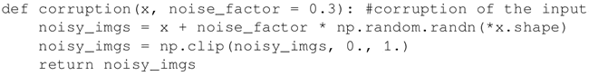
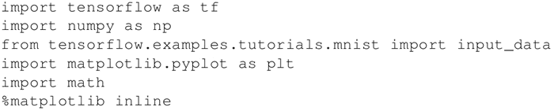
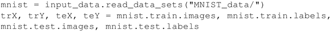
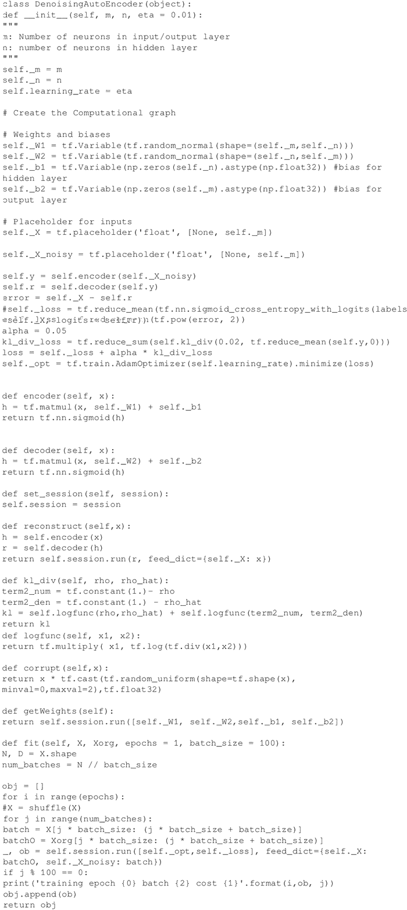
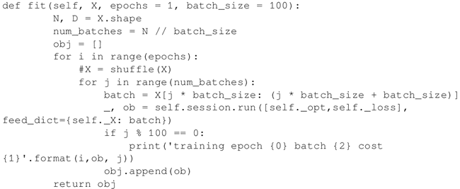
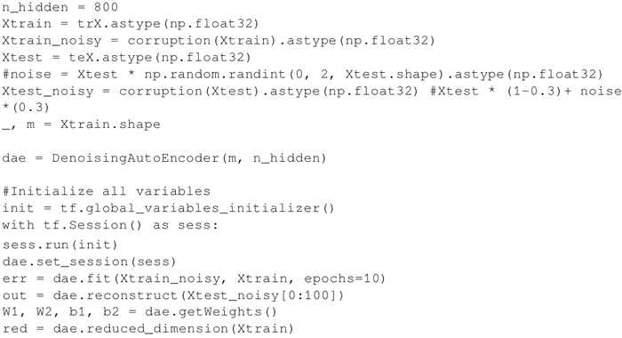
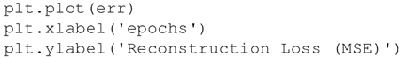
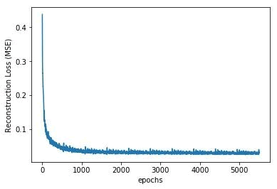
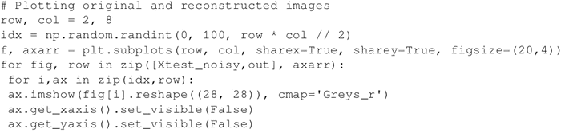
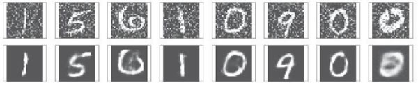

# 去燥自编码器（TensorFlow）实现详解

前两节中探讨的两个自编码器属于欠完备自动编码机，因为隐藏层的维度比输入（输出）层低。去噪自编码器属于过完备自编码器，隐藏层的维数大于输入层时效果会更好。

去噪自编码器从受损（噪声）输入中学习，它向编码器网络提供有噪声的输入，然后将解码器的重构图像与原始输入进行比较，这就会“教会”网络去学习如何对输入去噪。不再只是进行像素比较，为了去噪，它也会学习相邻像素的信息。

## 准备工作

去噪自编码器也具有 KL 散度惩罚项，它不同于稀疏自编码器的主要有两个方面，首先，隐藏层的单元数 n_hidden 大于输入层的单元数 m，即 n_hidden>m；其次，编码器的输入是受损输入，要做到这一点，这里构造了一个给输入添加噪声的受损函数：

## 具体做法

1.  导入必要的模块，导入 TensorFlow 和 numpy 处理输入数据，导入 matplotlib 绘图，等等：
    

2.  加载来自 TensorFlow 示例的数据。本章所有示例都使用了标准的 MNIST 数据库，这样不同自动编码机之间就有了对比的基准：
    

3.  定义类 DenoisingAutoEncoder，与前面的 SparseAutoEncoder 类相似。在这里，定义一个受噪声影响的图像的占位符，将这个噪声图像送入编码器；重构误差是原始清晰图像和解码器输出之间的差异，这里保留了稀疏惩罚项，因此，fit 函数参数包括原始图像和噪声图像：
    

4.  也可以为自动编码机对象添加噪声...将使用类中定义的受损方法：self._X_noisy=self.corrupt(self._X)*0.3+self._X*(1-0.3)，此时 fit 函数修改如下：
    

5.  使用前面定义的受损函数来生成一个噪声图像，并提供给会话：
    

6.  随着网络的学习，重构损失在减少：
    

    效果图如下：
    

7.  当将来自测试数据集中的噪声图像提供给训练好的网络时，可进行图像重构：
    
     得到以下结果：
    