# 卷积自编码器（TensorFlow 实现）

研究人员发现，卷积神经网络（CNN）之所以在处理图像上有优势，是因为可以提取隐藏在图像中的空间信息，因此很自然地想到如果可以使用 CNN 构造编码器和解码器网络，会比其他自动编码机工作得更好，因此产生了卷积自编码器（CAE）。

前面章节中已经解释了卷积和最大池化的概念，本节将以此为基础来理解卷积自编码器是如何工作的。

CAE 的编码器和解码器都是 CNN 网络，编码器的卷积网络学习将输入编码为一组信号，然后解码器 CNN 尝试重构来自自动编码机的输入。其中 CNN 作为通用特征提取器进行工作，学习如何最好地捕捉输入特征。

通过前面的学习我们知道，随着卷积层的添加，传递到下一层的空间尺寸信息在减小，但是在自编码器中，重构图像的大小和深度应与输入图片相同，这意味着解码器应该以某种方式调整图像大小和卷积来重构原始图像。

转置卷积层能够增加空间尺寸和卷积，在 TensorFlow 中通过 tf.nn.conv2d_transpose 即可实现，但是转置卷积层会导致最终图像中出现伪影。Augustus Odena 等人表明使用最近邻或双线性插值（上采样）紧跟着一个卷积层的方式可以避免这些伪影，他们采用最近邻差值（tf.image.resize_images）实现，最终取得了非常好的结果，在这里将使用相同的方法。

## 具体做法

1.  导入必要的模块：
    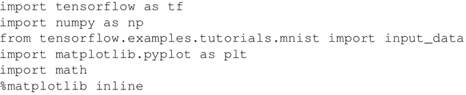

2.  加载输入数据：
    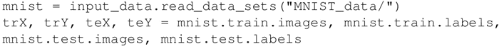

3.  定义网络参数，同时也计算每个最大池化层的输出空间维度，这些信息在解码器网络中对图像进行上采样：
    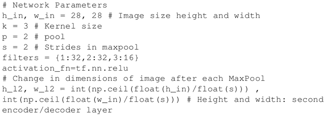

4.  为输入（噪声图像）和目标（对应的清晰图像）创建占位符：
    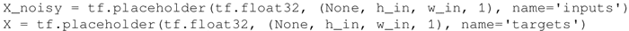

5.  建立编码器和解码器网络：
    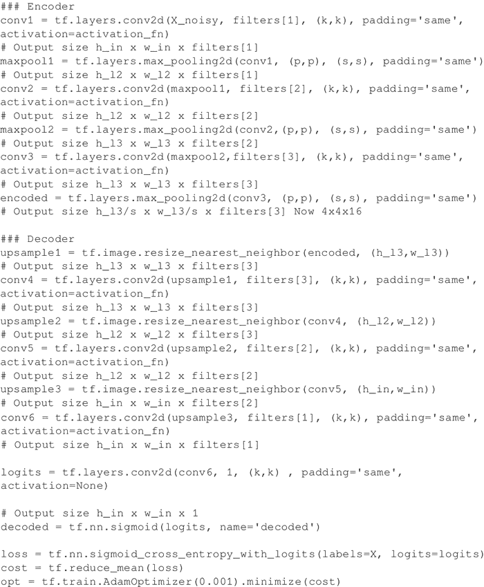

6.  建立会话：
    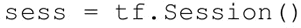

7.  根据给定输入调整模型：
    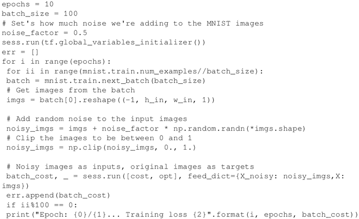

8.  网络学习误差如下：
    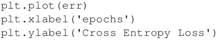
     效果图如下：
    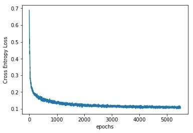
9.  图像重构：
    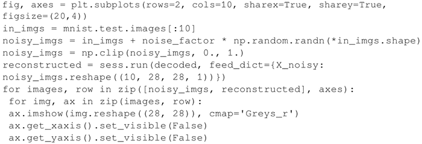
     下图是前面代码的输出：
    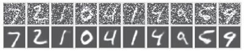
10.  关闭会话：
    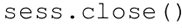

## 解读分析

这是一个去噪 CAE，可以看到，与仅由一个隐藏层组成的简单去噪自编码器相比，去噪 CAE 对图像去噪效果更好。

#### 拓展阅读

CAE 也被研究人员用于语义分割，可以参考一篇有趣的文章“[Segnet：a Deep Convolutional Encoder-Decoder Architecture for Image Segmentation](https://arxiv.org/pdf/1511.00561.pdf)”（Badrinayanan 等人，2015），该网络使用 VGG16 的卷积层作为编码器网络，并且包含相应的解码器结构，每个编码器对应一个解码器网络。解码器对从对应编码器接收到的最大池化输入特征映射进行了非线性上采样。