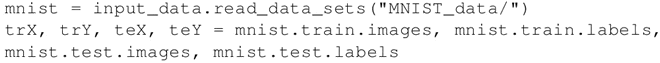
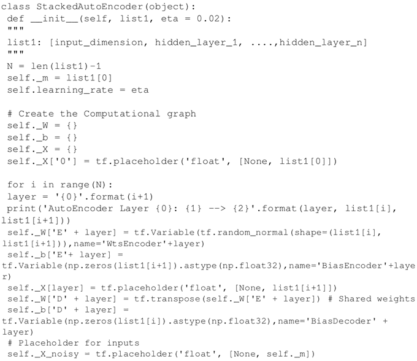
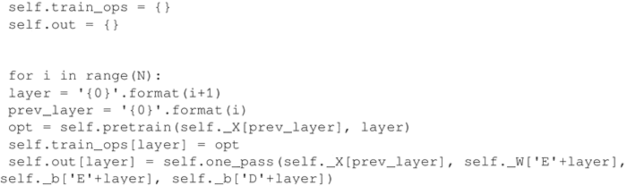
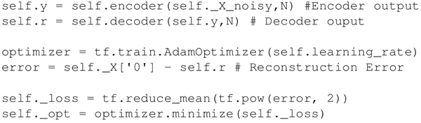
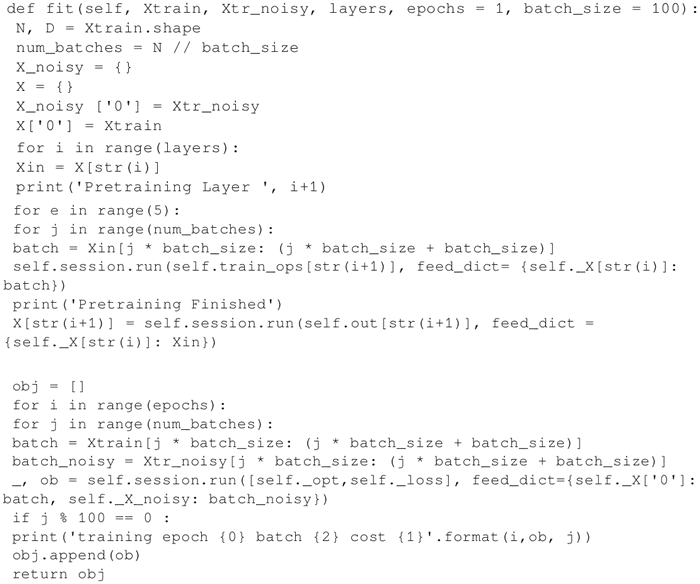
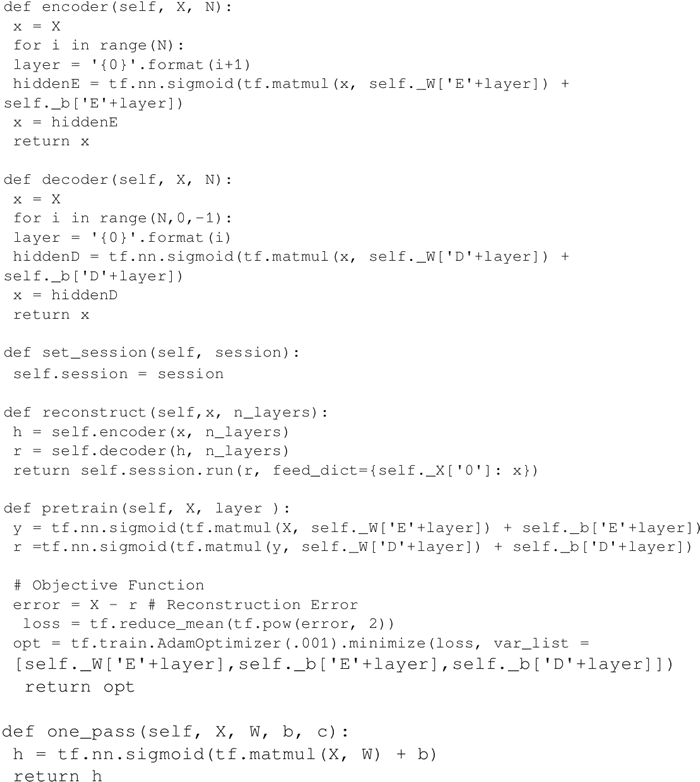
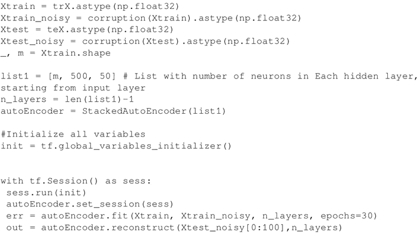
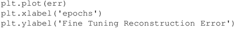
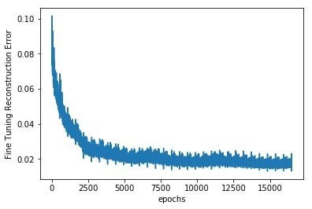
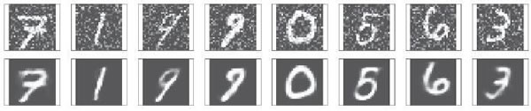

# 堆叠自编码器及（TensorFlow）实现（详解版）

到目前为止介绍的自编码器（除了 CAE）仅由单层编码器和单层解码器组成。编码器和解码器网络也可能有多层，使用更深的编码器和解码器网络可以使自编码器表示更复杂的特征，将一个编码器提取的特征作为输入传递到下一个编码器，这种结构被称为堆叠自编码器（或者深度自编码器）。

堆叠自编码器可以作为一个网络进行训练，训练目标是最小化重构误差；也可以首先使用之前学习的无监督方法对每个编码器/解码器网络进行预训练，然后对整个网络进行微调。有人指出，通过预训练（逐层贪婪训练），效果会更好。

本节将使用逐层贪婪方法来训练堆叠自编码器，为了降低训练难度，这里使用共享权重，因此相应的编码器/解码器权重将是彼此的转置。

## 具体实现过程

1.  导入所有必要的模块：
    

2.  加载数据集：
    

3.  定义类 StackedAutoencoder。__init__ 方法包括一个列表，其中包含每个自编码器中的诸多神经元，从第一个输入自编码器和学习率开始。由于每层都有不同的输入和输出维度，因此选择一个字典数据结构来表示每层的权重、偏置和输入：
    

4.  建立计算图，在预训练时为每个自编码器定义优化参数，当上一个自编码器的输出作为当前自编码器的输入时，为其定义重构损失，为此定义了方法 pretrain 和 one_pass，分别为每个自编码器返回编码器的训练操作和输出：
    

5.  在计算图中对整个堆叠自编码器进行微调，这里使用类方法 encoder 和 decoder 来实现：
    

6.  定义类方法 fit，对每个自编码器执行批量预训练，然后进行微调。在训练时使用正常的输入；在微调时使用受损输入。这使得可以用堆叠自编码器从噪声输入中进行重构：
    

7.  各个类方法如下：
    

8.  使用之前定义的 corruption 函数为图像加入噪声，最后创建一个 StackAutoencoder 对象并对其进行训练：
    

9.  随着堆叠自编码器的微调，重构误差不断降低。可以看到，由于进行了预训练，重构损失是从非常低的水平开始的：
    
     效果图如下：
    

10.  现在来测试一下层叠自编码器的性能。下图是存在噪声的测试图像以及去噪后的手写图像：
    

堆叠自编码器的实验表明，预训练应该用低的学习率，这确保了在微调期间有更好的收敛性和性能。