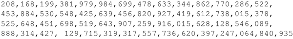
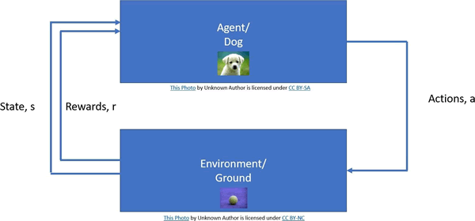

# 什么是强化学习算法

2016 年 3 月，谷歌公司 DeepMind 团队的 AlphaGo 以 4 比 1 战胜第 18 届世界围棋冠军李世石，这是一场具有历史意义的比赛。

图 1 围棋落子位置种类
让电脑学会下围棋是一件十分困难的事情，它有如图 1 所示这么多种可能的落子位置。在围棋中获胜不可能只靠简单的蛮力，它需要技巧、创造力，以及类似职业棋手的直觉。

通过融合深度强化学习网络和最先进的树搜索算法，AlphaGo 实现了这一创举。本章将介绍强化学习以及强化学习的算法案例。

第一个问题就是什么是强化学习，它与前几章介绍的监督学习和无监督学习有什么区别？

喂养过宠物的人都知道，想要训练宠物，最有效的方法就是当它做得好的时候奖励它，做得不好的时候惩罚它。强化学习就是一种类似的学习算法。神经网络算法采取一系列动作（a），它将会引起一系列与环境有关的状态（s）变化...它就可以得到奖励或者惩罚。

以一只狗为例，狗是这里的主体，狗主动采取动作，那么对应地做出反应，比如扔给它一块骨头作为奖赏。

图 2
注意，我们的大脑也有一组位于前脑底部的皮层下核，称为基础神经节。根据神经系统科学中的论述，基础神经节负责动作的选择，也就是说，它负责给出在任一给定时应该从几种可执行动作中选择执行哪一个动作。

算法的目的是最大化奖励和减少惩罚，在这个决策过程中存在众多困难，其中最重要的就是如何最大化未来回报，也就是未来信度分配问题。算法会根据某些策略（π）决定它的动作，同时，也会根据与环境的交互来学习该策略（π）。

策略学习算法很多，后续我们将对其中几种进行研究，不同的策略学习算法都会通过试错的过程来学习得到最优策略（π*），这其中必须要与环境进行交互。在这里选用提供了众多不同环境的 OpenAI Gym 作为交互的环境。

从本节开始，将介绍强化学习的基本概念，并且假设你已经熟知马尔可夫决策过程、折扣因子以及价值函数（状态值和动作值）。

这里定义一次迭代为游戏的一次运行，比如数独游戏的一次运行。通常，强化学习算法都需要多次迭代，来学习能够得到最大化奖励的最优策略。

通过强化学习可以让智能体在没有游戏先验知识的基础上学会打游戏，甚至在游戏中战胜人类。