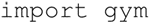
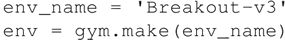
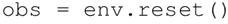
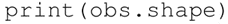
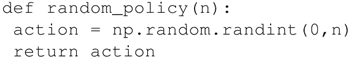
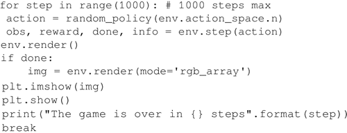
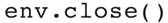
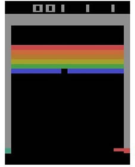
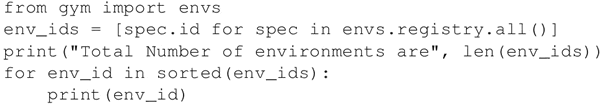
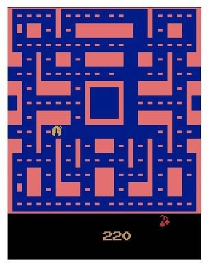

# OpenAI Gym 安装和使用详解

使用 OpenAI Gym 作为实践环境，这是一个可以用来研究和比较强化学习算法的开源工具包，包含了各种可用来训练和研究新的强化学习算法的模拟环境。

## OpenAI Gym 的安装

首先需要安装 OpenAI Gym，最简洁的方法是使用 `pip install gym`。

OpenAI Gym 提供了多种环境，比如 Atari、棋盘游戏以及 2D 或 3D 游戏引擎等。在 Windows 上的最小安装只支持算法基本环境，如 toy_text 和 classic_control 这几种。

如果你想研究其他环境，需要安装更多依赖项，如 OS X 和 Ubuntu 系统支持完整版本。

详细的说明可以在 OpenAI Gym 的 GitHub 链接（[`github.com/openai/gym#installing-dependencies-for-specific-environments`](https://github.com/openai/gym#installing-dependencies-for-specific-environments)）中阅读。

## OpenAI Gym 的使用

1.  OpenAI Gym 提供了一个统一的环境接口，智能体可以通过三种基本方法：重置、执行和回馈与环境交互：
    *   重置操作会重置环境并返回观测值；
    *   执行操作会在环境中执行一个时间步长，并返回观测值、奖励、状态和信息；
    *   回馈操作会回馈环境的一个帧，比如弹出交互窗口。
2.  使用 OpenAI Gym 首先需要将其载入：
    

3.  构造一个初始环境：
    

4.  通过重置来启动环境：
    

5.  显示环境的基本情况：
    

6.  可以执行的动作可以通过指令 actions=env.action_space 获得，比如 Breakout-v4 有四种可能的动作：等待、发射、向左和向右。动作总数可以通过指令 env.action_space.n 来获得。
7.  定义智能体从四种可能的动作中随机选择一种动作来执行：
    

8.  使用 obs、rewards、done，info=env.step(action) 让智能体继续随机执行 1000 步：
    

9.  观测值 obs 将环境信息传给智能体，在这里是一个 210×160×3 大小的彩色图片信息。每一步执行过程中，智能体都会得到一个 0 或 1 的奖励（reward），在 OpenAI Gym 中，奖励范围是 [-inf，inf]。游戏结束时，环境会返回 done=True。
    信息（info）在调试时非常有用，但智能体得不到这个信息。env.render() 指令会显示一个窗口提示当前环境的状态，当调用这个指令时，可以通过窗口看到算法是如何学习和执行的。在训练过程中，为了节约时间建议注释掉这条指令。
10.  最后，关闭环境：
    

## 解读分析

上述代码实现了智能体如何从四个动作中随机选择其中一个：
另一个需要注意的是，在这个环境中，动作空间是离散的，观测空间是 Box 类型的。在 OpenAI Gym 中提到的动作空间和观测空间的离散和 Box 是指它们允许的数值。离散空间是一个非负数值区间，在这里为（0...3）；而观测空间是一个 n 维的盒子，比如 Pac-Man 中任何合理的观测都是一个 210×160×3 的数组。

#### 知识扩展

OpenAI Gym 里包含很多环境，这都是它们社区的积极贡献。若要获取所有环境列表，可以运行如下代码（来自[`github.com/openai/gym`](https://github.com/openai/gym)）：

目前，OpenAI Gym 里共包含 777 种不同的环境，下图是早先使用相同随机算法的 Pac-Man 游戏的图像。
