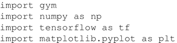
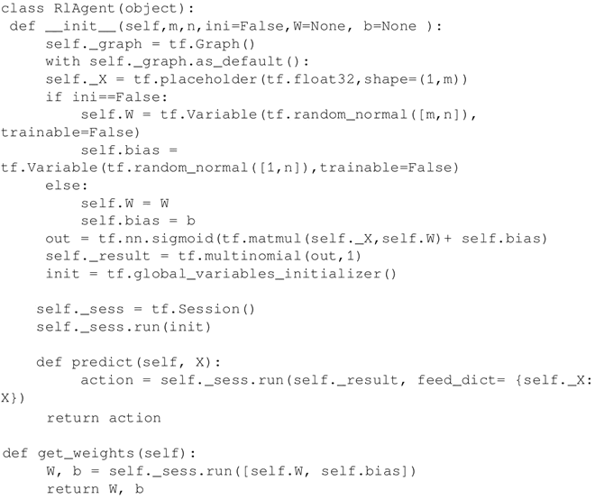
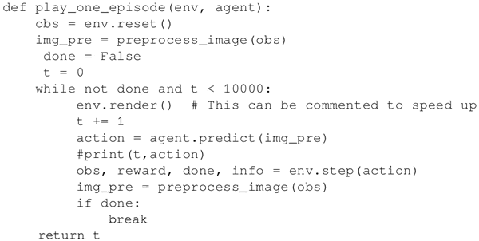
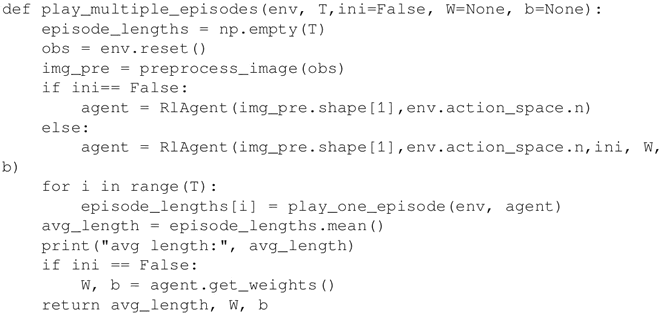
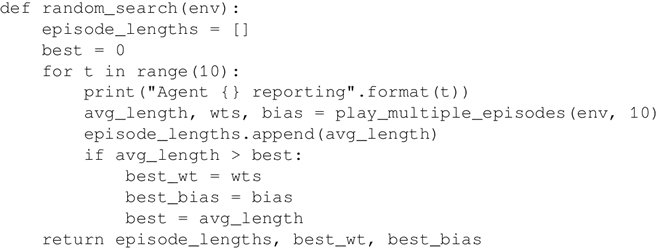
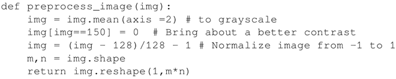
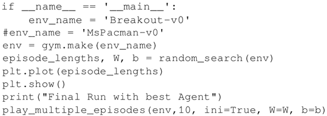
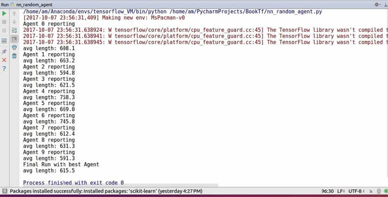

# 全连接神经网络实现（玩 Pac-Man 游戏）详解

本节使用一个简单的神经网络智能体玩 Pac-Man 游戏，首先创建一组随机权重和偏置，之后让它进行游戏，然后选择玩最长时间的智能体，因为它的策略很有可能是最优决策。

## 准备工作

这里的智能体不学习任何策略，而是依赖初始权重进行决策，也就是固定策略。智能体根据神经网络算出的概率来选择动作，这个决策完全基于对当前环境的观测。

这里采用全连接神经网络实现这个过程，神经网络的输入由环境的观测空间决定，输出神经元的数目取决于可能的离散动作数。Pac-Man 包含九个动作——等待、右转、左转、向上、向下、向左移动、向右移动、向上移动和向下移动，所以神经网络有 9 个输出神经元。

## 具体做法

1.  导入模块，也导入 gym，以便使用它提供的不同环境：
    

2.  定义 RlAgent 类。该部分主要包含三个方法，__init__ 方法初始化神经网络的大小并创建计算图，这里使用 TensorFlow 里的 tf.multinomial 函数计算采取哪种动作，该函数计算网络的 9 个输出神经元的 sigmoid 值，网络会根据概率大小选择动作。predit 函数返回神经网络预测的动作结果，get_weights 函数输出获胜智能体的权重和偏置：
    

3.  定义辅助函数 play_one_episode 进行一轮游戏：
    

4.  play_multiple_episodes 函数创建一个智能体，让这个智能体多玩几次游戏并返回平均持续时间：
    

5.  random_search 函数调用 play_multiple_episodes 函数，每次调用时，都会用一组新的随机权重和偏置实例化一个新的智能体。最后，从这些随机初始化的神经网络智能体中选出结果最好的作为优胜者：
    

6.  每执行一个步骤，环境都会返回一个观测值。观测值具有三个颜色通道，并且需要预处理，这里将之转换为灰度，增强对比度，整形成行向量后，输入神经网络中：
    

7.  神经网络智能体依次实例化并执行，对比后选出最优智能体。出于计算效率的考虑，这里只运行 10 个智能体，每个玩 10 个游戏，将游戏时间最长的结果视为最佳决策：
    
     运行结果如下：
    
     可以看到，智能体通过这种随机初始化的方法，可以实现游戏平均持续时间达到 615.5。