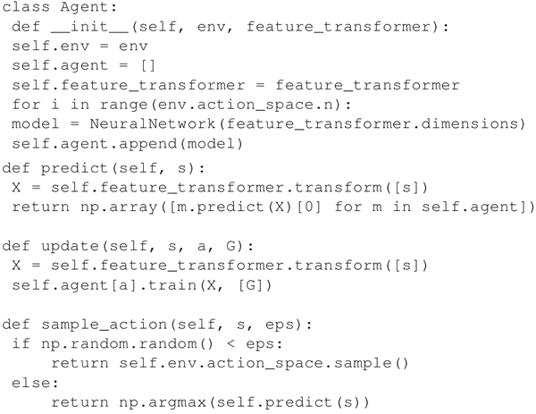

# Q learning 原理及实现（Cart-Pole 平衡游戏）详解

前面提到过，有一个由状态 s 描述的环境（s∈S，S 是所有可能状态的集合），一个能够执行动作 a 的 agent（a∈A，A 是所有可能动作的集合），智能体的动作致使智能体从一个状态转移到另外一个状态。智能体的行为会得到奖励，而智能体的目标就是最大化奖励。

在 Q learning 中，智能体计算能够最大化奖励 R 的状态-动作组合，以此学习要采取的动作（策略 π），在选择动作时，智能体不仅要考虑当前的奖励，还要尽量考虑未来的奖励：

 智能体从任意初始状态 Q 开始，选择一个动作 a 并得到奖励 r，然后更新状态为 s'（主要受过去的状态 s 和动作 a 的影响），新的 Q 值为：

 其中，α 是学习率，γ 是折扣因子。第一项保留 Q 的旧值，第二项对 Q 值进行更新估计（包括当前奖励和未来动作的折扣奖励），这会导致在结果状态不满意时降低 Q 值，从而确保智能体在下一次处于此状态时不会选择相同的动作。类似地，当对当前状态满意时，对应的 Q 值将增加。

Q learning 的最简单实现包括维护和更新一个状态-动作值的对应表，表格大小为 N×M，其中 N 是所有可能状态的数量，M 是所有可能动作的数量。对于大多数环境来说，这个表格会相当大，表格越大，搜索所需的时间越长，存储表格所需的内存越多，因此该方案并不可行。

本节将使用 Q learning 的 NN 实现，神经网络被用作函数逼近器来预测值函数（Q），NN 的输出节点等于可能动作的数量，它们的输出表示相应动作的值函数。

## 准备工作

本节将训练一个线性神经网络来实践 [CartPole-v0 环境](https://github.com/openai/gym/wiki/CartPole-v0)，目标是平衡小车上的杆子，观测状态由 4 个连续的参数组成：推车位置 [-2.4，2.4]，车速 [-∞，∞]，杆子角度 [～-41.8°，～41.8°] 与杆子末端速度 [-∞，∞]。

通过向左或向右推车能够实现平衡，所以动作空间由两个动作组成，下图就是 CartPole-v0 环境空间：

对于 Q learning，需要找到一种方法来量化连续的观测状态值。这里使用 FeatureTransformer 类来实现，首先生成观测空间中的 20000 个随机样本，然后用 scikit 的 StandardScaler 类将样本标准化，RBFSampler 用不同的方差来覆盖观测空间不同的部分。FeatureTransformer 类是用随机的观测空间样本实例化的，然后用 fit_transform 函数训练 RBFSampler。

上述过程执行结束之后，调用 transform 方法将连续观测空间转换为特征表示：

## 具体做法

1.  导入必要的模块。除了常用的 TensorFlow、Numpy 和 Matplotlib 外，还需导入 Gym 并从 scikit 导入一些类：
    

2.  在 Q learning 中使用神经网络作为函数逼近器来估计值函数。定义一个线性 NeuralNetwork 类，把转换后的观测空间作为输入，并预测 Q 估计值。由于有两种可能的动作，需要两个不同的神经网络对象来获得预测的状态–动作值。类中包括训练单个神经网络和预测输出的方法：
    

3.  下一个重要的类是 Agent 类，使用 NeuralNetwork 类创建智能体。实例化的智能体有两个线性神经网络，每个有 2000 个输入神经元和 1 个输出神经元。（实质上，这意味着智能体有 2 个神经元，每个神经元有 2000 个输入，因为神经网络的输入层不做任何处理。）Agent 类中定义了预测两个神经网络的输出和更新两个神经网络权重的方法。

    在这里，训练阶段时智能体使用 ε 贪婪策略进行探索，在每一步中，智能体可以选择具有最高 Q 值的动作或随机选择一个动作，具体取决于 epsilon（eps）的值，ε 在训练过程中不断衰减，因此，初始时智能体会做大量的随机动作（exploration...但是随着训练的进行，具有最大 Q 值的动作被采用（exploitation，利用）。这就是所谓的 Exploration-Exploitation 平衡：允许智能体探索随机动作，这能够让智能体尝试新的随机动作并从中学习：
    

4.  定义一个函数来运行一个步骤，类似于之前使用过的 play_one 函数，但现在使用 Q learning 来更新智能体的权重。用 env.reset() 重置环境来开始这个步骤，然后直到游戏完成（最大迭代次数以确保程序结束）。像以前一样，智能体基于当前的观测状态（obs）选择一个动作并在环境中执行(env.step(action))。不同的是，基于先前的状态和采取动作后的状态，神经网络用：
    
     更新权重，从而可以预测出与动作相对应的准确期望值。为了获得更好的稳定性，此处修改了奖励——每当杆子落下时，智能体将得到 -400 的奖励，否则每一步都会得到 +1 的奖励：
    

5.  所有的函数和类已经准备好，现在定义智能体和环境（本例中是'CartPole-v0'）。该智能体总共进行 1000 次游戏，并通过价值函数与环境交互来学习：
    

    

6.  下图是智能体在游戏中学习获得的总奖励和平均奖励。根据 Cart-Pole wiki 上的表述，奖励 200 意味着智能体在训练 1000 次后获胜了一次，而这里的智能体在训练 100 次时就达到了平均奖励 195.7，这是非常不错的：
    

相同的逻辑可以用于在其他 OpenAI 环境中构建的智能体上，然而，对于像 Breakout 和 Pac-Man 这样的 Atari 游戏来说，观测空间并不是一个只有四个数字的数组。相反，它非常大（210×160=33600 像素，3 个 RGB 通道），没有一定形式的量化，可能的状态是无限的，用简单的神经网络不会产生好结果，在深度 Q learning 章节中使用 CNN 来解决这个问题。