# DQN 算法原理及应用（实现 Atari 游戏）

深度 Q 网络（DQN）是将 Q learning 和卷积神经网络（CNN）结合在一起，由 Mnih 等人在 2013 年首次提出（[`arxiv.org/pdf/1312.5602.pdf`](https://arxiv.org/pdf/1312.5602.pdf)）。

CNN 由于能够提取空间信息，能够从原始像素数据中学习得到控制策略。由于前面已经介绍了卷积神经网络，所以本节不再介绍基础知识。

本节内容基于原始的 DQN 论文，DeepMind 使用深度强化学习玩转 Atari，这篇论文中提到了一种称为经验回放（experience replay）的概念，随机抽样前一个游戏动作（状态、动作奖励、下一个状态）。

## 准备工作

正如上一节提到的那样，对于像 Pac-Man 或 Breakout 这样的 Atari 游戏，需要预处理观测状态空间，它由 33600 个像素（RGB 的 3 个通道）组成。这些像素中的每一个都可以取 0～255 之间的任意值。preprocess 函数需要能够量化可能的像素值，同时减小观测状态空间。

这里利用 Scipy 的 imresize 函数来下采样图像。函数 preprocess 会在将图像输入到 DQN 之前，对图像进行预处理：

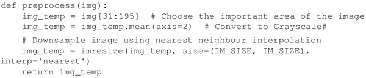

IM_SIZE 是一个全局参数，这里设置为 80。该函数具有描述每个步骤的注释。下面是预处理前后的观测空间：
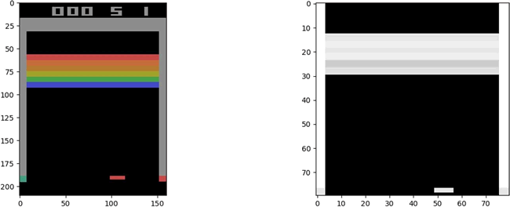
 另外需要注意的是当前观测空间并没有给出完整的游戏画面，例如，只看上图不能确定下面的板子是向左还是向右。因此，要完全理解游戏的当前状态，需要考虑动作和观测的序列。

本节考虑四个动作和观测序列来确定当前情况并训练智能体。update_state 函数用来将当前观测状态附加到以前的状态，从而产生状态序列：

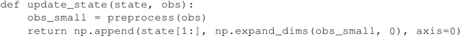

最后，为了训练稳定性，使用 target_network（目标网络）的概念，这是 DQN 的副本，但并不如同 DQN 一样更新。这里使用目标网络为 DQN 网络生成目标价值函数，在每一步中正常更新 DQN，同时在规律性的时间间隔之后更新 target_network（与 DQN 相同）。由于所有更新都在 TensorFlow 会话中进行，因此需要使用名称作用域来区分 target_network 和 DQN 网络。

## 具体做法

1.  导入必要的模块。使用 sys 模块的 stdout.flush() 来刷新标准输出（此例中是计算机屏幕）中的数据。random 模块用于从经验回放缓存（存储过去经验的缓存）中获得随机样本。datatime 模块用于记录训练花费的时间：
    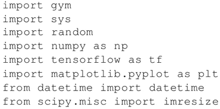

2.  定义训练的超参数，可以尝试改变它们，定义了经验回放缓存的最小和最大尺寸，以及目标网络更新的次数：
    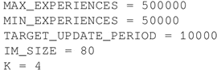

3.  定义 DQN 类，构造器使用 tf.contrib.layers.conv2d 函数构建 CNN 网络，定义损失和训练操作。
    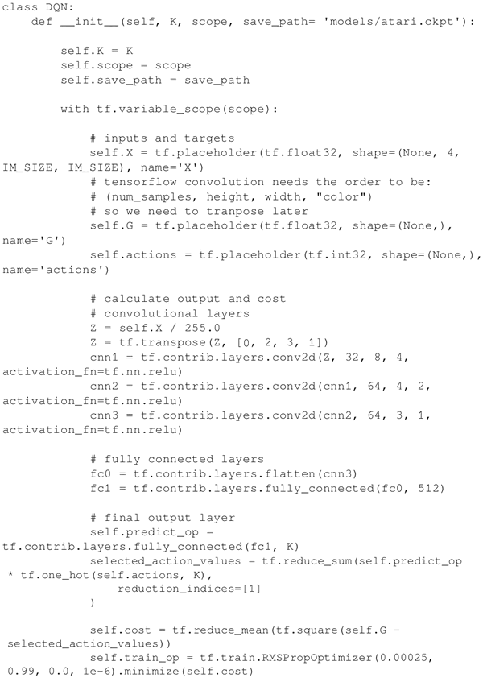

4.  类中用 set_session() 函数建立会话，用 predict() 预测动作值函数，用 update() 更新网络，在 sample_action() 函数中用 Epsilon 贪婪算法选择动作：
    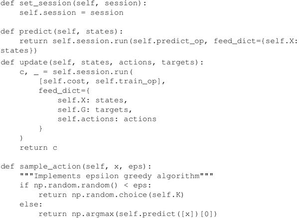

5.  另外还定义了加载和保存网络的方法，因为训练需要消耗大量时间：
    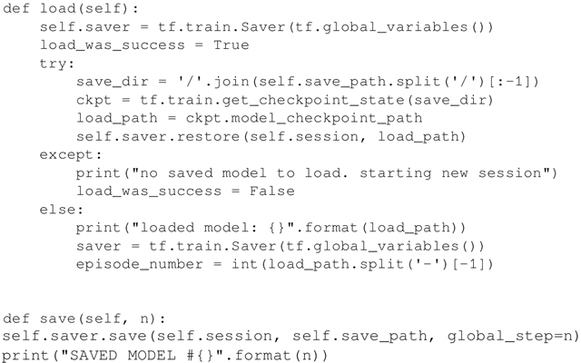

6.  定义将主 DQN 网络的参数复制到目标网络的方法如下：
    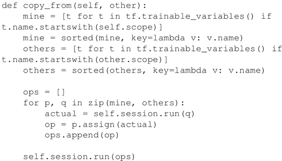

7.  定义函数 learn()，预测价值函数并更新原始的 DQN 网络：
    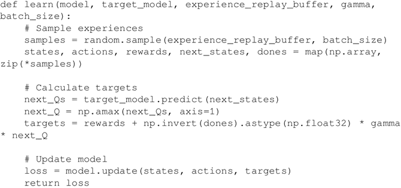

8.  现在已经在主代码中定义了所有要素，下面构建和训练一个 DQN 网络来玩 Atari 的游戏。代码中有详细的注释，这主要是之前 Q learning 代码的一个扩展，增加了经验回放缓存，所以不难理解：
    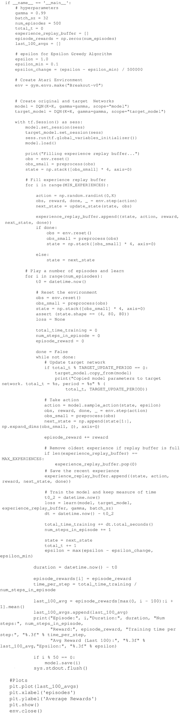
     从下图可以看出，随着训练，智能体获得越来越高的奖励：
    
     下图是每 100 次运行的平均奖励，更清晰地展示了奖励的提高。
    
     这只是在前 500 次运行后的训练结果。要想获得更好的结果，需要训练更多次，大约 1 万次。

## 更多内容

训练智能体需要运行很多次游戏，消耗大量的时间和内存。OpenAI Gym 提供了一个封装，将游戏保存为一个视频，因此，无须 render 函数，你可以使用这个封装来保存视频并在以后查看智能体是如何学习的。AI 工程师和爱好者可以上传这些视频来展示他们的结果。

要使用的话，首先要导入 wrappers，然后创建环境并调用 wrappers。默认情况下，它会存储 1，8，27，64 等次的视频，1000 次训练以后将每 1000 次的视频（次数是整数立方）默认保存在一个文件夹中。为此添加的代码如下所示：

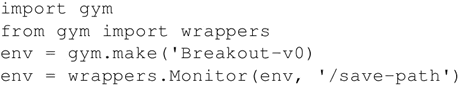

如果你想在下次训练中使用相同的文件夹，可以在 Monitor 中传入参数 force=True。