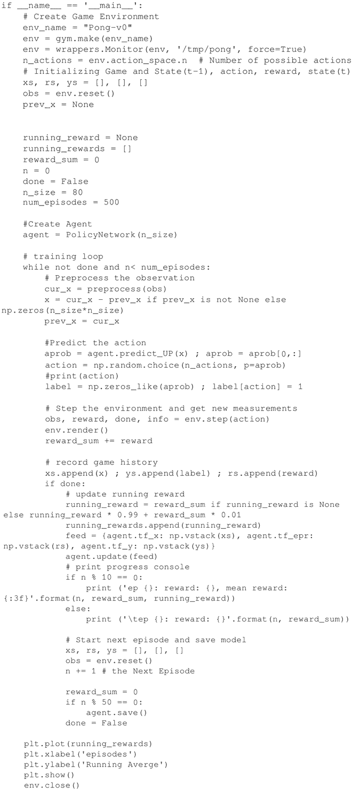

# David Silver 策略梯度算法及实际应用（实现 Pong 游戏）

到目前为止，策略梯度是最常用的 RL 算法之一。研究表明，经过适当的调整，它们的性能要优于 DQN，同时内存和计算消耗又不会过高。与 Q learning 不同，策略梯度使用参数化策略，可以在无须价值函数的情况下选择动作。

在策略梯度中有一个性能指标 η(θ[p])，目标是最大化性能，同时根据梯度上升算法更新神经网络的权重。然而，TensorFlow 没有 maximum 优化器，因此，需要使用指标梯度负值 -▽η(θ[p]) 的最小化来替代。

## 准备工作

Pong 是一个双人游戏，游戏的玩法是将球弹给对方，智能体可以上下移动球拍，也可以不操作。OpenAI 环境中的一个玩家是熟悉游戏规则的 AI 玩家，这里的目标是使用策略梯度来训练第二个智能体，使其成为每个玩过的游戏的专家。

代码中只运行了 500 次游戏，并在指定检查点保存智能体状态，这样在下一次运行时加载上一个检查点就可以了。为此，声明一个保存器（saver），然后调用 TensorFlow 的 saver.save 方法保存当前网络状态（检查点），最后从上次保存的检查点加载网络，下一节中定义的 PolicyNetwork 类用下面的方法完成这个工作：

使用以下代码每 50 次运行保存一次模型：

## 具体做法

1.  导入模块：
    

2.  定义 PolicyNetwork 类。在类构建过程中初始化模型超参数，定义输入状态 self.tf_x、预测动作 self.tf.y、相应奖励 self.tf_epr 的占位符，还定义了网络权重和预测动作价值、训练和更新的操作。同时初始化了一个交互式的 TensorFlow 会话：
    

3.  定义计算折扣奖励的方法，这确保智能体不仅考虑到当前的奖励，也考虑到未来的奖励。折扣奖励用下面式子计算：
    
     t 是时间，求和中 k∈[0，∞]，折扣因子 γ 取值为 0～1，代码中设置 gamma=0.99：
    

4.  定义 tf_policy_forward 方法计算在给定输入观测状态下向上移动球拍的概率，这里使用两层神经网络来实现。网络以预处理过的游戏状态图像为输入，生成移动球拍的概率。在 TensorFlow 中，由于网络计算图仅在 TensorFlow 会话中运算，因此这里定义另一个方法 predict_UP 来计算概率：
    

5.  PolicyNetwork 智能体使用 update 方法更新权重：
    

6.  定义一个辅助函数来预处理观测状态空间：
    

7.  创建一个游戏环境定义保存（状态、动作、奖励、状态）的数组，并让智能体多次学习游戏（中断或连续只取决于你的计算资源）。这里要注意的是，智能体并不是每步都学习，相反，智能体使用每一次游戏的（状态、动作、奖励、状态）集合来修正策略。这非常消耗内存：
    

8.  下图显示了智能体学习前 500 次游戏的平均奖励：
    

## 解读分析

权重使用 Xavier 方式进行初始化，权重既不能太大也不能太小，不会阻碍网络的学习。在这种方式下权重赋值服从均值为 0 和方差为 2/(n[in]+n[out]) 的分布，其中 n[in] 和 n[out] 分别是输入和输出的数量。

要了解有关 Xavier 初始化的更多信息，请参阅 Glorot 和 Bengio 在 2009 年的论文。