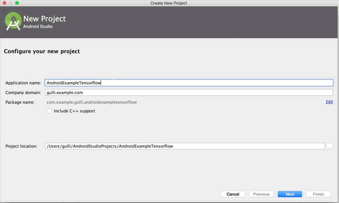
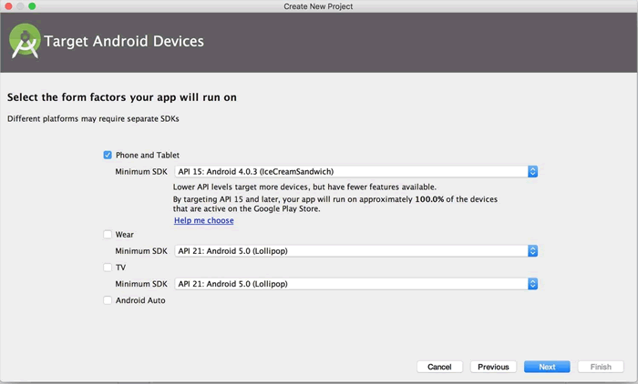
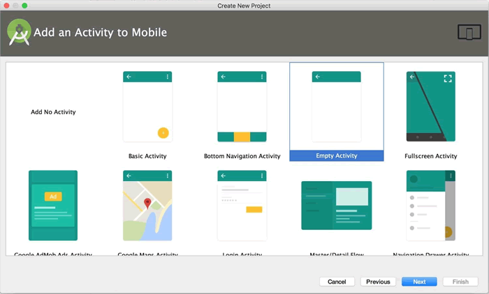
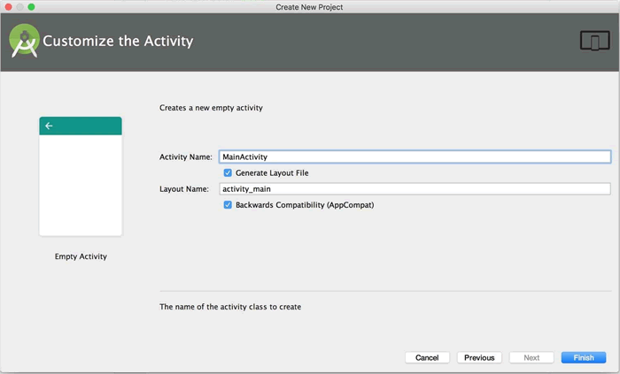
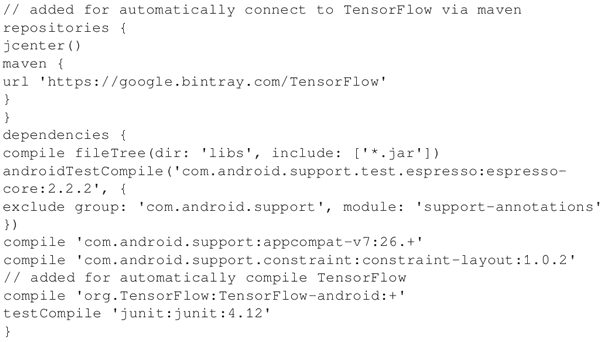
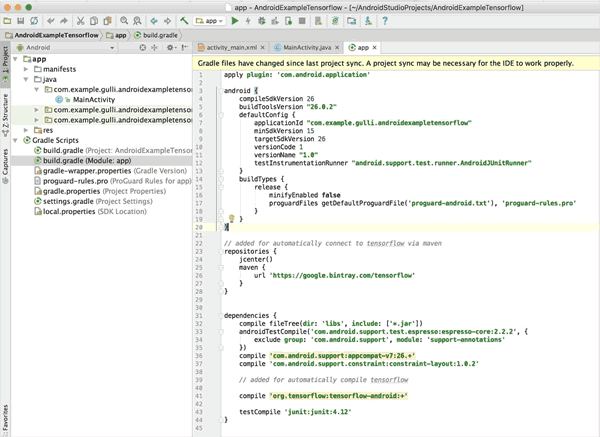
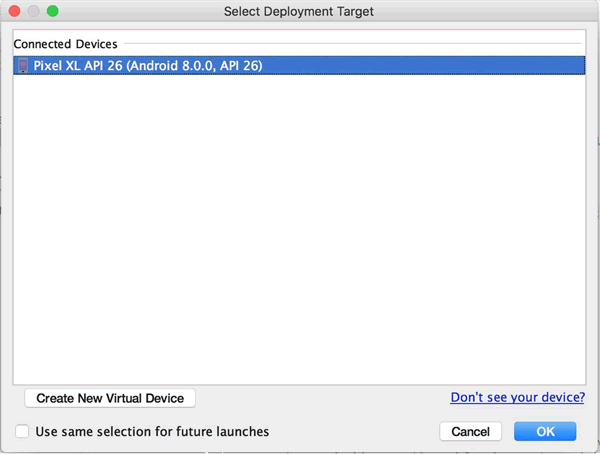
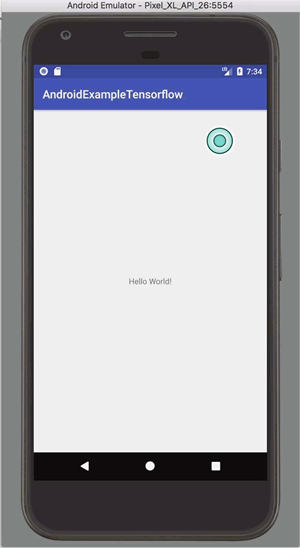
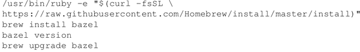
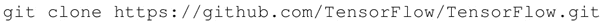

# Android 移动端部署 TensorFlow mobile

在下面的案例中将学习如何为移动环境安装 TensorFlow。设定的环境是 macOS，以 Android 系统为例，其他配置将在随后的案例中进行描述。

使用 Android Studio，采用 Google 的 Android 操作系统中的官方集成开发环境（IDE）。

## 具体安装过程

按照如下步骤为 macOS 和 Android 安装 TensorFlow mobile：

1.  安装 Android Studio：[`developer.android.com/studio/install.html`](https://developer.android.com/studio/install.html)。
2.  创建一个新的项目名称 AndroidExampleTensorflow，如下图所示：
    
     在 Android Studio 中创建 TensorFlow mobile 应用程序的示例，第一步选择 Phone and Tablet 选项，如下图所示：
    

3.  第二步选择 Empty Activity，如下图所示：
    

4.  第三步自定义 MainActivity，如下图所示：
    

5.  在 build.gradle 中插入以下代码：
    
     下图显示了插入的代码：
    
    （[点此查看高清大图](http://c.biancheng.net/uploads/allimg/190114/2-1Z114161AKU.gif)）

6.  运行该项目并获得如下结果：
    

7.  下面是一个 Android Studio 编译的示例，显示了连接的设备：
    

以上是在 Android Studio 中创建的 TensorFlow mobile 应用程序的一个示例，这是一个简单的 Hello World 应用程序。

## 总结

使用 Android Studio 安装 Android TensorFlow 非常简单，只需要将一些配置代码添加到应用的 build.gradle 文件中，Android Studio 就将替你完成所有工作。

如果从源码安装 TensorFlow，那么就需要安装 Bazel 和 TensorFlow。Bazel 是一个快速、可伸缩、多语言、可扩展的构建系统。Google 在内部使用构建工具 Blaze，并以 Bazel 的形式发布了 Blaze 工具的开源部分。

以下网页将指导你完成整个过程：[`github.com/TensorFlow/TensorFlow/tree/master/TensorFlow/examples/android/`](https://github.com/TensorFlow/TensorFlow/tree/master/TensorFlow/examples/android/)

如果在 macOS 上进行操作，整个过程会非常简单：

1.  按照[`docs.bazel.build/versions/master/install.html`](https://docs.bazel.build/versions/master/install.html)上的说明安装 Bazel，对于 macOS 使用自制软件：
    

2.  从 GitHub 克隆 TensorFlow 发行版：

    