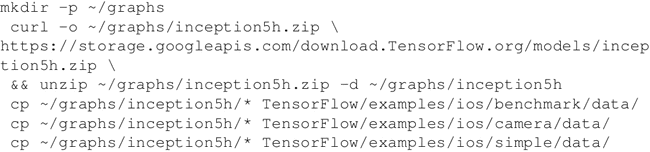

# iPhone 移动端部署 TensorFlow mobile

在这个案例中将学习如何在移动环境中安装 TensorFlow。此处的环境系统采用 macOS，主要是为 iOS 和 iPhone 开发的。

使用 Xcode 开发环境和预安装 TensorFlow 的 CocoaPods。假设 Xcode 已经安装在你的环境中。如果没有，请从[`developer.apple.com/xcode/`](https://developer.apple.com/xcode/)下载。

## 具体安装过程

1.  使用以下命令安装 CocoaPods：
    

2.  用 CocoaPods 安装 TensorFlow 发行版：
    

3.  从 Inception v1 中下载一些示例数据。将标签和图形文件提取到 simple 文件夹和 camera 文件夹内的数据文件夹中：
    

4.  下载用作测试的图像并将其复制到基准测试目录中：
    https://upload.wikimedia.org/wikipedia/commons/5/55/Grace_Hopper.jpg cp grace_hopper.jpg../../benchmark/data/ (https://upload.wikimedia.org/wikipedia/commons/5/55/Grace_Hopper.jpg%20cp%20grace_hopper.jpg../../benchmark/data/)

5.  打开之前使用的示例项目。下面的命令将打开已经提供了 TensorFlow 的 Xcode，然后运行编译，如下面的代码和图所示：
    

    
    （[点此查看高清大图](http://c.biancheng.net/uploads/allimg/190114/2-1Z1141A24A91.gif)）

6.  现在看看 iPhone 模拟器的结果。使用 Inception v1 分类器，步骤 4 的图像被识别为一个军装（military uniform）的图像：
    

Xcode 和 CocoaPods 被用作编译 TensorFlow 应用程序，用于在不同的 Inception 分类器中分类图像，将结果用 iPhone 模拟器可视化。

可以直接从应用程序中使用 TensorFlow。更多信息请参考：[`github.com/TensorFlow/TensorFlow/blob/master/TensorFlow/examples/ios/README.md`](https://github.com/TensorFlow/TensorFlow/blob/master/TensorFlow/examples/ios/README.md)。