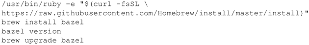
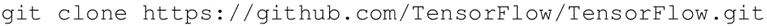
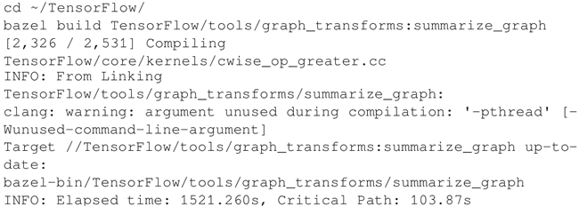
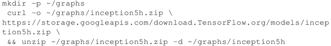
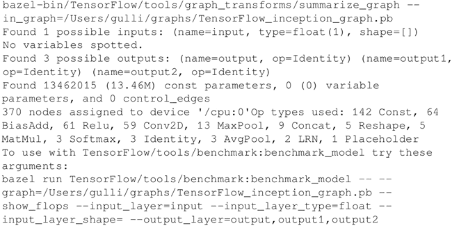
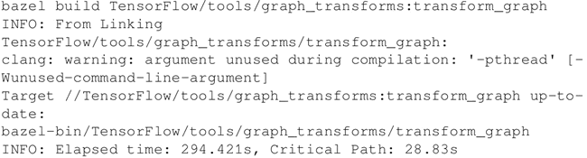
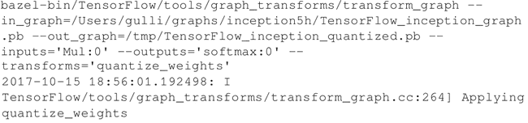
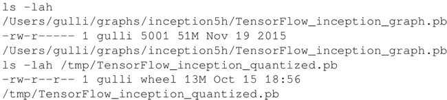

# 移动端优化 TensorFlow 代码详解

在这个案例中将考虑采用不同的方式来优化运行在移动设备上的 TensorFlow 代码。从减少模型的大小到量化等方面进行相关的分析。

使用 Bazel 来构建 TensorFlow 的不同组件，因此，第一步是确保已经安装了 Bazel 和 TensorFlow。

## 具体做法

1.  从网址[`developer.android.com/studio/install.html`](https://developer.android.com/studio/install.html)安装 Android Studio。
2.  按照网址[`docs.bazel.build/versions/master/install.html`](https://docs.bazel.build/versions/master/install.html)的说明安装 Bazel。对于 macOS 使用 Homebrew：
    

3.  从 GitHub 克隆 TensorFlow 发行版：
    

4.  建立总结计算图本身的计算图变换器：
    

5.  下载一个 TensorFlow 计算图作为示例。本例中将使用 Inception v1 TensorFlow 计算图：
    

6.  总结 Inception 计算图，并注意常量参数的数量：1346 万。每个参数都存储 32 位的浮点数，这非常占用资源：
    

7.  编译用于将常值运算量化为 8 位的工具：
    

8.  运行用于量化 Inception v1 计算图的工具：
    

9.  比较这两个模型：
    

## 解读分析

量化有助于将常值运算从 32 位减小到 8 位，以减少模型的大小。一般来说，该模型性能不会显著下降，但是，必须要在一个个案例中加以核实。