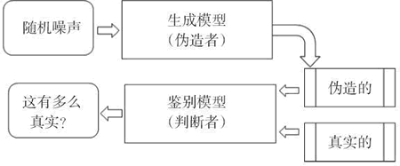

# GAN 生成式对抗网络及应用详解

从本节开始，我们将讨论如何将生成对抗网络（GAN）应用于深度学习的某个领域。其核心方法是在训练生成器的同时，也对鉴别器进行训练，以达到改进后者的目的。同样的方法可以应用于图像处理的不同领域中。

Yann LeCun（深度学习创始人之一）提出的 GAN 已经被认为是过去的 10 年里在 ML、领域中最有吸引力的想法。GAN 可以学习如何再现看似真实的合成数据。

例如，计算机可以学习如何绘画和创造逼真的图像。这个想法最初是由 Ian Goodfellow 提出的，他曾就职于蒙特利尔大学的 Google Brain 团队，现就职于 OpenAI 团队。

## 什么是 GAN

GAN 的关键过程很容易理解，就好像制作赝品的过程一样，赝品制作是仿造未被原创者授权艺术品的过程，原创者通常是更有名的艺术家。

GAN 同时训练两个神经网络：

1.  生成器 G（Z）是用来生成赝品的模块；
2.  鉴别器 D（Y）是可以根据对真实艺术品和副本的观察来判断赝品的真实性的模块。

鉴别器 D（Y）取一个输入 Y（例如一个图像）并发起投票来判断该输入的真实程度。一般来说，数值越接近于 0 表示输入越真实，而数值越接近 1 表示输入越虚假。生成器 G（Z）从一个随机噪声 Z 中生成一个输入并训练自己骗过鉴别器 D，使之认为其生成的输入都是真实的。因此训练鉴别器 D（Y）的目标是使鉴别器 D（Y）最大化来自真实数据分布的图像，并最小化不是来自真实数据分布的图像。所以生成器 G 和鉴别器 D 在玩一个对立的游戏：名为对抗训练。

需要注意的是，以交替方式训练生成器 G 和鉴别器 D，其中每个目标都表示为通过梯度下降优化的损失函数。生成器模块学会如何使输入越来越逼真，而鉴别器模块学会如何越来越准确地识别虚假输入。

鉴别器网络（通常是标准的卷积神经网络）用来界定输入图像是真实的还是生成的。一个重要的新想法是通过倒置鉴别器和发生器来调整生成器的参数，使得生成器可以学习如何在各种情况下骗过鉴别器。最终，生成器将学会如何生成与真实图像无法区分的图像：

图 1 生成器（伪造者）–鉴别器（判断者）模型示例图
当然，GAN 在两人比赛中找到了平衡点。为了有效地学习，如果一个选手在一轮更新中成功收敛，则相同的更新必须使另一个选手也能收敛。试想一下！如果伪造者每次都学会如何欺骗法官，那么伪造者自己就没有什么可学的了。

有时两人最终达到一个平衡，但并不能确保一定能够达到平衡，两位选手可以继续对弈很长时间。下图提供了双方的一个例子：

图 2 生成器和鉴别器的收敛性示意图

## 一些很酷的 GAN 应用

之前已经建立了生成器学习如何伪造数据，这意味着它学会了如何生成新的合成数据，这些数据是由网络和人所创建的，并且看起来很逼真。

在详细介绍 GAN 代码之前，分享一篇论文的结果（代码可通过[`github.com/hanzhanggit/StackGAN`](https://github.com/hanzhanggit/StackGAN)获取），其中 GAN 被用来从一个文本描述开始合成伪造图像。试验结果令人印象深刻。第一列是测试集中的实际图像，其他所有列都是根据 StackGAN 的 Stage-I 和 Stage-II 中的相同文本描述生成的图像：

 现在来看看 GAN 如何学习伪造 MNIST 数据集。在这种情况下，它是用于发生器和鉴别器网络的 GAN 和 ConvNet 的组合。在一开始时，生成器无法生成任何可以理解的东西，但经过几次迭代后，合成伪造的数字就越来越清晰。在下图中，面板是通过增加训练次数来整理的，可以看到面板之间的质量改进：

 改进的图像如下：

 可以在下面的图像中看到进一步的改进：

 GAN 的最酷用途之一是在生成器的矢量 Z 中对脸进行算术运算。换句话说，如果留在合成伪造图像的空间中，可以看到像这样的东西：[微笑的女人]-[平静的女人]+[平静的男人]=[微笑的男人]，或者像这样：[戴眼镜的男人]-[没有戴眼镜的男人]+[没有戴眼镜的女人]=[戴眼镜的女人]，如下图所示：

GAN 其他的酷例可访问 [`github.com/Newmu/dcgan_code`](https://github.com/Newmu/dcgan_code)。本文中的所有图像都是由神经网络生成的。它们都不是真实的。

经过 5 次训练后生成的卧室如下图所示：

图 3 生成的卧室示意图
专辑封面：这些图像不是真实的，而是由 GAN 生成的。专辑封面看起来像是真实的：
图 4 生成的专辑封面示意图