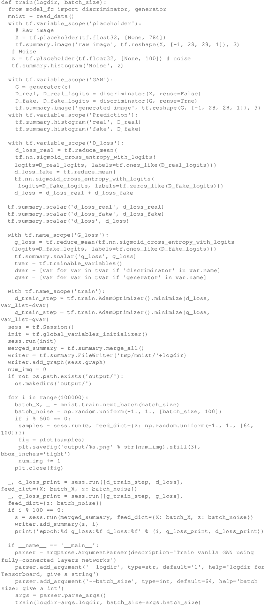

# GAN 生成式对抗网络虚构 MNIST 图像详解

本节将学习如何使用由生成器–鉴别器架构组织的完全连接层网络来伪造 MNIS T 手写的数字。

相关的可用代码请参阅：[`github.com/TengdaHan/GaN-TensorFlow`](https://github.com/TengdaHan/GaN-TensorFlow)。

## 具体实现过程

1.  从 GitHub 克隆代码：
    

2.  参照 Xavier Glorot 和 Yoshua Bengio 写的论文“Understanding the difficulty of training deep feedforward neural networks”(2009)，定义一个 Xavier 初始化器。初始化器被证明可以使 GAN 更好地收敛：
    

3.  定义输入 X 的生成器。首先定义一个维数为 [100，K=128] 的矩阵 W1，按照正态分布进行初始化。需要注意的是，100 是生成器使用的初始化噪音 Z 的任意值。接着，定义维度为 [K=256] 的偏置 B1。同样，定义一个维数为 [K=128，L=784] 的矩阵 W2 和一个维数为 [L=784] 的偏置 B2。

    通过使用步骤 2 中定义的 xavier_init 来初始化两个矩阵 W1 和 W2，而使用 tf.constant_initializer() 来初始化 B1 和 B2。之后，计算 X*W1，加上偏置 B1，并代入 ReLU 激活函数得到 fc1。然后将这个密集层与通过将矩阵 fc1 与 W2 相乘并加上偏置 B2 而产生的下一个密集层连接。将得到的结果代入 Sigmoid 函数。这些步骤用来定义用于生成器的两层神经网络：
    

4.  定义输入 X 的鉴别器。原则上，这与生成器非常相似。主要区别在于，如果参数重用为真，那么调用 scope.reuse_variables() 来触发重用。接着定义两个密集层：
    *   第一层使用维数为 [J=784，K=128] 的矩阵 W1 和维数为 [K=128] 的偏置 B1，并且它基于由 W1 生成的 X 的标准乘积。这个结果与偏置 B1 求和并代入一个 ReLU 激活函数来得到结果 fc1。
    *   第二层使用维数为 [K=128，L=1] 的矩阵 W2 与维数为 [L=1] 的偏置 B2，它基于由 W2 生成的 fc1 的标准乘积。这个结果与 B2 求和并代入一个 Sigmoid 函数：
    

5.  定义一些有用的附加函数。首先，导入一堆标准模块：
    

6.  接着从 MNIST 数据集中读取数据并定义一个绘制样本的辅助函数：
    

7.  定义训练函数。首先，读取 MNIST 数据，然后为一个标准的 MNIST 手写字符定义一个形状为 28×28 的单通道矩阵 X。接着定义大小为 100 的噪声矢量 z——这是在高质量 GAN 论文中采用的常见选择。下一步是在 z 上调用生成器并将结果赋值给 G。之后，将 X 代入鉴别器而不再重复使用。接着把伪造/虚假的 G 结果代入鉴别器，并重新使用经过训练形成的权重。

    其中一个重要的方面是如何选择鉴别器的损失函数，它是两个交叉熵的总和：
    *   一个熵用于真实字符，其中所有真实的 MNIST 字符都有设定为 1 的标签；
    *   另一个熵用于伪造字符，其中所有伪造的字符都有设定为 1 的标签；鉴别器和生成器在 10 万步迭代中交替运行。每 500 步，从经过训练形成的分布中抽取一个样本，以展示生成器目前为止学到的内容。它定义了一个新的迭代，结果将在下一节中给出。实现上述描述的代码片段如下：
    

## 解读分析

在每个迭代中，生成器进行了大量的预测（它生成伪造的 MNIST 图像），鉴别器试图学习如何生成伪造的图像，该图像由预测与真实的 MNIST 图像混合产生。经过 32 次迭代后，生成器学会了伪造这组手写数字。

没有人编写程序使机器能够写作，但机器已经学会了如何编写与人类写的无法区分的数字。值得注意的是，训练 GAN 可能非常困难，因为需要找到两名选手之间的平衡点。

如果对这个话题感兴趣，建议看一下从业者收集的一系列技巧（[`github.com/soumith/ganhacks`](https://github.com/soumith/ganhacks)）。

下面看一下不同迭代时的一些实际例子，以了解机器如何学会改进写作：
