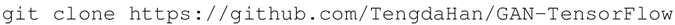
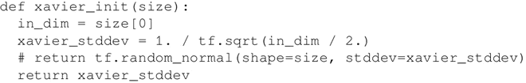
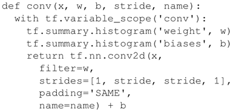
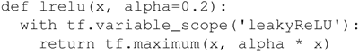
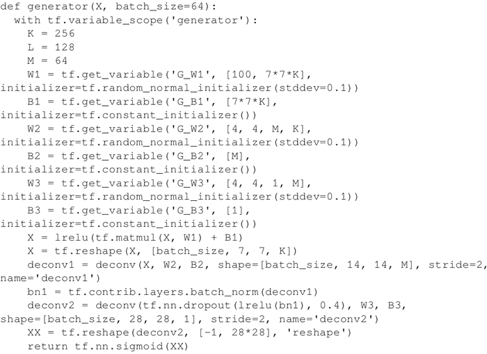
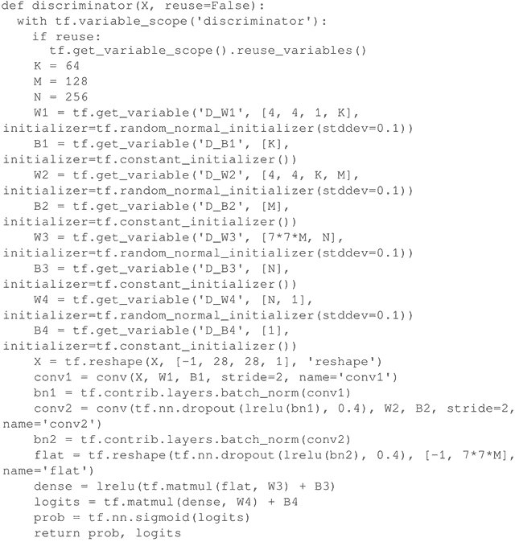
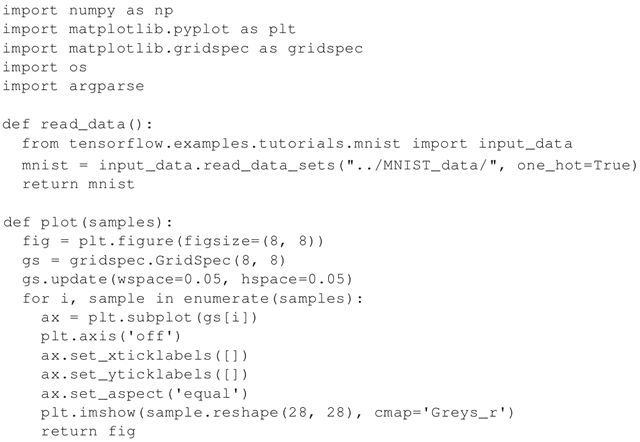
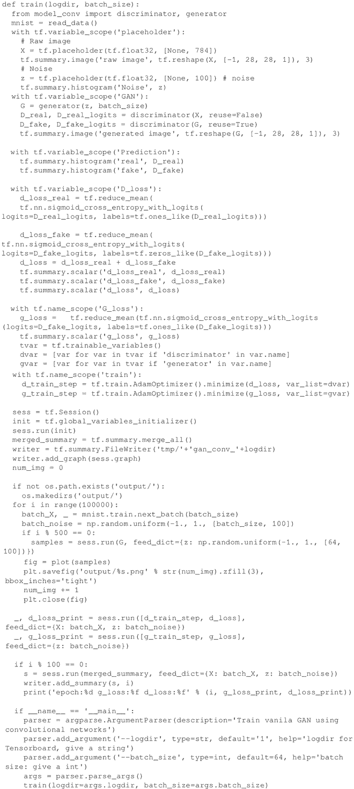
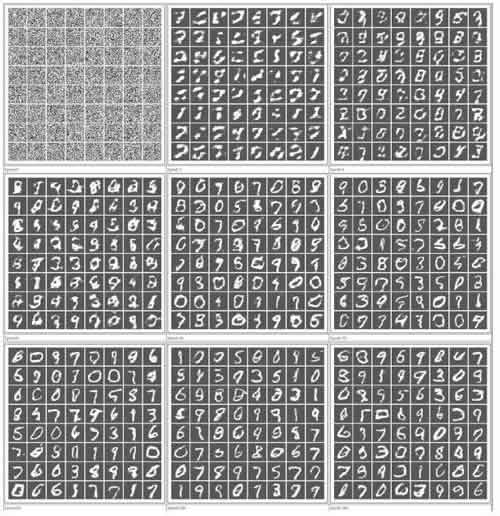

# DCGAN 及实际应用（虚构 MNIST 图像）

本节将使用一个简单的 GAN，它使用 CNN 来学习如何伪造 MNIST 图像并生成不属于原始数据集的新图像。这个想法是将 CNN 与 GAN 一起使用来提高处理图像数据集的能力。值得注意的是，之前的方法是使用具有完全连接网络的 GAN，而在这里将专注于 CNN。

本节的可行代码可访问网页：[`github.com/TengdaHan/GAN-TensorFlow`](https://github.com/TengdaHan/GAN-TensorFlow)。

## 具体实现过程

1.  从 GitHub 中克隆代码：
    

2.  参照 Xavier Glorot 和 Yoshua Bengio 的论文“Understanding the difficulty of training deep feedforward neural networks”(2009)，定义一个 Xavier 初始化器。初始化器被证明可以使 GAN 更好地收敛：
    

3.  为给定输入 x、权重 w、偏置 b 和给定步幅定义一个卷积运算。代码使用标准的 tf.nn.conv2d（...）模块。需要注意的是，将使用前面章节中定义的 'SAME' 进行填充：
    

4.  定义一个标准的 LeakyReLU，它对于 GAN 来说是一个非常有效的激活函数：
    

5.  定义生成器。首先定义一个输入大小为 100 的全连接层（Z 为生成器选取的初始噪声，其大小是任意的）。全连接层由维数为 [100，7*7*256]、按照正态分布初始化的矩阵 W1 和维数为 [7*7*256] 的偏置 B1 组成。该图层使用 ReLU 作为激活函数。

    有了全连接层之后，生成器将进行两个解卷积运算，deconv1 和 deconv2，这两个运算的步幅均为 2。第一次 deconv1 运算完成后，其结果被批量标准化。值得注意的是，第二个解卷积运算有 40% 的概率在运行之前被退出。最后一个阶段是一个用作非线性激活的 Sigmoid 函数，如下代码片段所示：
    

6.  定义鉴别器。如前方法所述，如果参数重用是真实的，那么就调用 scope.reuse_variables() 来触发重用。鉴别器使用两个卷积层。第一个卷积层接着批量标准化，第二个卷积层在运行前有 40% 的概率被退出，之后才接着批量标准化步骤。在这之后，是一个基于激活函数 ReLU 的密集层，而后是另一个基于 Sigmoid 的激活函数的密集层：
    

7.  从 MNIST 数据集读取数据，并定义一个绘制样本的辅助函数：
    

8.  定义训练函数。首先，读取 MNIST 数据，然后为一个标准的 MNIST 手写字符定义一个形状为 28×28 的单通道矩阵 X。接着定义大小为 100 的噪声矢量 z——这是在高质量 GAN 论文中采用的常见选择。下一步是在 z 上调用生成器并将结果赋值给 G。之后，将 X 代入鉴别器而不再重复使用。接着把伪造/虚假的 G 结果代入鉴别器，并重新使用经训练形成的权重。

    其中一个重要的方面是如何选择鉴别器的损失函数，它是两个交叉熵的总和：
    *   一个熵用于真实字符，其中所有真实的 MNIST 字符都有设定为 1 的标签；
    *   另一个熵用于伪造字符，其中所有伪造的字符都有设定为 1 的标签。鉴别器和生成器在 10 万步迭代中交替运行。每 500 步，从经过训练形成的分布中抽取一个样本，以展示生成器到目前为止学到的内容。它定义了一个新的迭代，结果将在下一节中给出。训练函数的代码片段如下所示：
    

## 解读分析

将 CNN 与 GAN 一起使用可以提高学习的速度。通过对比不同迭代的一些实际例子，了解机器如何学会改进写作的过程。例如，将使用上述方法进行四次迭代后的结果与使用之前的方法进行四次迭代后的结果进行比较。能看到差别吗？
图 1 DCGAN 伪造 MNIST 样字符的示例图