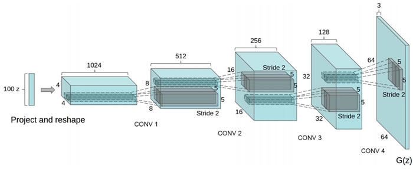
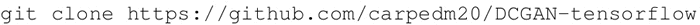
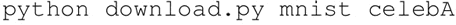
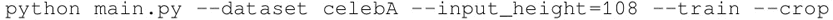
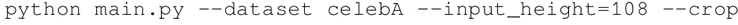
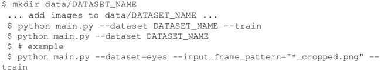
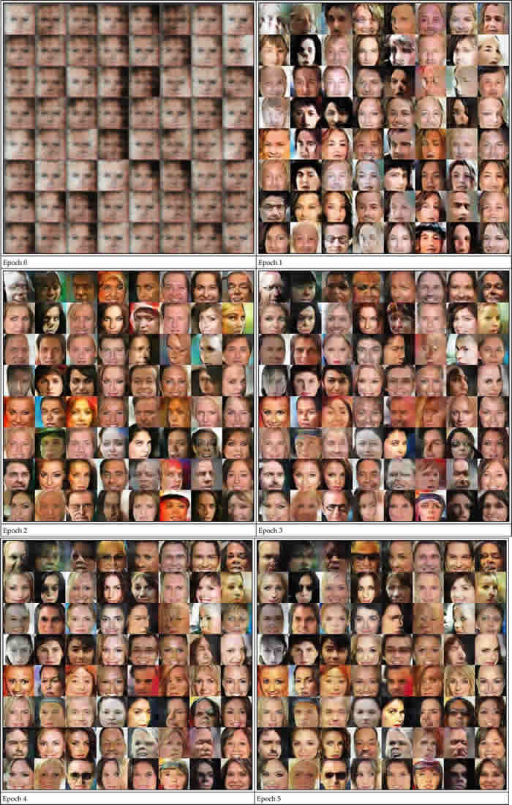

# DCGAN 实际应用：虚构名人面孔和其他数据集

近年来，卷积网络（CNN）的监督学习在计算机视觉中得到了广泛的应用。相比之下，无监督的 CNN 学习受到的关注较少。

本节希望能够帮助弥合有监督学习和无监督学习的可用 CNN 之间的差距。引入了一类称为深度卷积生成对抗网络（DCGAN）的 CNN，它具有一定的架构约束，表明它们是无监督学习的有力候选者。通过训练各种图像数据集，展示了令人信服的证据，深度卷积对抗双方学习了从对象部分到生成器和鉴别器中场景的表示层。另外，将经过训练生成的特征应用于新任务——将它作为一般图像特征进行应用。

用于伪造 MNIST 图像的想法同样可以应用于其他图像领域。本节将学习如何使用软件包在不同的数据集上训练 DCGAN 模型。

参阅该软件包可访问网址：[`github.com=/carpedm20/DCGAN-tensorflow`](https://github.com=/carpedm20/DCGAN-tensorflow)。

请注意，生成器具有下图所示的体系结构：值得注意的是，在封装方面，为了避免 D（鉴别器）网络的快速收敛，原始纸张有变化，G（生成器）网络在每个 D 网络更新周期中被更新两次。

本节的可行代码可访问网页：[`github.com/carpedm20/DCGAN-tensorflow`](https://github.com/carpedm20/DCGAN-tensorflow)。

## 具体实现过程

1.  从 GitHub 中克隆代码：
    

2.  下载以下数据集：
    

3.  要使用下载的数据集来训练模型，需要使用以下内容：
    

4.  要使用现有模型进行测试，需要使用以下命令：
    

5.  还可以通过执行以下操作来使用自己定义的数据集：
    

## 解读分析

生成器学习如何生成名人的伪造图像，而鉴别器学会如何从真实的图像中识别伪造的图像。在两个网络的每次迭代都争取改善和减少损失。前五个迭代的报告如下：

内容感知填充是摄影师用来填充不需要或缺少的图像部分的工具。Raymond A.Yeh、Chen Chen、Teck Yian Lim、Alexander G.Schwing、Mark Hasegawa-Johnson 和 Minh N 在 2016 年发表的论文“Semantic Image Inpainting with Perceptual and Contextual Losses”中使用 DCGAN 进行图像生成，它学会了如何填充图像的所需部分。