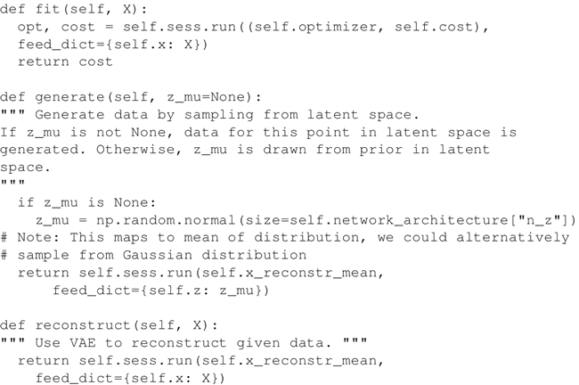
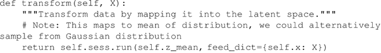

# VAE 变分自编码器及其实现详解

变分自编码器（VAE）组合了神经网络和贝叶斯推理这两种最好的方法，是最酷的神经网络，已经成为无监督学习的流行方法之一。

变分自编码器是一个扭曲的自编码器。同自编码器的传统编码器和解码器网络一起，它们具有附加的随机层。

编码器网络之后的随机层使用高斯分布对数据进行采样，而解码器网络之后的随机层使用伯努利分布对数据进行采样。

与 GAN 一样，变分自编码器根据它们所接受的分布来生成图像和数字。VAE 允许设置潜在的复杂先验，从而学习强大的潜在表征。

下图描述了一个 VAE。编码器 qφ 网络近似于真实，但后验分布 p(z|x) 很难处理，其中 x 是 VAE 的输入，z 是潜在表示。解码器网络 pθ 将 d 维潜在变量（也称为潜在空间）作为其输入并生成与 P(x) 相同分布的新图像。从 z|x~N(μ[z|x]，Σz|x) 采样得到潜在表示 z，而解码器网络的输出从 x|z~N(μ[x|z]，Σx|z) 采样得到 x|z：

图 1 自编码器的编码器–解码器示例图
现在已经有了 VAE 的基本结构，问题在于如何对它们进行训练，因为训练数据和后验密度的最大可能性是难以处理的。通过最大化 log 数据可能性的下限来训练网络。因此，损失项由两部分组成：通过采样从解码器网络获得的生成损失，以及被称为潜在损失的 KL 发散项。

发生损耗确保了由解码器生成的图像和用于训练网络的图像是相同的，并且潜在损失能够确保后验分布 qφ 接近于先验分布 p[θ]​(z)。由于编码器使用高斯分布进行采样，所以潜在损耗测量潜在变量与单位高斯匹配的匹配程度。

一旦 VAE 接受训练，只能使用解码器网络来生成新的图像。

## 具体做法

1.  导入必要的模块。本方法中，需要调用 Numpy、Matplolib 和 TensorFlow 函数：
    

2.  定义 VariationalAutoencoder 类。采用 __init__ 类方法来定义超参数，如学习率、批量大小、用于输入的占位符、编码器及解码器网络的权重和偏置变量。它还根据 VAE 的网络体系结构建立计算图。在本方法中使用 Xavier 初始化器初始化权重。与使用自己定义的方法进行 Xavier 初始化不同，本方法使用 tf.contrib.layers.xavier_initializer() 来进行初始化。最后，定义损失（生成和潜在）及优化器操作：
    

3.  创建网络编码器和网络解码器。网络编码器的第一层接收输入并生成输入的递减式潜在表示；第二层将输入映射到高斯分布。网络学习这些转变：
    

4.  VariationalAutoencoder 类还包含一些帮助函数来生成和重建数据，并适应 VAE：
    

5.  一旦 VAE 类完成，定义一个函数序列，它使用 VAE 类对象并通过给定的数据进行训练：
    

6.  使用 VAE 类和序列函数。采用 MNIST 数据集：
    

7.  定义网络架构，并在 MNIST 数据集上进行 VAE 的训练。在这种情况下，为了简单保留了潜在维度 2。
    

8.  看一下 VAE 是否重构了输入。输出表明那些数字确实被重构了，而且由于使用了二维的潜在空间，所以图像显得模糊了：
    
     下图是上述代码的输出：
    

9.  以下是使用经过训练的 VAE 生成的手写数字样本：
    
     以下是由自编码器生成的 MNIST 样字符的范围：图 2 由自编码器生成的一系列 MNIST 样字符示意图

代码基于 Kingma 和 Welling 撰写的论文“[Autoencoding Variational Bayes](https://arxiv.org/pdf/1312.6114.pdf)”，并通过 GitHub 进行了调整：[`jmetzen.github.io/2015-11-27/vae.html`](https://jmetzen.github.io/2015-11-27/vae.html)。

## 解读分析

VAE 学习重构，同时产生新的图像。生成的图像依赖于潜在空间。生成的图像与训练它们的数据集具有相同的分布。

通过在 VariationalAutoencoder 类中定义一个变换函数来查看潜在空间中的数据：

使用变换函数的 MNIST 数据集的潜在表示如下：

生成的 VAE 图像取决于潜在的空间维度。使潜在空间尺寸减小的模糊在增加。5-d、10-d 和 20-d 潜在维度的重构图像分别如下：

（[点此查看高清大图](http://c.biancheng.net/uploads/allimg/190115/2-1Z115134200B4.gif)）