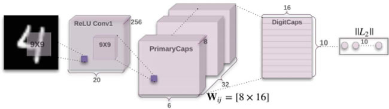
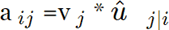
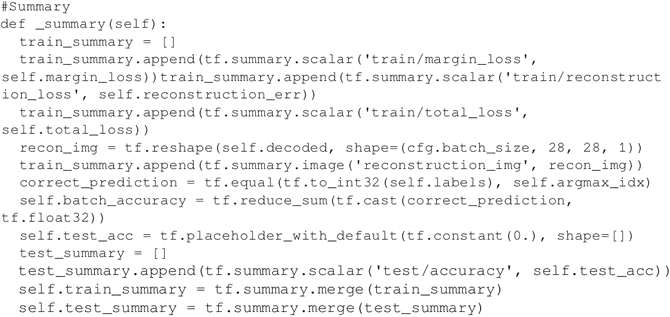

# CapsNet 胶囊网络原理和 TensorFlow 实现详解

胶囊网络（CapsNet）是一个非常新颖的创新型深度学习网络。该技术于 2017 年 10 月底在 Sara Sabour、Nicholas Frost 和 Geoffrey Hinton 发表的一篇名为“Dynamic Routing Between Capsule”的开创性论文中被提出。Hinton 是深度学习的先驱之一，因此，整个深度学习社区很高兴看到 capsule 带来的进展。

事实上，令人印象深刻的是 CapsNet 已经在 MNIST 分类中击败了最好的 CNN！那么 CNN 有什么问题呢？在 CNN 中，每一层都以渐进级别的粒度识别图像。正如在多个方法中描述的那样，第一层很可能会识别直线或简单的曲线和边，而后面的层将开始识别更复杂的形状，如矩形和更复杂的形式，如人脸。

当前用于 CNN 的一个关键操作是池化。池化旨在建立位置不变性，并且通常在每个 CNN 层之后使用以使任何问题在计算上易于处理。但是，池化引入了一个重要的问题，因为它迫使我们失去所有的位置数据。这是很不利的。想象一张脸：包含两只眼睛、一张嘴和一个鼻子，而重要的是这些部位之间有空间关系（嘴巴在鼻子下方，而鼻子通常在眼睛的下面）。

的确如此，Hinton 说：卷积神经网络中使用的池化操作是一个很大的错误，即使它运行得很好，也将是一场数据灾难。

从技术上讲，需要的不是位置不变性，而是等值性。等值是表明想要了解图像中的旋转或比例变化的一个特定术语，希望相应地调整网络。这样，图像中不同分量的空间定位就不会丢失。

那么胶囊网络有什么创新点呢？据作者说，大脑有被称为 capsule 的模块，每个 capsule 专门处理特定类型的信息。capsule 对于理解位置的概念、尺寸的概念、定向的概念、变形的概念、纹理等尤其有效。除此之外，作者推断大脑具有特别有效的机制，能将每条信息动态传输到 capsule。这被认为最适合用来处理特定类型的信息。

所以，CNN 和 CapsNet 之间的主要区别在于，CNN 不断添加用于创建深层网络的图层，而 CapsNet 将神经层嵌入另一个。一个 capsule 是一组神经元，它在网络中引入更多的结构，它产生一个矢量来表示图像中存在的一个实体。特别是，Hinton 使用活动矢量的长度来表示实体存在的概率和表示实例化参数的取向。当多个预测一致时，更高级别的 capsule 变得活跃。对于每个可能的父代，capsule 产生额外的预测矢量。

现在又有了一个创新：使用 capsule 的动态路由，不再使用原始的池化思想。较低级别的 capsule 更倾向于将其输出发送到较高级别的 capsule，而活动矢量与来自较低级别 capsule 的预测具有较高的标量乘积。具有最大标量预测矢量积的父代增加了 capsule 键。所有其他父代减少了它们的 capsule 键。

换句话说，这个想法是如果一个更高层次的 capsule 与更低层次的 capsule 达成了协议，那么它会要求发送更多的这种类型的信息。如果没有达成协议，它会要求发送更少的这种类型的信息。这种使用协议方法的动态路由优于当前的机制，如最大池化。根据 Hinton 所述，路由最终是解析图像的一种方式。确实，最大池化只关注了最大值，而动态路由通过低层和高层之间的协议有选择性地传递信息。

第三个区别是引入了一个新的非线性激活函数。CapsNet 并没有像在 CNN 中一样为每个图层添加一个压缩函数，而是将一个压缩函数添加到一个嵌套的图层集合中。非线性激活函数如下所示，它被称为压缩函数：

 其中，v[j] 是 capsule j 的矢量输出，s[j]​ 是它总的输入。

此外，Hinton 等人也表明：一种有差别训练的多层 capsule 系统在 MNIST 上实现了最新的性能，并且在识别高度重叠的数字方面比卷积网络好得多。文章“Dynamic Routing Between Capsules”展示了简单的 CapsNet 架构：

图 1 一个简单的 CapsNet 架构图
该架构非常浅显易懂，只有两个卷积层和一个全连接层。Conv1 有 256 个 9×9 卷积核，它的步长为 1，由 ReLU 激活。该层的作用是将像素强度转换为局部特征检测器的活动，然后将其作为 PrimaryCapsules 的输入。PrimaryCapsules 是一个 32 通道的卷积 capsule 层；每个主 capsule 包含 8 个卷积单元，带有一个 9×9 内核，步幅为 2。

总之，PrimaryCapsules 有 [32，6，6] capsule 输出（每个输出是一个 8D 矢量），[6，6] 网格中的每个 capsule 共享彼此的权重。最后一层（DigitCaps）在每个数字类中有一个 16D capsule，这些 capsule 中的每一个都接收来自下面所有其他 capsule 的输入。路由只产生在两个连续的 capsule 层（如 PrimaryCapsules 和 DigitCaps）之间。

相关代码可访问网页：[`github.com/debarko/CapsNet-Tensorflow`](https://github.com/debarko/CapsNet-Tensorflow)，更多相关代码可访问：[`github.com/naturomics/CapsNet-Tensorflow.git`](https://github.com/naturomics/CapsNet-Tensorflow.git)。

## 具体做法

1.  根据 Apache 许可证从 GitHub 克隆代码：
    

2.  下载 MNIST 并创建适当的结构：
    

3.  开始训练过程：
    

4.  看一下用于定义 capsule 的代码。每个 capsule 以一个 4D 张量作为输入并返回一个 4D 张量。可以将 capsule 定义为一个完全连接的网络（DigiCap）或一个卷积型网络（Primary capsule）。需要注意的是，Primary 是 ConvNet 的集合，之后非线性压缩函数被应用。Primary capsule 将通过动态路由与 DigiCap 进行通信：
    

5.  路由算法在论文 Dynamic Routing Between Capsules 中进行了描述，同时本文的相关部分与方程 2 和方程 3 的定义一起进行了解释。路由算法的目标是将信息从低层 capsule 传递到高层 capsule 并识别哪里有协议。通过简单地使用在上层中的每个 capsule j 的当前输出和由 capsule i 做出的预测之间的标量积来计算该协议：对于除了第一层之外的所有 capsule，一个 capsule s[j] 的总输入是来自下层 capsule 的所有“预测矢量”的加权和，预测矢量由下层 capsule 的输出与权重矩阵 W[ij] 的乘积获得：
    
    其中，c[ij] 为取决于迭代动态路由过程的耦合系数。capsules i 与所有上层的 capsule 的耦合系数之和为 1，它取决于路由 softmax。路由 softmax 的初始分对数 b[ij] 是 capsule i 与 capsule j 的先验概率的对数。

    应该与 capsule j 耦合：
     先验概率的对数可以同时被分别训练成所有其他的权重。它们取决于位置和两个 capsule 的类型而不是取决于当前的输入图像。初始的耦合系数通过衡量每个 capsule j 在上一层级的当前输出 v[j] 和由 capsule i 做出的预测之间的协议而被循环优化。

    在卷积 capsule 层中，capsule 的每个单元都是一个卷积单元。因此，每个 capsule 都会输出一系列矢量而不是只有一个矢量输出。

    协议就是一个简单的数量积：
    ​
    在计算所有使 capsule i 与更高层 capsule 相连的耦合系数的新取值之前，该协议被训练为最大似然的对数并代入初始分对数 b[ij]

    Procedure 1 路由算法：
    
     以下方法在前面的图像中实现了步骤 1 中描述的步骤。值得注意的是，输入是来自第 l 层中的 1152 个 capsule 的 4D 张量。输出是在 l+1 层中 capsule j 的矢量输出“v_j”的形状张量[batch_size，1，length（v_j）=16，1]：
    

6.  回顾一下非线性激活压缩函数。它的输入是一个形状为 [batch_size，num_caps，vec_len，1] 的 4D 矢量，输出是一个与矢量形状相同但在第三维和第四维上压缩的 4D 张量。给定一个矢量输入，目标是计算公式 1 中表示的值，如下所示：
    
     其中，v[j] 是 capsule j 的矢量输出，s[j] 是总的输入。
    

7.  在前面的步骤中，已经定义了 capsule 是什么，capsule 之间的动态路由算法以及非线性压缩函数。现在我们可以定义合适的 CapsNet。损失函数是为训练而建立的，选择 Adam 优化器。build_arch（...）方法定义了下图所示的 CapsNet：
    
     值得注意的是，本文描述了一种重构技术作为正则化方法。来自论文：使用额外的重构损失来鼓励数字 capsule 对输入数字的实例化参数进行编码。在训练期间，掩盖了除了正确数字 capsule 的活动矢量之外的所有数据。

    接着使用这个活动向量来重构。

    数字 capsule 的输出被反馈到由三个完全连接层构成的解码器中，解码器对如下图所述的像素强度进行建模。最小化逻辑单元的输出与像素强度之间的差的平方和。把这个重构损失降低了 0.0005，这样它就不会在训练期间占主导地位。下面给出的 build_arch（..）方法也被用于创建解码器：
    
     从 DigitCap 层表示中重构一个数字的解码器结构。图像和 sigmoid 层的欧氏距离在训练中被最小化。在训练中使用真标签作为重构目标，如下图所示：
    
     边际损失函数是本文定义中的另一个重要部分。在以下文章的片段引用（等式 4）中进行了解释，并在 loss（..）方法中执行，该方法包括三项损失：差额损失、重构损失和总损失：
    

8.  此外，很容易定义一个 _summary（...）方法来报告损失和精确度：
    

## 解读分析

CapsNet 与最先进的深度学习网络是不同的，它使用浅层网络，让 capsule 层嵌套在其他层中，而不需要增加更多的层和让网络深层次化。每个 capsule 被用于检测图像中的特定实体，一个动态的路由机制将检测到的实体发送给父层。对于 CNN 来说，要从不同角度识别一个物体，你必须从很多不同的方面来考虑成千上万的图像。Hinton 认为，这些层次中的冗余将会使 capsule 网络能够从多个角度和在不同情况下识别物体，相比 CNN，使用的数据更少。

检验一下 Tensorboard 所示的网络：

（[点此查看高清大图](http://c.biancheng.net/uploads/allimg/190115/2-1Z115164H6200.jpg)）令人印象深刻的结果如下图所示：

 3 个路由迭代的 CapsNet 的样本 MNIST 测试重构。（l，p，r）分别表示标签、预测和重构目标。最右边的两列表示一个失败案例的两个重构，它解释了模型是如何混淆在图像中的 5 和 3 的。其他的列都是由正确的分类获得的，它表明模型选取了细节而平滑了噪声。

这些图表取自公开发表的论文。CapsNet 在以前只能在深度网络中实现三层网络上的低测试误差（0.25%）。基线是具有 3 个卷积层的 CNN 具有 256，256–128 的通道。每个基线有 5×5 个内核，步幅为 1。最终的卷积层之后是两个大小为 328 和 192 的完全连接层。最后的全连接层连接到具有交叉熵损失的 10 类 softmax 层：

 此表为 CapsNet 分类测试精度，MNIST 均值和标准差结果由 3 次试验获得。

看看差额损失、重构损失和总损失的减少情况：

 看一下精确度的提高情况。经过 500 次迭代达到 92%，在 3500 次迭代中达到 98.46%：图 2 CapsNet 的精确度提高的例子