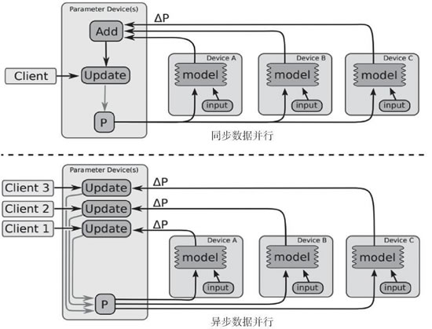

# TensorFlow 分布式详解

每次 TensorFlow 运算都被描述成计算图的形式，它允许结构和运算操作配置所具备的自由度能够被分配到各个分布式节点上。计算图可以分成多个子图，分配给服务器集群中的不同节点。

强烈推荐读者阅读论文“[Large Scale Distributed Deep Networks](https://research.google.com/archive/large_deep_networks_nips2012.html)”，本文的一个重要成果是证明了分布式随机梯度下降算法（SDG）可以运行，在该算法中，有多个节点在数据分片上并行工作，通过向参数服务器发送更新来异步独立更新梯度。论文摘要引用如下：实验揭示了一些关于大规模非凸优化的令人惊喜的结果。首先，很少应用于非凸问题的异步 SGD 在训练深度网络方面效果很好，特别是在结合 Adagrad 自适应学习率时。

这篇论文本身的一个照片可以很好地解释这一点：

图 1
 另一个值得阅读的文档是 TensorFlow 白皮书：《[Large-Scale Machine Learning on Heterogeneous Distributed Systems](http://download.tenorflow.org/paper/whitepaper2015.pdf)》（Martín Abadi 等人，2015 年 11 月）。

考虑其中包含的一些示例，可以在下面的图片中看见，左侧显示的是 TensorFlow 代码片段，右侧显示的是对应的图表：
图 2 TensorFlow 计算图示例（[点此查看高清大图](http://c.biancheng.net/uploads/allimg/190115/2-1Z1151I14D53.gif)）
通过进行本地计算以及在必要时轻松添加计算图远程通信节点，计算图可以被切分覆盖多个节点，前面提到的论文中的图可以很好地解释这个问题：

图 3 插入接收/发送节点前后的对比图
梯度下降和所有主要的优化器算法可以以集中方式（下图左侧）或分布式方式（下图右侧）进行计算，后者包括一个 master 进程，它与多个提供 GPU 和 CPU 的 worker 相连：

图 4 单机模式和分布式模式结构
分布式计算可以是同步的（所有 worker 同时更新数据块上的梯度）或异步的（更新不会同时发生），后者通常允许更高的可扩展性，更大的图计算在最优解的收敛方面表现得更好。以下照片同样来自 TensorFlow 白皮书，如果想了解更多，我强烈鼓励有兴趣的读者看看这篇论文：

图 5 同步和异步数据并行训练，同步和异步数据并行训练的示例