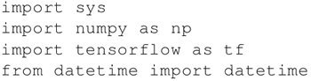

# TensorFlow GPU 的安装和使用

本节将学习如何在 GPU 中使用 TensorFlow，所执行的运算操作是在 CPU 或 GPU 上进行简单的矩阵乘法。

首先安装一个支持 GPU 的 TensorFlow 版本。官方的 TensorFlow 安装说明能够提供良好的开始：[`www.tensorflow.org/`](https://www.tensorflow.org/)。请记住，对 GPU 的环境支持需要通过 CUDA 或 CuDNN。

#### GPU 上 TensorFlow 的使用

1.  导入几个模块：
    

2.  从命令行获得想要使用的处理器类型（GPU 或 CPU）：
    

3.  在 GPU 或 CPU 上执行矩阵乘法。关键指令是使用 tf.device（device_name），它创建一个新的上下文管理器来告诉 TensorFlow 在 GPU 或 CPU 上执行这些操作：
    

4.  打印一些调试计时，以验证 CPU 和 GPU 之间的区别：
    

此案例说明了如何将 TensorFlow 计算分配给 CPU 或 GPU，代码非常简单，并将作为基础案例。