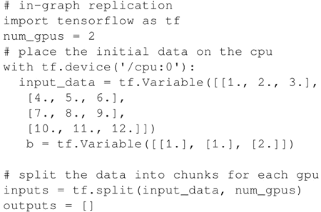

# 玩转 TensorFlow 分布式（多 GPU 和多服务器）详解

本节介绍有关 TensorFlow 分布式的两个实际用例，分别是数据并行（将数据分布到多个 GPU 上）和多服务器分配。

## 玩转分布式 TensorFlow：多个 GPU 和一个 CPU

展示一个数据并行的例子，其中数据被切分到多个 GPU 上。

这个案例灵感来自 Neil Tenenholtz 的一篇很好的博客文章，网址为[`clindatsci.com/blog/2017/5/31/distributed-tensorflow`](https://clindatsci.com/blog/2017/5/31/distributed-tensorflow)。

#### 具体做法

1.  考虑在单个 GPU 上运行矩阵乘法的这段代码：
    

2.  通过图内拷贝模式中对代码进行了分割，如以下两个不同 GPU 的代码片段所示。请注意，CPU 充当 master 节点，分配计算图，并收集最终结果：
    

    

这是一个非常简单的案例，其中计算图由作为 master 的 CPU 分成两部分，并分配给作为 worker 的两个 GPU，计算结果由 CPU 收集。

## 玩转分布式 TensorFlow：多服务器

在这个案例中学习如何将 TensorFlow 计算分配到多个服务器中，其中需假设 worker 和参数服务器的代码是相同的，因此每个计算节点的作用就是传递命令行参数。

这个案例的灵感来自 Neil Tenenholtz 的一篇很好的博客文章，可以在线获取，网址为：[`clindatsci.com/blog/2017/5/31/distributed-tensorflow`](https://clindatsci.com/blog/2017/5/31/distributed-tensorflow)。

#### 具体做法

1.  考虑以下这段代码，所采用的集群架构包括一个在 192.168.1.1：1111 上运行的 master 和两个分别在 192.168.1.2：1111 和 192.168.1.3：1111 上运行的 worker。
    

2.  请注意，代码被复制到多台机器上，因此知道当前执行节点的角色是很重要的，从命令行中能得到这些信息。机器可以是一个 worker 或一个参数服务器。
    

3.  给定一个集群，运行训练服务，每个计算节点都能够有一个角色（worker 或者 ps）和一个 id。
    

4.  根据计算节点的角色，计算是不同的：
    *   如果角色是参数服务器，则条件是加入服务。请注意，在这种情况下，没有要执行的代码，因为 worker 将不断推送更新，而参数服务器必须执行的唯一操作就是等待。
    *   相反，worker 代码将在集群内的特定设备上执行。这部分代码与第一次构建模型然后进行本地训练的单个机器上执行的代码类似。请注意，TensoFlow 轻松地完成了所有的工作分配以及更新结果的收集，并且提供了非常方便的 tf.train.replica_device_setter，可自动将运算操作分配给设备。

#### 解读分析

在这个案例中，已经看到了如何创建一个具有多个计算节点的集群。节点既可以扮演参数服务器的角色，也可以扮演 worker 的角色。

在这两种情况下，执行的代码是相同的，但是根据从命令行收集的参数，代码的执行则是不同的。参数服务器只需要等待 worker 发送更新。请注意，tf.train.replica_device_setter(..) 的作用是自动将运算操作分配给可用设备，而 tf.train.ClusterSpec(..) 用于集群设置。

另外请注意，出于效率原因，你可以使用多个参数服务器。利用参数，服务器可以提供更好的网络利用率，并允许将模型扩展到更多的并行机器。