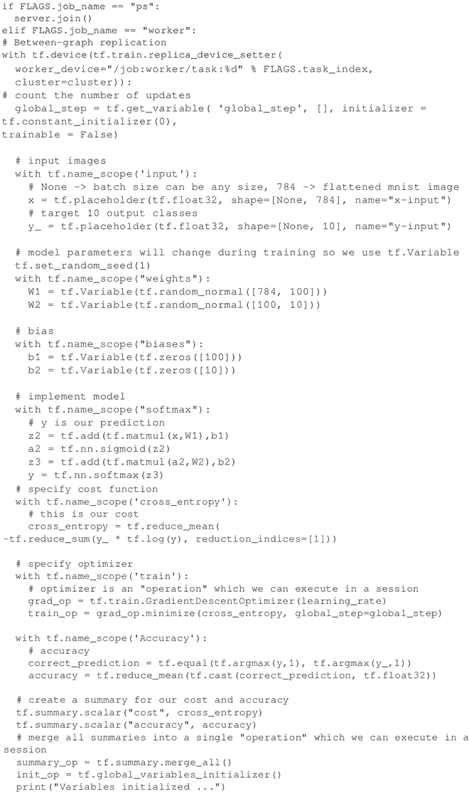

# TensorFlow 分布式训练 MNIST 分类器

本节以分布式方式训练完整的 MNIST 分类器。

该案例受到下面博客文章的启发：[`ischlag.github.io/2016/06/12/async-distributed-tensorflow/`](http://ischlag.github.io/2016/06/12/async-distributed-tensorflow/)，运行在 TensorFlow 1.2 上的代码可以在网址[`github.com/ischlag/distributed-tensorflow-example`](https://github.com/ischlag/distributed-tensorflow-example)上找到。

注意，这个案例基于上一节，所以按顺序阅读可能会很方便。

## 具体做法

1.  导入一些标准模块并定义运行计算的 TensorFlow 集群，然后为指定任务启动服务：
    

2.  读取 MNIST 数据并定义用于训练的超参数：
    

3.  检查角色是参数服务器还是 worker，如果是 worker 就定义一个简单的稠密神经网络，定义一个优化器以及用于评估分类器的度量（例如精确度）：
    

4.  启动一个监督器作为分布式设置的主机，主机是管理集群其余部分的机器。会话由主机维护，关键指令是 sv=tf.train.Supervisor(is_chief=(FLAGS.task_index==0))。另外，通过 prepare_or_wait_for_session(server.target)，监督器将等待模型投入使用。请注意，每个 worker 将处理不同的批量模型，然后将最终的模型提供给主机：
    

这个案例描述了一个分布式 MNIST 分类器的示例，在这个例子中，TensorFlow 允许定义一个三台机器的集群，一个用作参数服务器，另外两个用作独立批量训练数据的 worker。