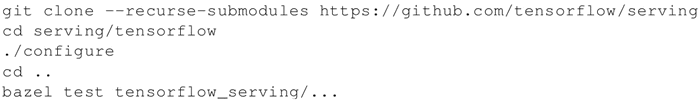
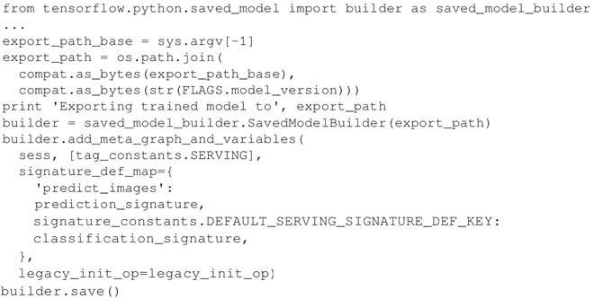
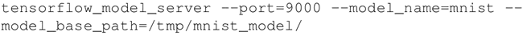

# TensorFlow Serving 运行 Docker 容器（详解版）

在这个案例中将演示如何为 TensorFlow Serving 运行一个 Docker 容器，这是一组组件，用于导出经过训练的 TensorFlow 模型，并使用标准的 tensorflow_model_server 来为实现的模型服务。TensorFlow Serving 服务器发掘出新的导出模型并使用 gRPC 来提供服务。

我们将使用 Docker 并假定你熟悉该系统，可参考 [`www.docker.com/`](https://www.docker.com/) 了解 Docker 的相关知识并安装它。我们要做的是建立一个 TensorFlow Serving 版本。

## 具体做法

1.  从网址[`github.com/tensorflow/serving/blob/master/tensorflow_serving/tools/docker/Dockerfile.devel`](https://github.com/tensorflow/serving/blob/master/tensorflow_serving/tools/docker/Dockerfile.devel)上下载 Dockerfile.devel。
2.  通过运行以下命令构建一个容器：

    docker build--pull-t$USER/tensorflow-serving-devel-f Dockerfile.devel

3.  运行容器：

    docker run-it$USER/tensorflow-serving-devel

4.  克隆 TensorFlow Serving、配置和测试服务器：
    

5.  现在看一个保存模型的示例，以便服务器可以保存它。该例子是受一个示例启发得到的，构建 MNIST 训练器并为模型提供服务（[`github.com/tensorflow/serving/blob/master/tensorflow_serving/example/mnist_saved_model.py`](https://github.com/tensorflow/serving/blob/master/tensorflow_serving/example/mnist_saved_model.py)）。第一步是将构建器（builder）导入为 saved_model_builder，然后大部分的工作由 SavedModelBuilder() 来完成，它将被训练模型的 snapshot 保存到可靠的存储空间中。请注意，这里的 export_path 是 /tmp/mnist_model/
    

6.  模型可以用一个简单的命令来执行：
    

## 总结

2016 年 2 月谷歌发布 [TensorFlow Serving](https://www.tensorflow.org/serving/)，是针对机器学习模型的一个高性能服务系统，用于生产环境。2017 年 8 月，谷歌在生产中已经有超过 800 个项目使用了 TensorFlow Serving。

TensorFlow Serving 是一款非常灵活的软件，在这个案例中只是学习了它潜在用途的表面而已。如果你有兴趣了解更多的高级功能，如大批量运行或动态加载模型，推荐参考[`github.com/tensorflow/serving/blob/master/tensorflow_serving/g3doc/serving_advanced.md`](https://github.com/tensorflow/serving/blob/master/tensorflow_serving/g3doc/serving_advanced.md)。