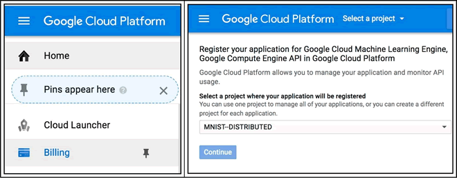
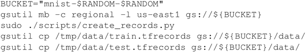

# TensorFlow 分布式在谷歌云平台运行详解

在这个案例中将学习如何在谷歌云平台上使用 Google TensorFlow，回顾的例子是经典的 MNIST。

在[`cloud.google.com/`](https://cloud.google.com/)中查看 GCP 的工作方式将是一件好事。请注意，GCP 提供 300 美元的免费积分以使用任何 GCP 产品。

## 具体做法

1.  从网络控制台[`pantheon.google.com/cloud-resource-manager`](https://pantheon.google.com/cloud-resource-manager)上创建新的谷歌云项目：
    
     单击“create project”时将显示以下界面：
    

2.  通过在云控制台的左侧导航栏中选择相关的语音来为此项目启用计费，然后为项目启动 Compute Engine（计算引擎）和 Cloud Machine Learning APIs（云机器学习 API）：
    

3.  登录到网络云端[`pantheon.google.com/cloudshell/editor`](https://pantheon.google.com/cloudshell/editor)：
    

4.  在控制台上运行以下命令来配置要执行计算的区域，下载示例代码并创建用于运行代码的虚拟机，最后连接到机器上：
    

5.  登录到机器后，需要用以下命令安装 PIP 和 TensorFlow 来设置环境：
    

6.  有多个处理 MNIST 数据的 worker，所以最好的办法是创建一个在所有 worker 之间共享的存储桶，并复制这个桶中的 MNIST 数据：
    

7.  创建多个 worker（worker-0，worker-1），它们是初始模板——实例机器的克隆。不希望在机器关闭时删除磁盘，这就是为什么要有第一条命令：
    

8.  最后一步是执行分布式训练的计算：
    

## 解读分析

Demo 脚本将代码移动到每个虚拟机并启动分布式计算，这两个 worker 基于一个共同的存储桶所共享的相同的 MNIST 数据，并行进行运算，计算结束后，脚本将打印训练模型的位置。

## 扩展阅读

如果不想管理 TensorFlow，那么可使用 Google 运行的托管版本，这是在下一个案例中所描述的 CloudML 服务。另外，如果你决定使用带有 CloudML 的 GPU，那么[`cloud.google.com/ml-engine/docs/using-gpus`](https://cloud.google.com/ml-engine/docs/using-gpus)是一个很好的起点。