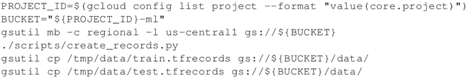
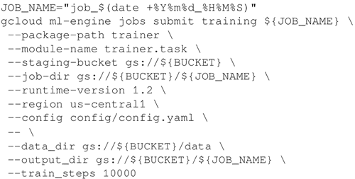
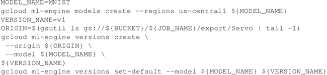
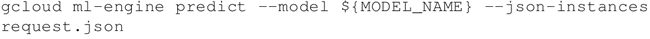

# TensorFlow 分布式在谷歌 CloudML 运行

CloudML 是由 Google 运行的 TensorFlow 托管版本，你可以不用自己运行 TensorFlow，只需轻松地使用 CloudML，并忘记与基础架构和可扩展性相关的所有问题。

假设你已经创建了云平台项目，并为项目启动计费，并启用 Google 计算引擎和云机器学习 API，这些步骤与上一个案例描述的步骤相似。这个案例受到 MNIST 训练代码的启发：[`cloud.google.com/ml-engine/docs/distributed-tensorflow-mnist-cloud-datalab`](https://cloud.google.com/ml-engine/docs/distributed-tensorflow-mnist-cloud-datalab)。

## 具体做法

继续在 Google CloudML 上运行分布式 TensorFlow：

1.  从[`github.com/GoogleCloudPlatform/cloudml-dist-mnist-example`](https://github.com/GoogleCloudPlatform/cloudml-dist-mnist-example)下载示例代码。
2.  然后下载数据并保存在 GCP 存储桶中：
    

3.  提交训练工作非常简单：可以轻松地使用 CloudML 引擎调用训练步骤。在这个例子中，训练代码在 us-central1 区域运行 1000 次，输入数据来自存储桶，输出桶将被提交到一个不同的存储桶。
    

4.  如果你愿意，可以通过访问 CloudML 控制台（[`pantheon.google.com/mlengine/`](https://pantheon.google.com/mlengine/)）控制训练过程。
5.  一旦培训结束，可以直接从 CloudML 中提取模型。
    

6.  一旦模型在线提供，就可以获取服务并进行预测，request.json 是通过使用从 MNIST 读取数据的脚本 make_request.py 创建的，该脚本执行独热编码，然后使用格式良好的 json 模式编写特征。
    

## 解读分析

CloudML 是使用 Google TensorFlow 托管版本的便捷解决方案，它不直接关注基础架构和运算，而是关注开发机器学习模型。

#### 拓展阅读

CloudML 的一个非常酷的功能是通过并行运行多个试验来自动调整模型中包含的超参数，这为超参数提供了优化值，从而最大限度地提高了模型的预测精度。

如果有兴趣了解更多信息，请参考[`cloud.google.com/ml-engine/docs/hyperparameter-tuning-overview`](https://cloud.google.com/ml-engine/docs/hyperparameter-tuning-overview)。