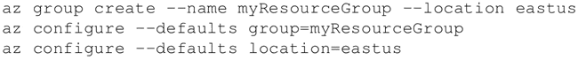
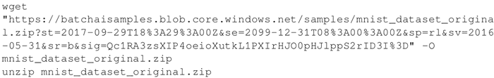
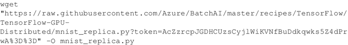
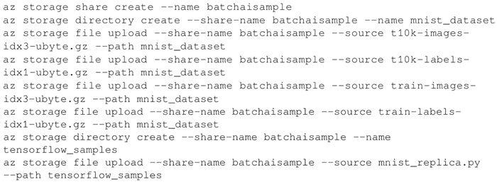
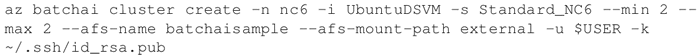
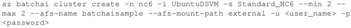
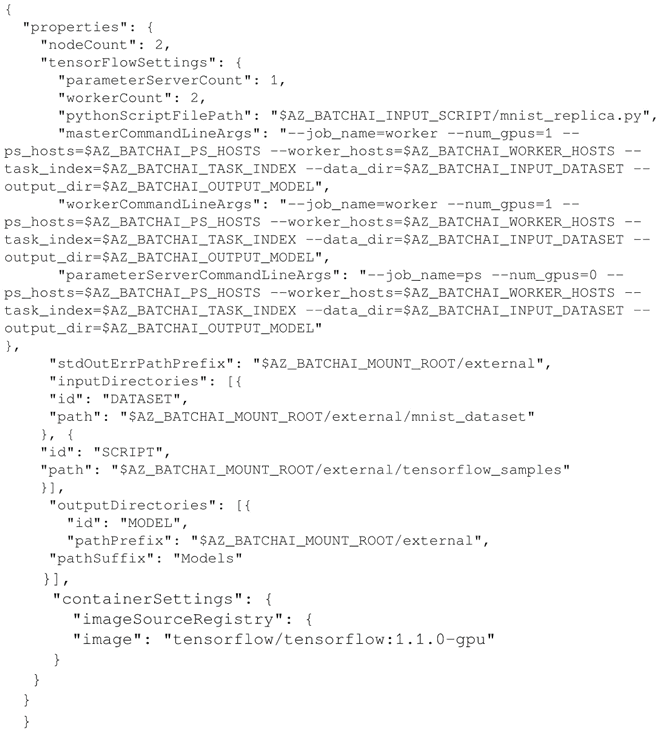
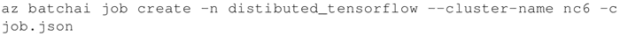
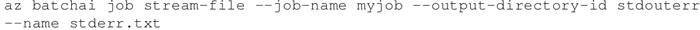

# TensorFlow 分布式在 Microsoft Azure 上运行

Microsoft Azure 提供了一个名为 Batch AI 的服务，它允许在 Azure 虚拟机群集上运行机器学习模型。

首先需要一个 Azure 账户，如果你还没有账户，可以免费创建一个账户，网址为[`azure.microsoft.com/en-us/services/batch-ai/`](https://azure.microsoft.com/en-us/services/batch-ai/)。Azure 为新用户提供 30 天 200 美元的积分。

这个案例将按照 Azure 提供的示例，使用分布式 TensorFlow 在两个 GPU 上运行 MNIST，相关的代码发布在 GitHub 上，网址为：[`github.com/Azure/batch-shipyard/tree/master/recipes/TensorFlow-Distributed`](https://github.com/Azure/batch-shipyard/tree/master/recipes/TensorFlow-Distributed)。

## 具体做法

1.  安装 Azure CLI。不同操作系统平台上的安装细节请参考：[`docs.microsoft.com/en-us/cli/azure/install-azure-cli?view=azure-cli-latest`](https://docs.microsoft.com/en-us/cli/azure/install-azure-cli?view=azure-cli-latest)。
2.  在创建集群之前，需要使用命令 az login 登录 Azure。它会生成一个口令和网址，并验证你的使用凭证。在这个网址上按照步骤依次操作，系统会要求关掉页面并验证你的凭证，az 证书将被验证。
3.  配置默认位置，创建和配置资源组:
    

4.  使用 <az storage account create> 命令创建存储，并根据操作系统设置环境变量，有关环境变量及其值的详细信息可从网址[`docs.microsoft.com/en-us/azure/batch-ai/quickstart-cli`](https://docs.microsoft.com/en-us/azure/batch-ai/quickstart-cli)获取。
5.  下载并提取预处理的 MNIST 数据库：
    

6.  下载 mnist_replica：
    

7.  创建一个 Azure 文件共享，在其中上传下载的 MNIST 数据集和 mnist_replica.py 文件：
    

8.  创建一个集群。对于这个案例，该集群包括两个标准的 NC6 型 GPU 节点，或者 Ubuntu LTS 和 Ubuntu DVSM 型节点。可以使用 Azure CLI 命令创建集群：
    对于 Linux 系统来说，命令如下：
    
     对于 Windows 系统来说，命令如下：
    

9.  在 job.json 文件中创建工作参数：
    

10.  使用以下命令创建 Batch AI 作业：
    

## 解读分析

Batch AI 自己管理资源，你只需指定作业、输入位置和存储输出的位置。如果在执行作业期间想要查看结果，可以使用以下命令：

作业结束后，使用命令 az batchai job delete 和 az batchai cluster delete 删除作业和集群。

#### 拓展阅读

上面学习了如何使用 Azure 命令行工具将 Microsoft Azure Batch AI 用于分布式 TensorFlow，也可以使用 Jupyter Notebook 做同样的事情。这将涉及设置 Azure Active Directory，并进行新的应用程序注册。

详细信息可从[`docs.microsoft.com/en-us/azure/azure-resource-manager/resource-group-create-service-principal-portal`](https://docs.microsoft.com/en-us/azure/azure-resource-manager/resource-group-create-service-principal-portal)获得。