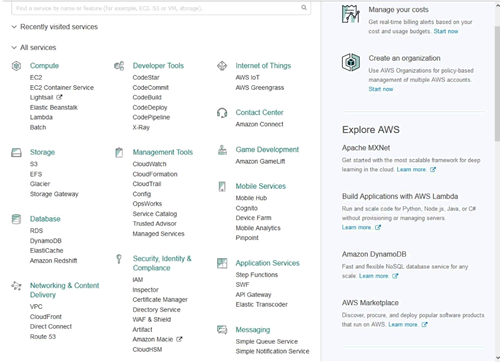
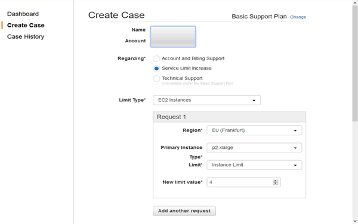
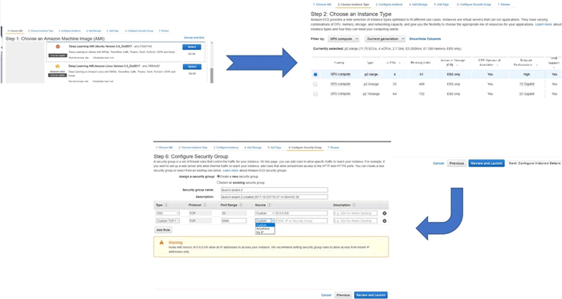
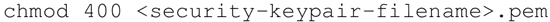
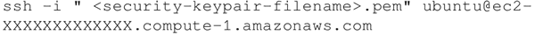
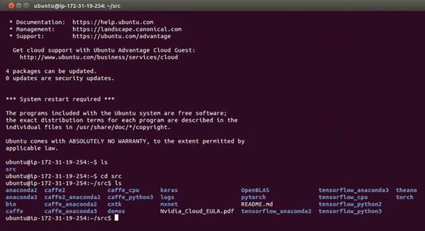
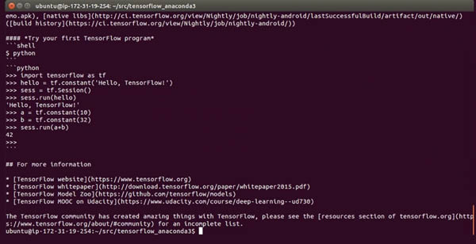
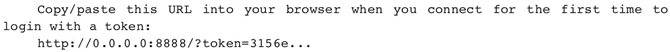

# TensorFlow 分布式在 Amazon AWS 上运行

Amazon AWS 提供采用 NVIDIA K8 GPU 的 P2.x 机器。为了能够使用，第一步还需要创建一个 Amazon AWS 账户，如果还没有，可以使用链接[`portal.aws.amazon.com/billing/signup?nc2=h_ct redirect_url=https%3A%2F%2Faws.amazon.com%2Fregistration-confirmation#/start (https://portal.aws.amazon.com/billing/signup?nc2=h_ct%20redirect_url=https%3A%2F%2Faws.amazon.com%2Fregistration-confirmation#/start)`](https://portal.aws.amazon.com/billing/signup?nc2=h_ct redirect_url=https%3A%2F%2Faws.amazon.com%2Fregistration-confirmation#/start (https://portal.aws.amazon.com/billing/signup?nc2=h_ct%20redirect_url=https%3A%2F%2Faws.amazon.com%2Fregistration-confirmation#/start))来创建。登录账户后，控制台看起来如下图所示：

（[点此查看高清大图](http://c.biancheng.net/uploads/allimg/190116/2-1Z116141F9448.jpg)）
可以看到，Amazon AWS 提供了大量服务，但在这里关注的是使用 Amazon AWS 进行深度学习。

GPU 仅在 P2 实例构建时可用，并且在默认情况下不可用，为了获得该服务，需要通过 AWS support 来提高价格以增加资源，support 位于右上角，一旦进入 support，你会看到一个 Create case 按钮，点击该按钮，并做出以下选择：

 你可以选择任何提供 p2.xlarge 实例的区域。New limit value 决定了可使用实例的最大数量，请仔细选择该数字，因为该服务不是免费的，每小时大约花费 1 美元。AWS 大约会用 24 小时回复请求。

## 准备工作

现在已经拥有了 AWS 账户和 p2.xlarge 实例，就可以从 EC2 控制台创建自己的实例。第一步是选择 Machine Image（机器镜像），到目前为止，亚马逊提供预装深度学习库的特殊机器镜像，你可以选择 Ubuntu 或 Linux 版本。接下来，选择 GPU 确定实例类型。

你可以使用默认参数查看和启动（Review and Lanuch）实例，也可以配置设置，选择存储并配置安全组（security group）。配置安全组非常重要，默认情况下，SSH 安全组已经设置，但是如果你要使用 Jupyter Notebook，则需要为端口 8888 添加自定义安全组，选择 source 以备登录实例，其中 source 有三个选项，分别为：Custom、Anywhere 和 My IP。

（[点此查看高清大图](http://c.biancheng.net/uploads/allimg/190116/2-1Z116142623517.jpg)）
最后，当你启动实例的时候，你会被要求创建一个密钥对（key pair），它允许你登录到指定的实例。创建一个密钥对并下载相应的 .pem 文件，这将在稍后登录时使用。

## 具体做法

1.  连接到实例，可以通过 ssh 命令或浏览器完成，使用 CLI（命令行界面）。
2.  连接 .pem 文件的可变化模块：
    

3.  使用下面的命令将 SSH 连接到实例，当要连接时，通过控制台能够看到准确地址：
    

4.  选择的机器实例已经包含了包括 TensorFlow 在内的所有深度学习库，所以不需要安装任何东西：
    

5.  每个文件夹都包含一个介绍如何使用相应库的 readme 文件：
    

## 解读分析

你可以运行刚才学习的已经创建的实例的相关代码。一旦工作结束，不要忘记退出，并从控制台上停止实例。有关价格和使用的更多细节请访问：[`aws.amazon.com/documentation/ec2/`](https://aws.amazon.com/documentation/ec2/)。

#### 拓展阅读

AWS 市场上有大量具备预配置库和 API 的 docker 镜像和机器镜像。要启动 jupyter notebook，请在命令行中使用 <jupyter notebook--ip=0.0.0.0--no-browser>，输出如下所示：

复制该网址到浏览器中即可开始使用。

此外，使用 AWS CloudFormation 可以简化整个流程。CloudFormation 通过模板创建和配置 Amazon Web Services 资源，能够简化建立分布式深度学习集群的过程，有兴趣的读者请参考：[`aws.amazon.com/blogs/compute/distributed-deep-learning-made-easy/`](https://aws.amazon.com/blogs/compute/distributed-deep-learning-made-easy/)。