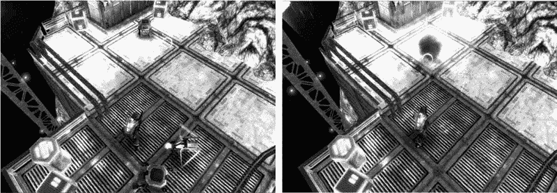
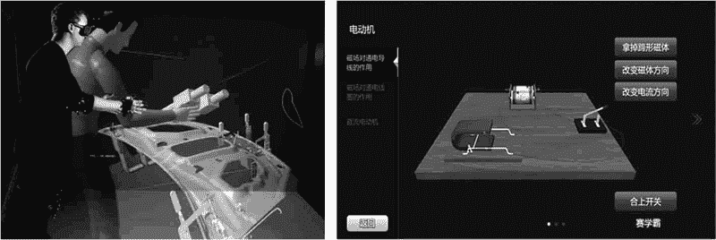
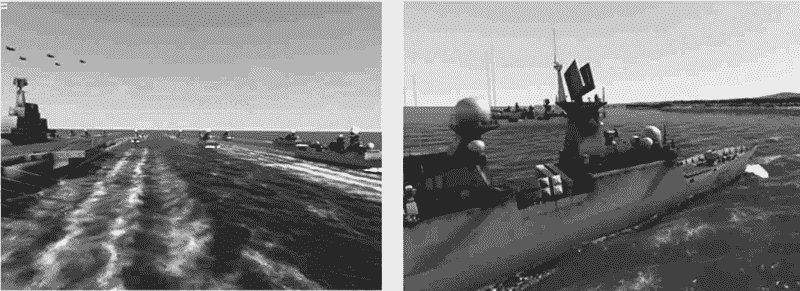
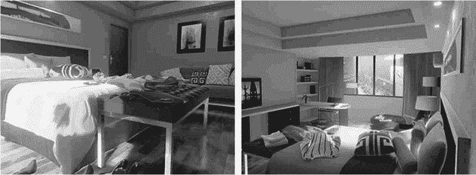
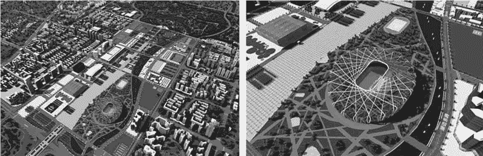
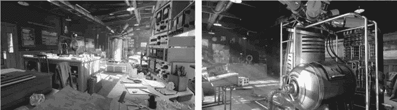
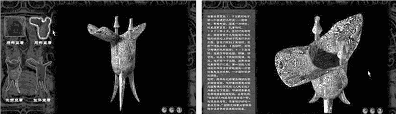

# Unity 3D 的应用

> 原文：[`c.biancheng.net/view/2652.html`](http://c.biancheng.net/view/2652.html)

Unity 3D 是目前主流的游戏开发引擎，有数据显示，全球最赚钱的 1000 款手机游戏中，有 30% 是使用 Unity 3D 开发出来的。尤其在 VR 设备中，Unity 3D 游戏开发引擎具有统治地位。

Unity 3D 能够创建实时、可视化的 2D 和 3D 动画、游戏，被誉为 3D 手游的传奇，孕育了成千上万款高质、超酷炫的神作，如《炉石传说》《神庙逃亡 2》《我叫 MT2》等。

Unity 3D 行业前景广泛，在游戏开发、虚拟仿真、动漫、教育、建筑、电影等多个行业中得到广泛运用。

## Unity 3D 在游戏中的应用

3D 游戏是 Unity 游戏引擎重要的应用方向之一，从最初的文字游戏到二维游戏、三维游戏，再到网络三维游戏，游戏在其保持实时性和交互性的同时，其逼真度和沉浸感在不断地提高和加强。

下图为 Unity 官方发布的 3D 游戏 AngryBots 的试玩版（demo）。随着三维技术的快速发展和软硬件技术的不断进步，在不远的将来，3D 虚拟现实游戏必将成为主流游戏市场应用方向。

## Unity 3D 在虚拟仿真教育中的应用

Unity 3D 应用于虚拟仿真教育是教育技术发展的一个飞跃，如下图所示。它营造了自主学习的环境，由传统的“以教促学”的学习方式变为学习者通过自身与信息环境的相互作用来得到知识、技能的新型学习方式。

## Unity 3D 在军事与航天工业中的应用

模拟训练一直是军事与航天工业中的一个重要课题，这为 Unity 3D 提供了广阔的应用前景，如下图所示。

美国国防部高级研究计划局（DARPA）自 20 世纪 80 年代起一直致力于 SIMNET 的虚拟战场系统的研究，以提供坦克协同训练，该系统可连接 200 多台模拟器。

另外，该系统利用 VR 技术，可模拟零重力环境，以代替现在非标准的水下训练宇航员的方法。

## Unity 3D 在室内设计中的应用

Unity 3D 引擎可以实现虚拟室内设计效果，它不仅仅是一个演示媒体，而且还是一个设计工具。它以视觉形式反映了设计者的思想。

在装修房屋之前，首先要做的事是对房屋的结构、外形做细致的构思。为了使之定量化，还需设计许多图纸，当然这些图纸只有内行人能读懂。

虚拟室内设计可以把这种构思变成看得见的虚拟物体和环境，使以往传统的设计模式提升到数字化的所见即所得的完美境界，大大提高了设计和规划的质量与效率。

虚拟室内设计方案应用 Unity 3D 引擎进行开发，设计者可以完全按照自己的构思去构建和装饰虚拟的房间，并可以任意变换自己在房间中的位置，去观察设计的效果，直到满意为止，既节约了时间，又节省了做模型的费用，如下图所示。

## Unity 3D 在城市规划中的应用

城市规划一直是对全新的可视化技术需求最为迫切的领域之一，利用 Unity 3D 引擎可以进行虚拟城市规划，并带来切实且可观的利益。

展现规划方案时，虚拟现实系统的沉浸感和互动性不但能够给用户带来强烈、逼真的感官冲击，使用户获得身临其境的体验，还可以通过其数据接口在实时的虚拟环境中随时获取项目的数据资料，方便大型复杂工程项目的规划、设计、投标、报批、管理，有利于设计与管理人员对各种规划设计方案进行辅助设计与方案评审，如下图所示。

## Unity 3D 在工业仿真中的应用

当今世界工业已经发生了巨大的变化，先进科学技术的应用显现出巨大的威力。

Unity 3D 引擎已经被世界上一些大型企业广泛地应用到工业仿真的各个环节，对企业提高开发效率，加强数据采集、分析、处理能力，减少决策失误，降低企业风险起到了重要的作用，如下图所示。

## Unity 3D 在文物古迹展示、保护中的应用

利用 Unity 3D 引擎，结合网络技术，可以将文物古迹的展示、保护提高到一个崭新的阶段。

首先表现在将文物古迹实体通过影像数据采集手段建立三维实物或模型数据库，保存文物古迹原有的各种形式的数据和空间关系等重要资源，实现濒危文物古迹资源的科学、高精度和永久的保存。

其次，利用这些技术来提高文物修复的精度，预先判断、选取将要采用的保护手段，同时可以缩短修复工期。

通过计算机网络来整合统一大范围内的文物古迹资源，并且通过网络在大范围内利用虚拟技术更加全面、生动、逼真地展示文物古迹，从而使文物古迹脱离地域限制，实现资源共享，真正成为全人类可以拥有的文化遗产。

如下图所示。利用 Unity 3D 引擎实现虚拟文物古迹仿真可以推动文博行业更快地进入信息时代，实现文物古迹展示和保护的现代化。

