# Unity 3D 下载安装教程

> 原文：[`c.biancheng.net/view/2637.html`](http://c.biancheng.net/view/2637.html)

Unity 5.x 软件的下载与安装十分便捷，游戏开发者可根据个人计算机的类型有选择地安装基于 Windows 平台或 MacOS X 平台的 Unity 3D 软件。

考虑到国内的游戏开发者使用的计算机多是 Windows 系统，因此我们接下来将着重为游戏开发者介绍 Unity 5.x 版本在 Windows 平台下的下载与安装步骤。

## Unity 3D 下载教程

要安装 Unity 3D 游戏引擎的最新版，可以访问 Unity 官方网站 [`unity3d.com/cn/`](https://unity3d.com/cn/)，如下图所示。

进入 Unity 官网，单击右上角的“获取 Unity”进入下载页面。

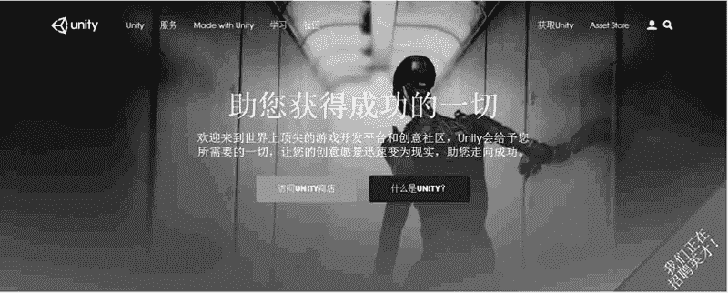
在下载页面中有 Unity 版权的一些信息。在 Unity 的官方网站的下载页面可以看到 4 个版本，分别是 Personal、Plus、Pro、Enterprise，如下图所示。单击 Personal 下的“立即下载”按钮。

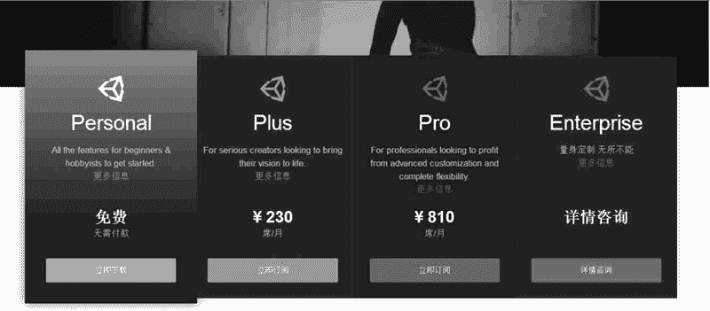
选择 Personal 版本后，在这个页面上有一个很大的下载按钮，如下图所示。单击该按钮就可以下载 Unity 的安装包了。

不过单击这个按钮首先下载的是 Unity 官方的一个专业下载器，运行这个下载器就可以得到真正的 Unity 安装包。

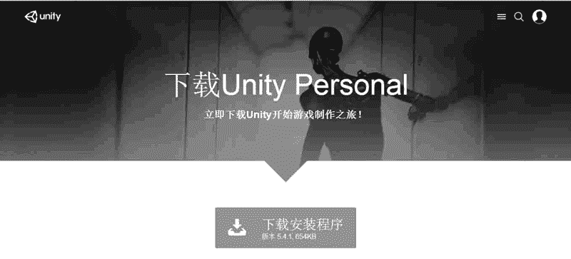

## Unity 3D 安装教程

下载好安装包之后，双击安装包运行，根据提示，选择安装路径，一步步下去，就能够完成安装。

步骤 1)：双击下载得到的 UnitySetup64-5.2.1f1 文件进行安装，如下图所示。

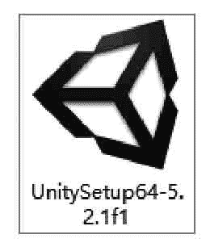
Unity 安装程序的加载需要一段时间，需要稍等片刻，如下图所示。

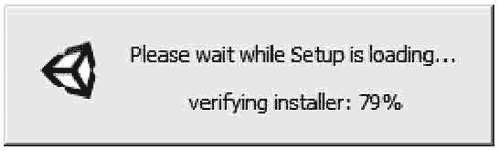
步骤 2)：进入安装欢迎界面，如下图所示。直接单击 Next 按钮进入 License Agreement 界面。

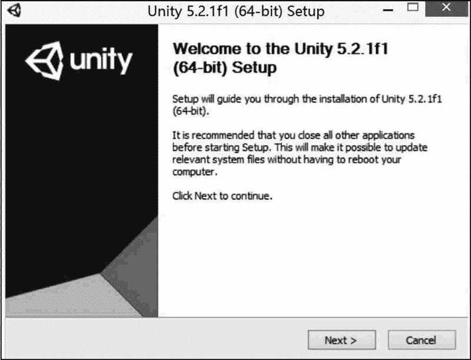
步骤 3)：在 License Agreement 界面，单击 I Agree 按钮，如下图所示。

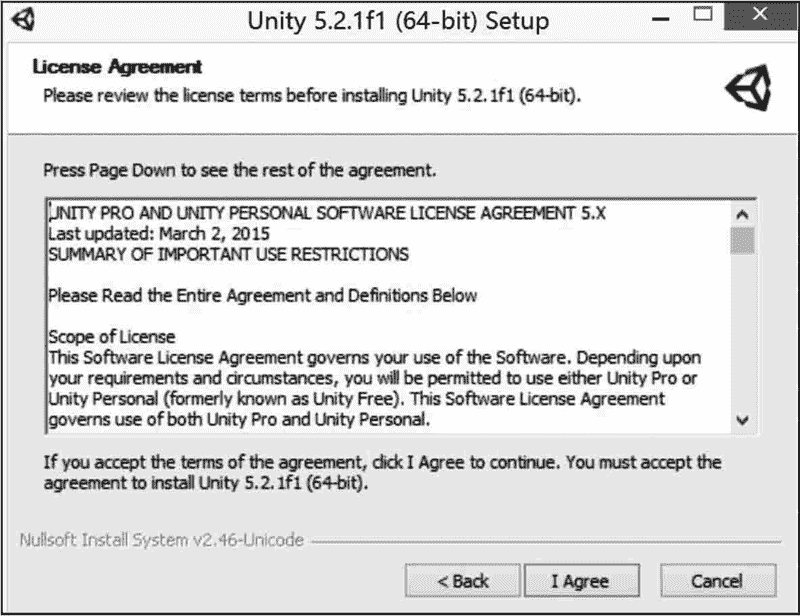
步骤 4)：进入 Choose Components 界面，选中所有组件，然后单击 Next 按钮，如下图所示。

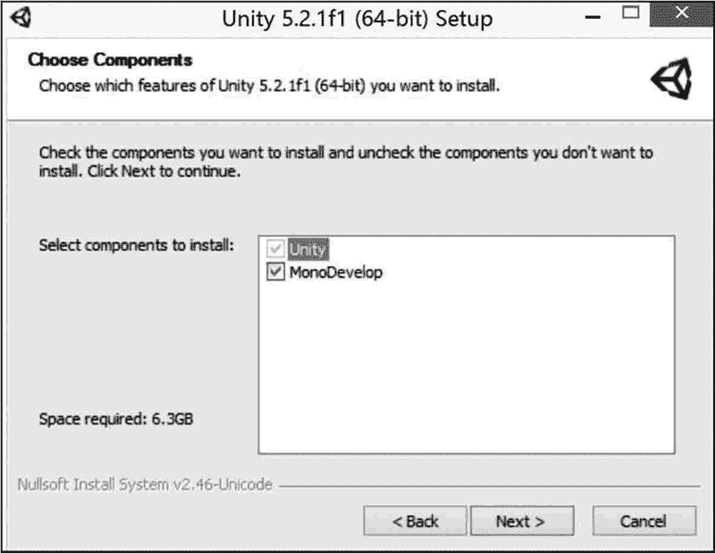
步骤 5)：进入 Choose Install Location 界面，单击 Browse 按钮选择 Unity 的安装路径，默认安装在 C：\Program Files\Unity 中，选好路径后单击 Install 按钮进行安装，如下图所示。

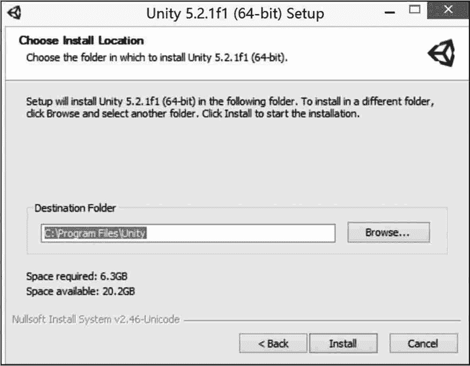
步骤 6)：安装过程会持续比较长的时间，请耐心等待，如下图所示。

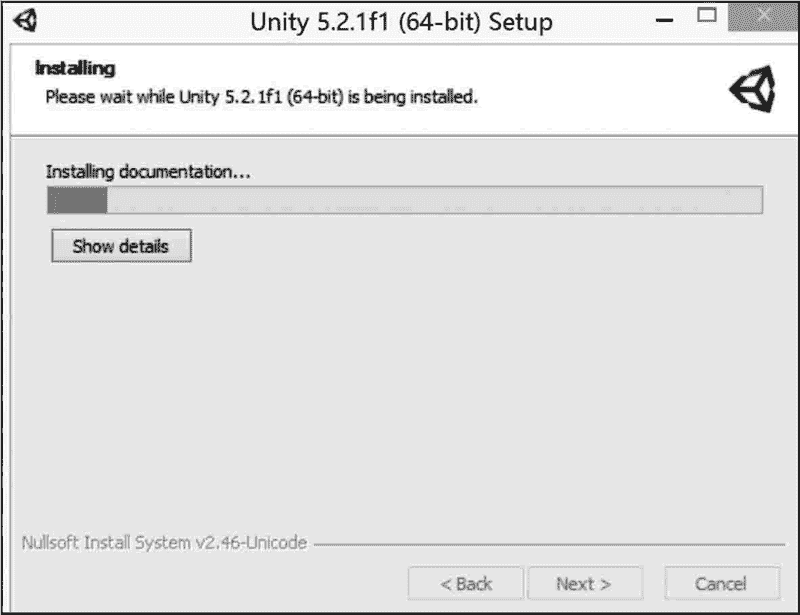
步骤 7)：当滚动条进到 100% 时将会转到 Finish 界面，单击 Finish 按钮。接下来安装 Unity 资源，双击 UnityStandardAssetsSetup 图标，如下图所示。

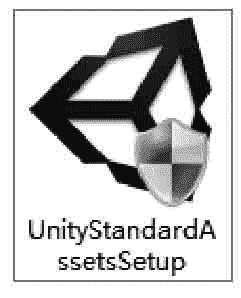
步骤 8)：进入资源安装欢迎界面，如下图所示。直接单击 Next 按钮进入 License Agreement 界面。

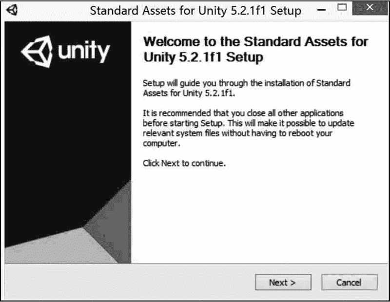
步骤 9)：在 License Agreement 界面，单击 I Agree 按钮，如下图所示。

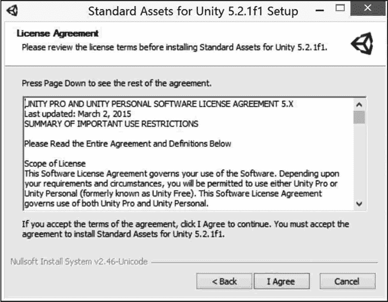
步骤 10)：在 Choose Component 界面中，选中所有组件，单击 Next 按钮，如下图所示。

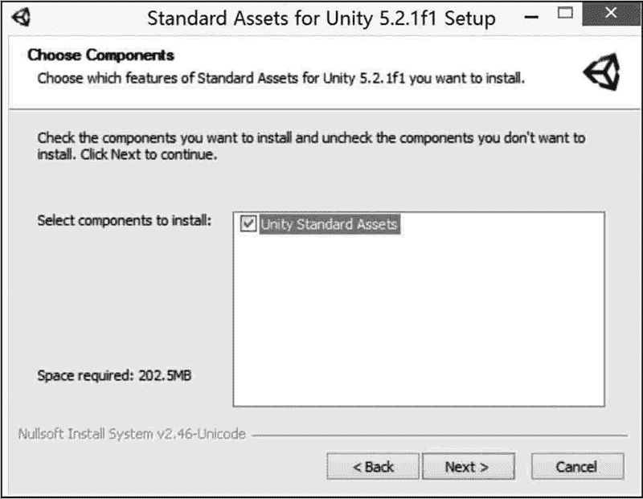
步骤 11)：进入 Choose Install Location 界面，单击 Browse 按钮选择 Unity 资源的安装路径，默认安装在 C：\Program Files\Unity 中，选好路径后单击 Install 按钮进行安装，如下图所示。

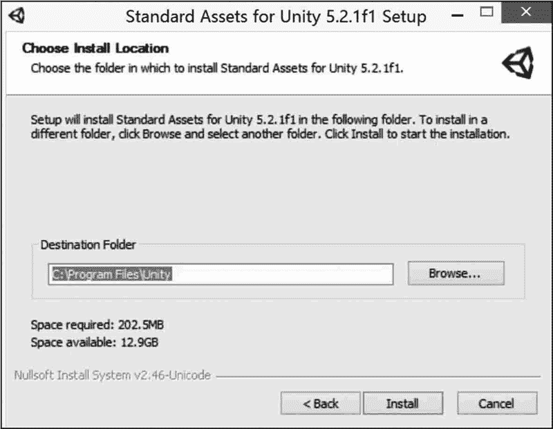
等待片刻就会弹出安装完成界面，如下图所示。

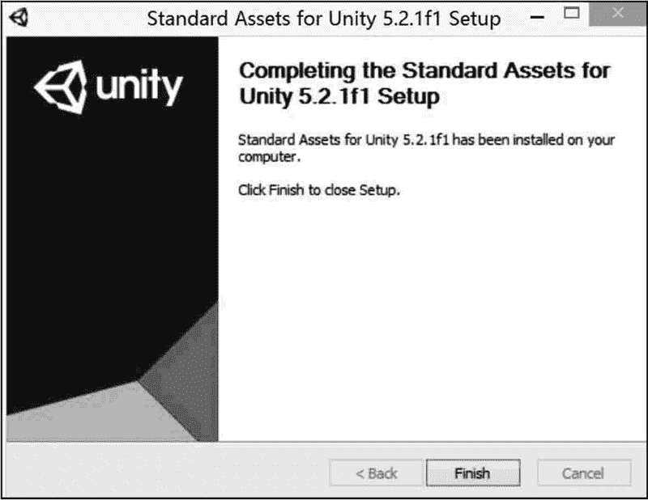
步骤 12)：将 Patcher 置于安装目录的 Editor 文件夹下，右击该文件夹，以管理员权限运行，单击 Browse 按钮找到 Editor 文件夹，选择 Unity 5.0 后，单击 PATCH 按钮，如下图所示。

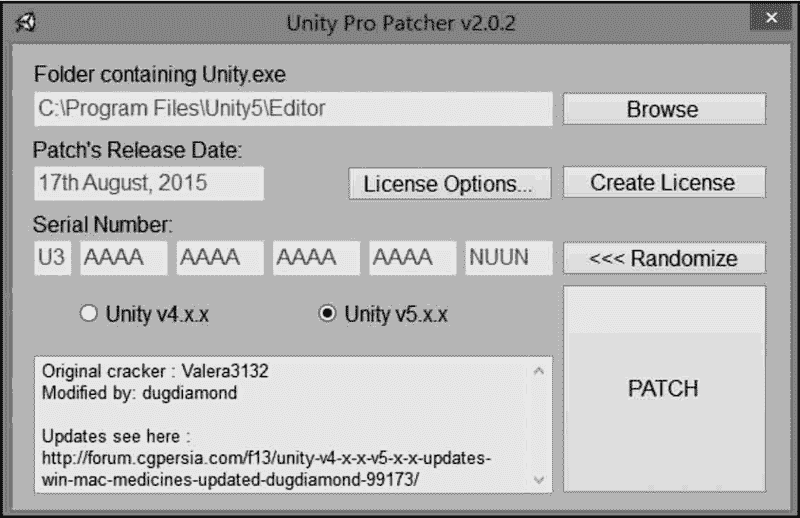
步骤 13)：激活成功后，系统会弹出 Patcher 激活成功对话框，如下图所示。激活完成之后，双击桌面上的 Unity.exe 快捷方式，就可以进行 Unity 3D 开发了。

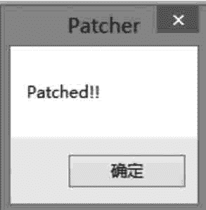