# Unity 3D 创建项目，并添加游戏物体和游戏组件

> 原文：[`c.biancheng.net/view/2641.html`](http://c.biancheng.net/view/2641.html)

Unity 3D 创建游戏的理念可以简单地理解为：一款完整的游戏就是一个项目（project），游戏中不同的关卡对应的是项目下的场景（scene）。一款游戏可以包含若干个关卡（场景），因此一个项目下面可以保存多个场景。

## 创建新项目

启动 Unity 3D 后，在弹出的 Project Wizard（项目向导）对话框中，单击 Create New Project（新建项目），创建一个新的工程，可以设置工程的目录，然后修改文件名称和文件路径，如下图所示。

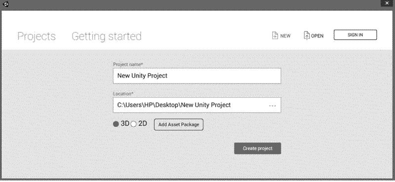
在 Project name 下（项目名称）中输入项目名称，然后在 Location（项目路径）下选择项目保存路径并且选择 2D 或者 3D 工程的默认配置，最后在 Add Assets Package 中选择需要加载的系统资源包，如下图所示。

设置完成后，单击 Create project 按钮完成新建项目。Unity 3D 会自动创建一个空项目，其中会自带一个名为 Main Camera 的相机和一个 Directional Light 的直线光。

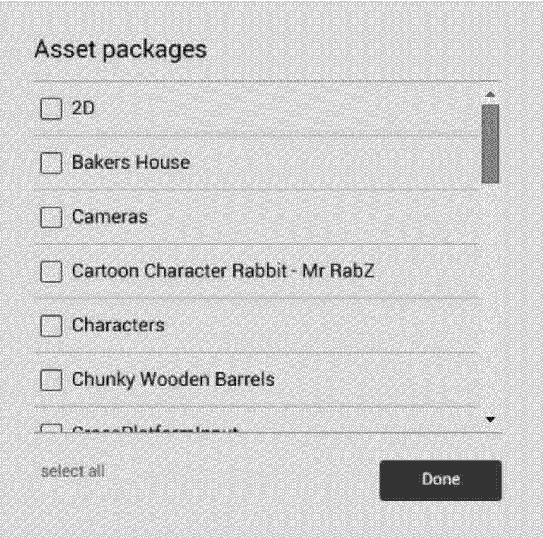
创建好新项目后，由于每个项目中可能会有多个不同的场景或关卡，所以开发人员往往要新建多个场景。

新建场景的方法是：选择 Unity 3D 软件界面上的菜单 File（文件）→New Scene（新建场景）命令即可新建场景，如下图所示。

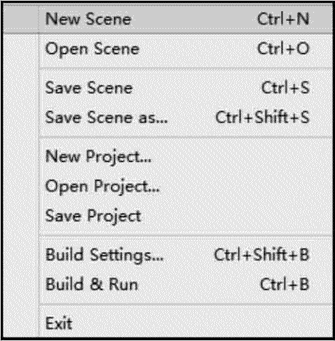

## 创建游戏物体

选择 GameObject（游戏对象）→3D Object（三维物体）→Plane（平面）命令创建一个平面用于放置物体，如下图所示。

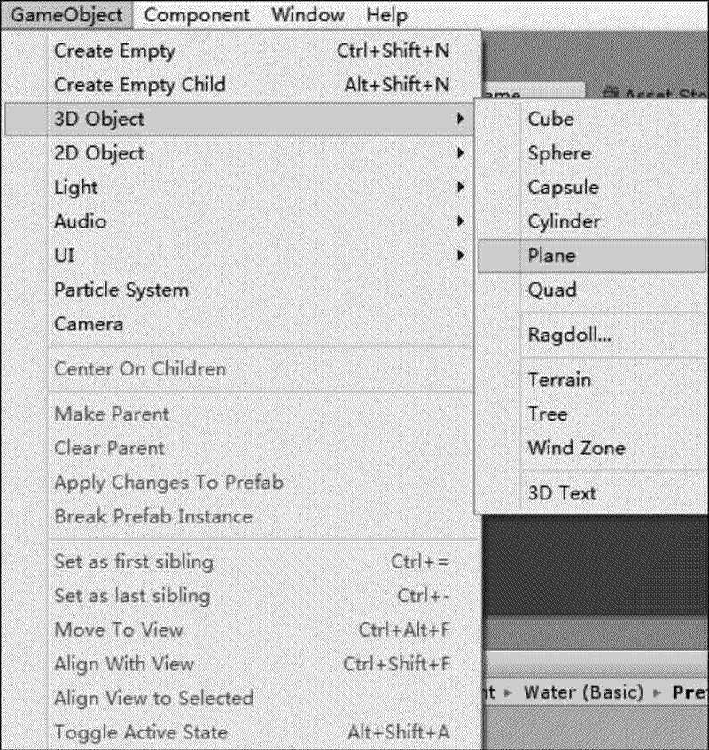
选择 GameObject（游戏对象）→3D Object（三维物体）→Cube（立方体）命令创建一个立方体，如下图所示。

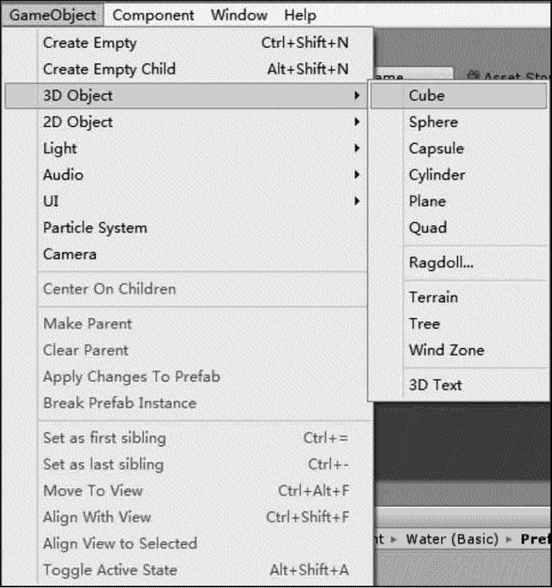
最后使用场景控件调整物体位置，从而完成游戏物体的基本创建，如下图所示。

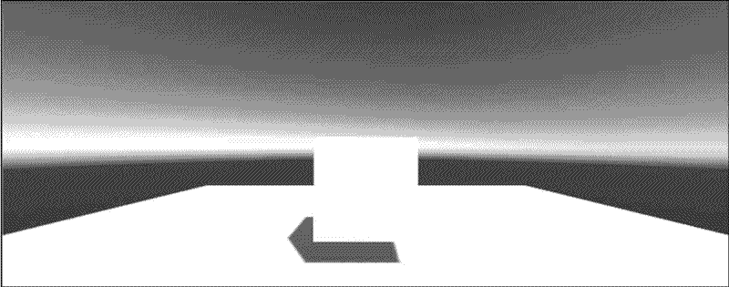

## 添加游戏物体组件

游戏物体组件可以通过 Inspector（属性编辑器）显示，这些组件还可以附加很多组件。例如要为 Cube（立方体）组件添加 Rigidbody（刚体）组件，选中 Cube，执行 Component（组件）→Physics（物理）→Rigidbody（刚体）菜单命令，为游戏物体 Cube 添加 Rigidbody 组件，如下图所示。

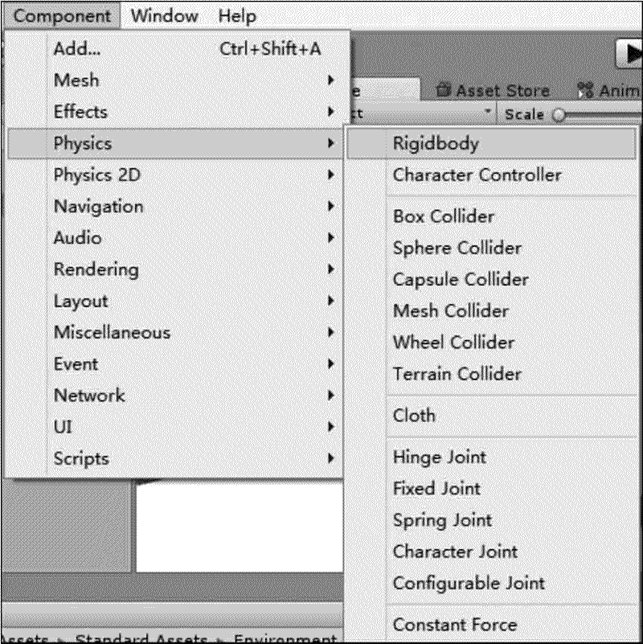
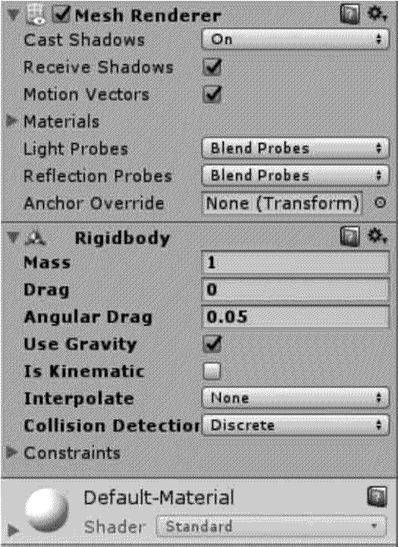
Rigidbody 添加完成后，在 Scene（场景）视图中单击 Cube 并将其拖曳到平面上方，然后单击 Play 按钮进行测试，可以发现 Cube 会做自由落体运动，与地面发生相撞，最后停在地面，如下图所示。

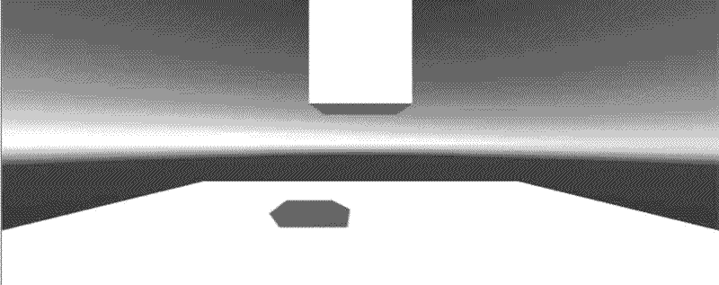
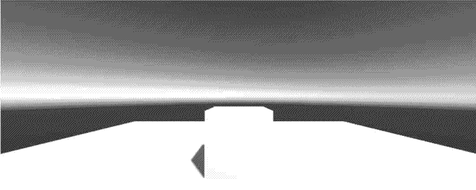

## 项目保存

执行 File（文件）→Save Scene（保存场景）菜单命令或按快捷键 Ctrl+S，如下图所示。

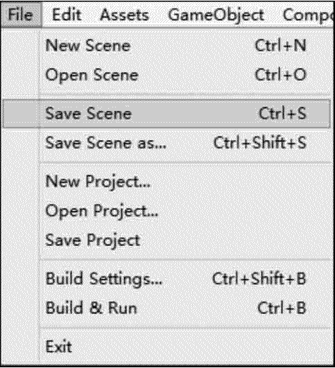
在弹出的保存场景对话框中输入要保存的文件名，如下图所示。此时在 Project（项目）面板中能够找到刚刚保存的场景。

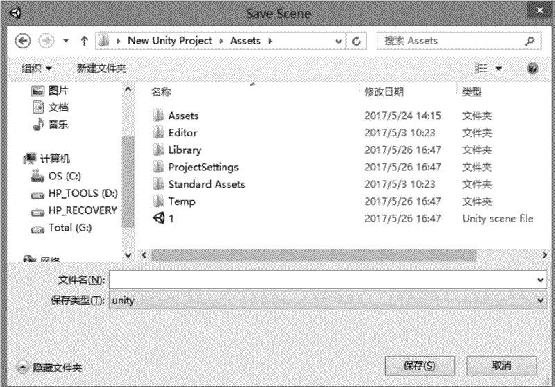