# Unity 3D 游戏发布到 PC 平台

> 原文：[`c.biancheng.net/view/2642.html`](http://c.biancheng.net/view/2642.html)

PC 是最常见的游戏运行平台。在 2007 年之前，PC 平台上能够玩的单机游戏实在是少之又少，而几乎就是网游的天下，但是从 2007 年开始，情况就发生了变化。

随着欧美游戏的崛起，很多游戏开始登录 PC 平台，并且很多游戏类型和好的创意诞生于 PC 平台。Unity 平台支持 9 种游戏，PC 平台就是其中最重要的发布平台之一。

利用 Unity 3D 开发游戏，在需要发布游戏时，执行 File→Build Settings 菜单命令，如下图所示。

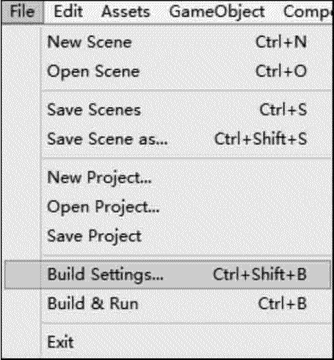
在 Platform 列表框中选择 PC，Mac&Linux Standalone 选项，在右侧的 Target Platform 下拉列表中可以选择 Windows、MacOS X、Linux 选项，在右侧的 Architecture 下拉列表中可以选择 x86 或 x86_64 选项，如下图所示。

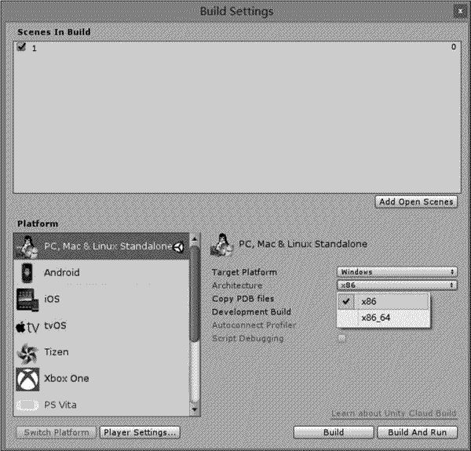
单击左下角的 Player Settings 按钮后，便可以在右侧的 Inspector 面板中看到 PC，Mac&Linux 的相关设定，如下图所示。在 PlayerSettings 界面中，Company Name 和 Product Name 用于设置相关的名称，而 Default Icon 用于设定程序在平台上显示的图标。

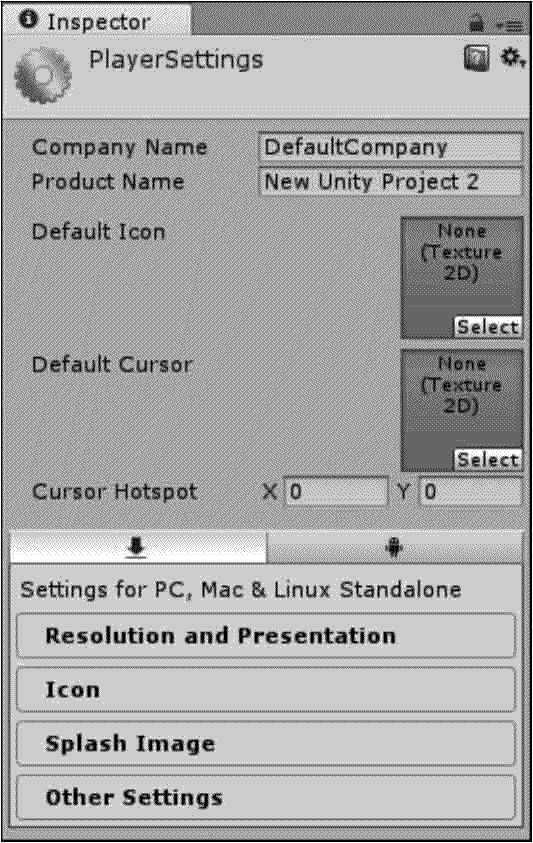
在 PlayerSettings 界面的下部有 4 个选项设置：Resolution and Presentation、Icon、Splash Image 和 Other Settings。下图是 Resolution and Presentation 的参数设置内容，参数如下表所示。

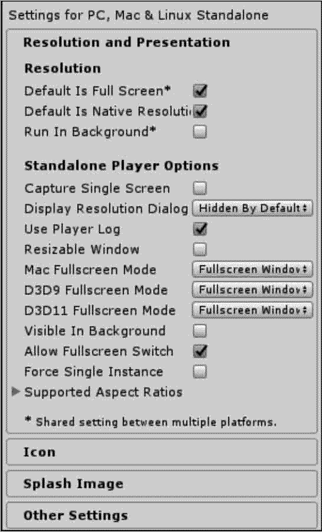

| 参 数 | 功 能 |
| Default Is Full Screen | 若选中此复选框，则游戏启动时会以全屏幕显示 |
| Default Is Native Resolution | 默认本地分辨率 |
| Run In Background | 当暂时跳出游戏转到其他窗口时，显示游戏是否要继续进行 |
| Supported Aspect Ratios | 显示器能支持的画面比例，包括 4 : 3、5 : 4、16 : 10,16 : 9 和 Others |

当完成上述设置或者全部采用默认值后，便可回到 Build Settings 对话框，单击右下角的 Build 按钮，选择文件路径用于存放可执行文件。

发布的内容是一个可执行的 exe 文件和包含其所需资源的同名文件夹，单击该文件后便会出现如下图所示的游戏运行对话框。

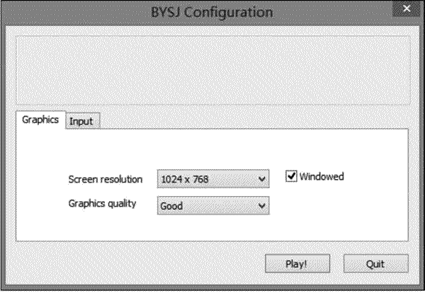

## 实践案例：PC 平台游戏场景发布

#### 案例构思

在一个完整的 Unity 3D 项目制作完毕后，可以将其发布到很多主流游戏平台，其中 PC 平台是应用最广泛的平台，本案例主要讲解将 Unity 3D 游戏发布到 PC 平台的方法。

#### 案例设计

本案例计划在 Unity 3D 内创建一个简单的场景，在场景内放入一个盒子基本几何体，并在场景内加入灯光，测试发布到 PC 平台后的效果，如下图所示。

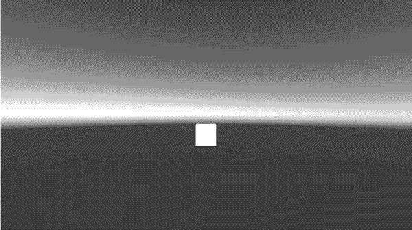

#### 案例实施

步骤 1)：启动 Unity 3D 软件，并设置其存储路径，单击 Create 按钮即生成一个新项目，如下图所示。

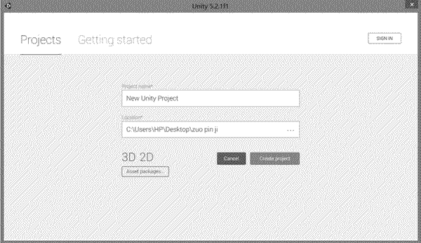
步骤 2)：执行 GameObject（游戏对象）→Light（灯光）→Directional Light（方向光）菜单命令，创建灯光。

步骤 3)：执行 GameObject（游戏对象）→3D Object（三维物体）→Cube（立方体）菜单命令，创建一个小立方体，如下图所示。

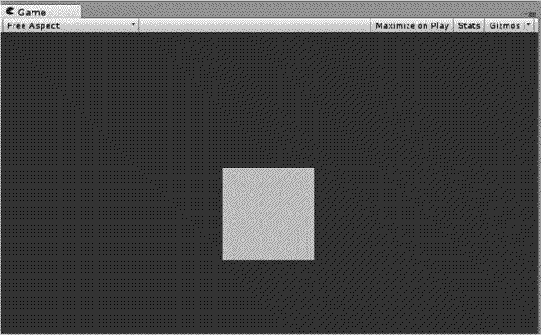
步骤 4)：执行 File→Save Scene 菜单命令保存场景，如下图所示。

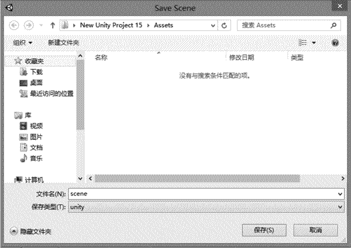
步骤 5)：执行 File→Build Settings 菜单命令，如下图所示。

步骤 6)：弹出 Build Settings 对话框，单击 Add Current 按钮添加当前场景，然后选择 Platform（模板），这里需要选择 PC，在右侧界面中选择平台，这里需要选择 Windows，最后单击 Build 按钮，如果想编译打包后直接运行，查看运行结果，就单击 Build And Run 按钮，如下图所示。

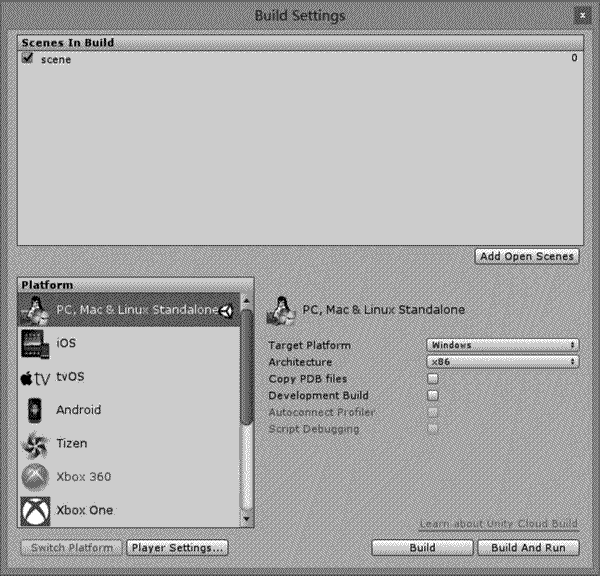
步骤 7)：弹出 Build PC，Mac&Linux Standalone 对话框，填写游戏的文件名，可以看到这里是生成 Windows 下的可执行文件，所以保存类型默认是 exe，不需要更改，然后单击“保存”按钮，如下图所示。

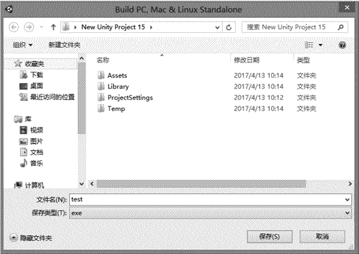
接下来就可以看到 Building Player 对话框的进度条，等进度条刷新完后，就完成了打包，如下图所示。

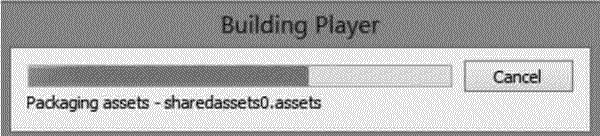
步骤 8)：当完成了打包后，游戏程序便立即运行，弹出的配置界面如下图所示。此时可以选择分辨率等参数，然后单击 Play！按钮即可运行游戏，可以看到运行的游戏界面，因为这里创建了一个简单的场景，所以只看到了一个场景的简单运行界面。

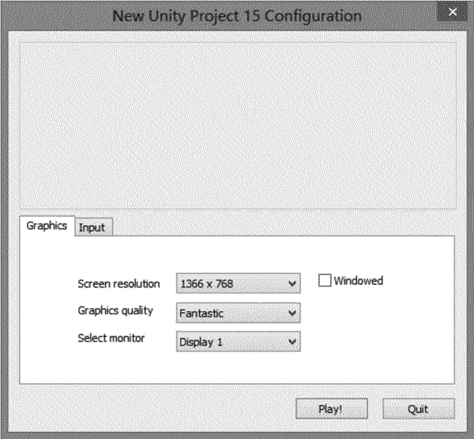