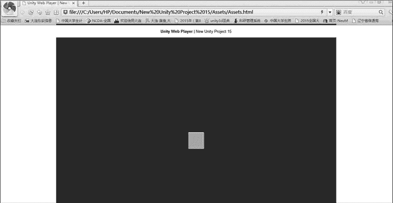
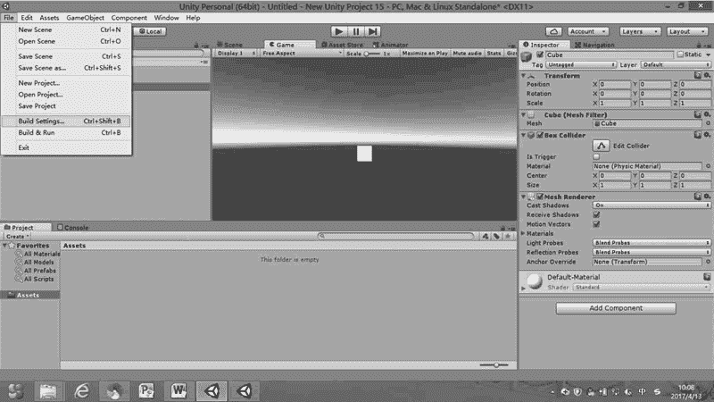
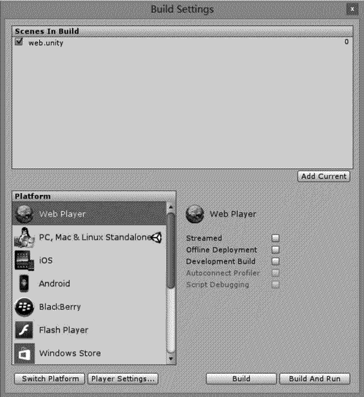
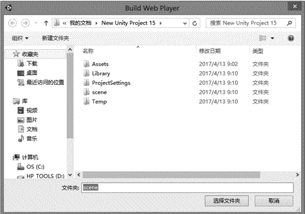
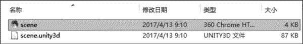

# Unity 3D 游戏发布到 WEB 平台

> 原文：[`c.biancheng.net/view/2643.html`](http://c.biancheng.net/view/2643.html)

为了使通过 Unity 3D 发布的 Web 版游戏运行流畅，前期需要安装一个浏览器插件 Unity Web Player（Unity 3D 网页播放器）。访问官方网址 [`unity3d.com/webplayer/`](http://unity3d.com/webplayer/) 即可下载 UnityWebPlayer.exe 安装包，下载后关闭浏览器，双击 UnityWebPlayer.exe 安装包进行安装。

## 实践案例：Web 平台游戏场景发布

#### 案例构思

Unity 5 支持开发者跨越多种平台，包括新的 WebGL 以及游戏主机、台式机、移动设备和 VR 设备。随着网络技术的快速发展，各种基于 Web 的设计都成为研究热点，本案例主要讲解将 Unity 3D 游戏发布到 Web 平台的方法。

#### 案例设计

本案例计划在 Unity 3D 内创建一个简单的场景，在场景内放入一个盒子基本几何体，并在场景内加入灯光，如下图所示，测试发布到 Web 平台后的效果。

#### 案例实施

步骤 1)：打开要发布的 Unity 3D 工程，执行 File→Build Settings 菜单命令，如下图所示。

步骤 2)：执行 File（文件）→Build Settings（发布设置）菜单命令，打开场景发布窗口，如下图所示。

新建的项目默认发布到 Web 平台，单击 Add Current 按钮，将刚刚保存的场景添加到发布窗口中，然后选中发布窗口中的 Web Player（网页播放器）选项，接下来单击 Switch Platform（交换平台）按钮启动该平台。

平台启动后，该平台选项后会出现 Unity 3D 图标，同时 Switch Platform 按钮会变成灰色。

步骤 3)：平台启动成功后，单击 Build（发布）按钮，发布 Web 文件，由于发布的是两个文件，所以需要创建一个文件夹，本案例将其命名为 scene，如下图所示。

步骤 4)：发布之后的两个文件如下图所示。双击 scene.html 打开页面，在弹出的系统提示中单击“允许阻止 ActiveX 控件”即可。

