# Unity 3D 游戏发布到 Android 平台

> 原文：[`c.biancheng.net/view/2645.html`](http://c.biancheng.net/view/2645.html)

Android 是目前最流行的一个词，Android 的游戏、软件等几乎是人们每天都要用到的。要将 apk 文件发布到 Android 平台，必须先安装两个工具：Java（JDK）和 Android 模拟器（SDK）。

Java 是 Android 平台的主要开发语言，搞 Android 开发的读者肯定具备了 Java 基础，所以这里就不再讲解 Java 开发环境（JDK）的下载与安装了，不了解的读者请移步到：

*   JDK 下载与安装教程
*   Java JDK 环境变量配置

## Android 模拟器（SDK）的安装

步骤 1)：进入网址 [`developer.android.google.cn/studio/index.html`](https://developer.android.google.cn/studio/index.html) 选择适合自己的计算机类型的 Android SDK，在网页最下端选择 SDK 进行下载，如下图所示。

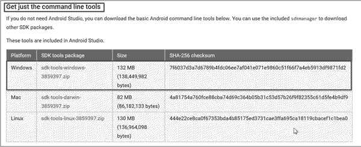
步骤 2)：将下载好的工具解压（这里可以下载到任意磁盘，只要自己记住在哪里就可以），如下图所示。

接下来找到 SDK Manager，将 SDK Manager 复制到 tools 文件夹下，打开 tools→android 并运行，如下图所示。

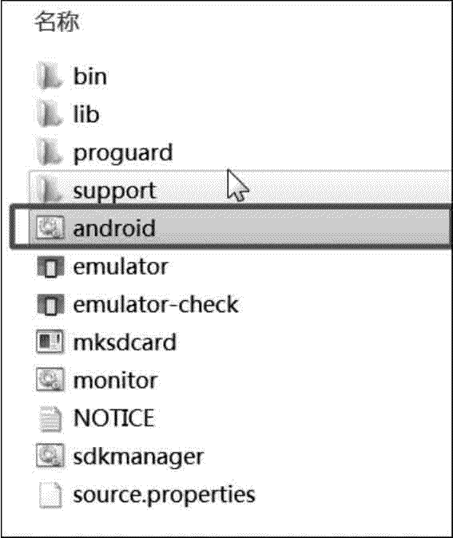
步骤 3)：选择相关开发工具，单击 Install 按钮开始安装 Android SDK，如下图所示。

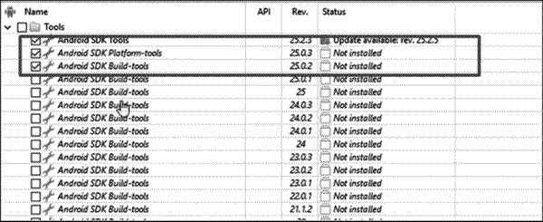
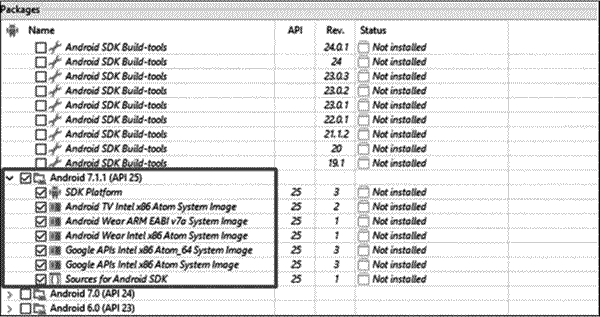
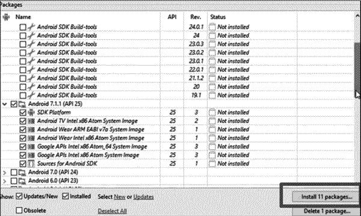

## 实践案例：Android 平台游戏场景发布

#### 案例构思

目前手机的应用非常广泛，几乎每个人都有一部手机，游戏行业当然不会放过这个市场。Unity 3D 游戏引擎能够将开发好的游戏直接发布到 Android 平台上，并且开发了很多游戏，供玩家随时娱乐。本案例主要讲解并测试 Unity 3D 游戏发布在 Android 平台的方法。

#### 案例设计

本案例计划将开发完成的 Unity 3D 游戏发布到 Android 平台上，实现手机端发布效果，如下图所示。

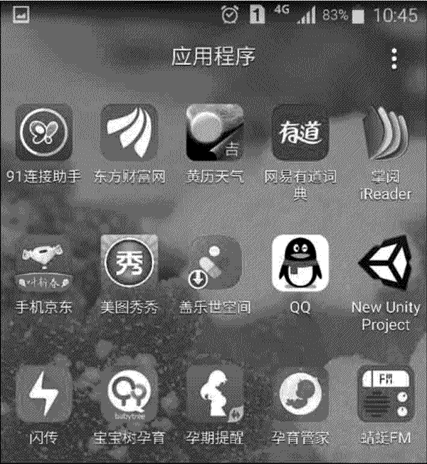

#### 案例实施

步骤 1)：安装完成后，就可以在 Unity 3D 中发布 Android 的 APK，打开 Unity 3D，找到要发布的项目，如下图所示。

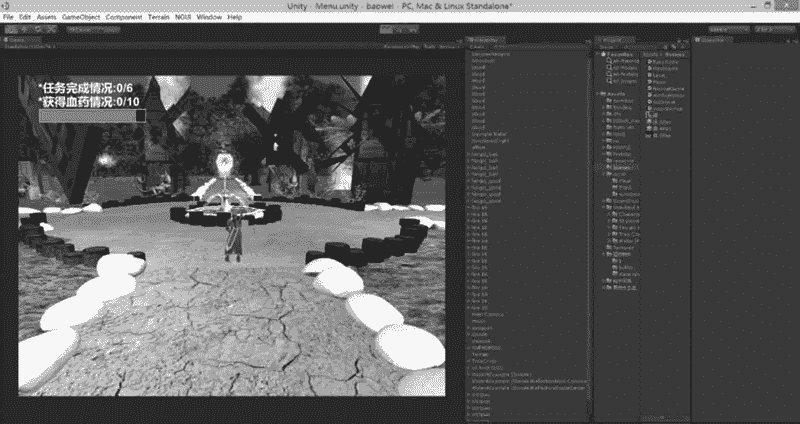
步骤 2)：执行 File→Build Settings 菜单命令，单击 Open Download Page 按钮，如下图所示。

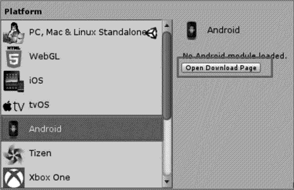
步骤 3)：执行 Edit→Preferences→External tools 菜单命令添加环境变量路径，如下图所示。

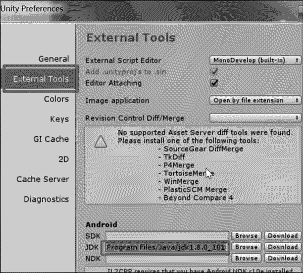
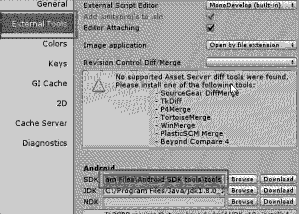
步骤 4)：单击 Switch Platform 按钮转换平台，如下图所示。

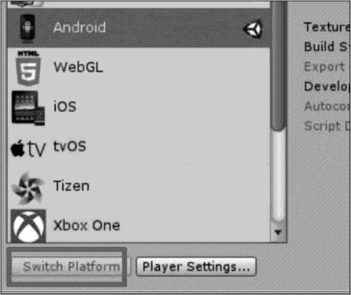
步骤 5)：单击 Player Settings 按钮，配置相关属性，如下图所示。

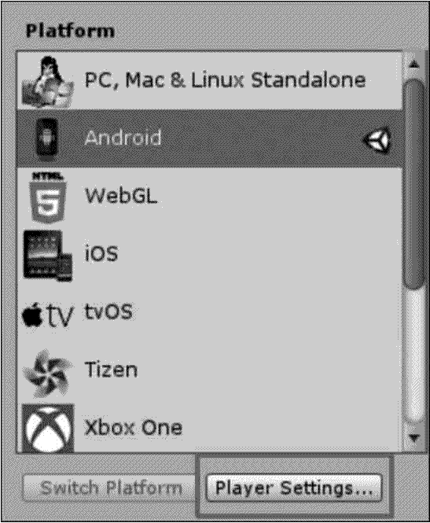
步骤 6)：创建 Company Name 和 Product Name，要保证下方 Other Settings 中的 Package Name 与其一致，如下图所示。

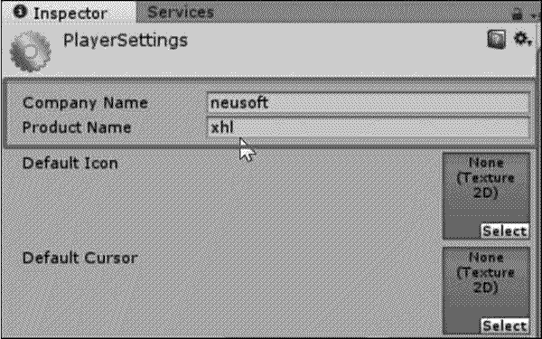
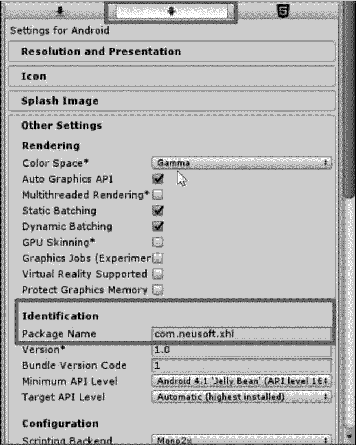
步骤 7)：执行 File→Build Settings→Build 菜单命令进行测试，导出的文件为 APK 格式。游戏发布成功后可以看见一个小图标。发布好后，将其直接复制到用户的 Android 机器中，安装完成后即可运行。